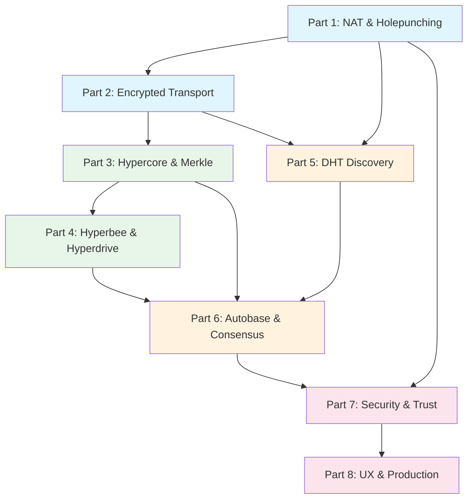

# Series: P2P from Scratch — Building on the Holepunch Stack

> "The best way to predict the future is to invent it."
> — Alan Kay

**Series Excerpt:** By the end of this series, you'll understand how to build production-grade peer-to-peer applications — from punching through NATs and verifying data with Merkle proofs, to linearizing multi-writer histories and shipping honest UX. No central server required.

**Audience:** Developers who know JavaScript and have built client-server apps, but are new to P2P architecture. Each post builds from intuition to implementation.
**Total Parts:** 8
**Estimated Total Length:** 20,000–28,000 words

---

## Series Map

| Part | Title | Core Question | Prerequisites | Est. Words |
|------|-------|---------------|---------------|------------|
| 1 | The Internet is Hostile: NAT, Holepunching, and Why P2P is Hard | Why can't two computers just talk to each other? | None | ~3,000 |
| 2 | Encrypted Pipes: Secret Stream, Protomux, and Wire Protocols | How do peers communicate securely over a single connection? | Part 1 | ~2,500 |
| 3 | Append-Only Truth: Hypercore, Flat Trees, and Merkle Proofs | How do you build an unforgeable, verifiable history? | Parts 1–2 | ~3,500 |
| 4 | From Logs to Databases: Hyperbee, Hyperdrive, and Corestore | How do you build useful data structures on append-only logs? | Part 3 | ~2,500 |
| 5 | Finding Peers: DHT Discovery, Swarm Lifecycle, and Peer Graphs | How do you find other peers without a central server? | Parts 1–2 | ~2,500 |
| 6 | Many Writers, One Truth: Autobase, Causal DAGs, and Quorum Consensus | How do multiple peers agree on what happened and in what order? | Parts 3–5 | ~3,500 |
| 7 | Trust No One, Verify Everything: Security in P2P Systems | How do you build trust without a central authority? | Parts 1–6 | ~3,000 |
| 8 | Building for Humans: UX, Availability, and Production P2P | How do you make P2P feel reliable to real users? | Parts 1–7 | ~3,000 |

## Dependency Graph

## Shared Concepts Index

| Concept | Defined In | Referenced In |
|---------|-----------|---------------|
| NAT (Network Address Translation) | Part 1 | Parts 5, 7, 8 |
| Holepunching | Part 1 | Parts 2, 5, 8 |
| Noise XX Handshake | Part 2 | Parts 5, 7 |
| Protomux Channel | Part 2 | Parts 3, 4, 6 |
| Hypercore | Part 3 | Parts 4, 5, 6, 7, 8 |
| Flat In-Order Merkle Tree | Part 3 | Parts 4, 7 |
| Sparse Replication | Part 3 | Parts 4, 6, 8 |
| Ed25519 Signatures | Part 3 | Parts 5, 7 |
| Hyperbee | Part 4 | Parts 6, 8 |
| Corestore Key Derivation | Part 4 | Parts 6, 7 |
| DHT (Distributed Hash Table) | Part 5 | Parts 7, 8 |
| Causal Ordering | Part 6 | Parts 7, 8 |
| Quorum Checkpoint | Part 6 | Parts 7, 8 |
| Blind Pairing | Part 7 | Part 8 |

---

## Posts

1. [Part 1: The Internet is Hostile](part-1-nat-holepunching.md)
2. [Part 2: Encrypted Pipes](part-2-encrypted-pipes.md)
3. Part 3: Append-Only Truth *(coming soon)*
4. Part 4: From Logs to Databases *(coming soon)*
5. Part 5: Finding Peers *(coming soon)*
6. Part 6: Many Writers, One Truth *(coming soon)*
7. Part 7: Trust No One *(coming soon)*
8. Part 8: Building for Humans *(coming soon)*
