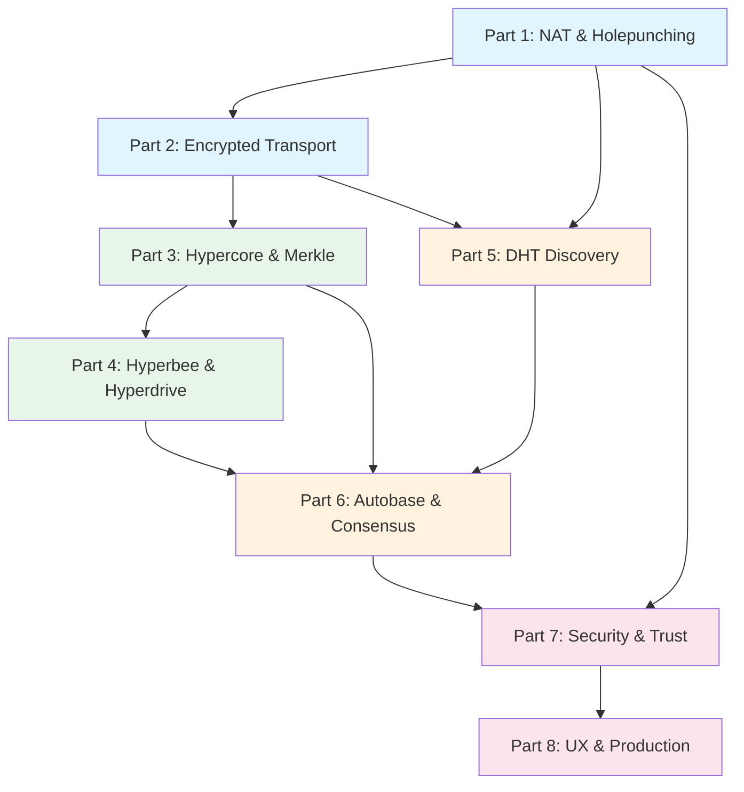

# Series: P2P from Scratch — Building on the Holepunch Stack

> "The best way to predict the future is to invent it."
> — Alan Kay

**Series Excerpt:** By the end of this series, you'll understand how to build production-grade peer-to-peer applications — from punching through NATs and verifying data with Merkle proofs, to linearizing multi-writer histories and shipping honest UX. No central server required.

**Audience:** Developers who know JavaScript and have built client-server apps, but are new to P2P architecture. Each post builds from intuition to implementation.
**Total Parts:** 8
**Estimated Total Length:** 20,000–28,000 words

---

## Series Map

The series breaks into four stages: **Transport** (Parts 1–2) gets bytes flowing safely between peers. **Data Layer** (Parts 3–4) gives you verifiable logs and the databases built on top. **Network & Consensus** (Parts 5–6) lets peers find each other and agree on shared history. **Production** (Parts 7–8) covers the security model and the UX work needed to ship.

| Part | Stage | Title | Core Question | Prerequisites | Est. Words |
|------|-------|-------|---------------|---------------|------------|
| 1 | Transport | NAT Hole Punching Explained | Why can't two computers just talk to each other? | None | ~3,000 |
| 2 | Transport | P2P Encryption with the Noise Protocol | How do peers communicate securely over a single connection? | Part 1 | ~2,500 |
| 3 | Data Layer | Merkle Trees and Append-Only Logs | How do you build an unforgeable, verifiable history? | Parts 1–2 | ~3,500 |
| 4 | Data Layer | Building P2P Databases with Hyperbee and Hyperdrive | How do you build useful data structures on append-only logs? | Part 3 | ~2,500 |
| 5 | Network & Consensus | Peer Discovery with Kademlia DHT | How do you find other peers without a central server? | Parts 1–2 | ~2,500 |
| 6 | Network & Consensus | Multi-Writer Consensus with Autobase | How do multiple peers agree on what happened and in what order? | Parts 3–5 | ~3,500 |
| 7 | Production | P2P Security — Threats, Defenses, and Trust | How do you build trust without a central authority? | Parts 1–6 | ~3,000 |
| 8 | Production | Offline-First UX for P2P Applications | How do you make P2P feel reliable to real users? | Parts 1–7 | ~3,000 |

## Dependency Graph


```mermaid
graph TD
    P1["Part 1: NAT & Holepunching"] --> P2["Part 2: Encrypted Transport"]
    P1 --> P5["Part 5: DHT Discovery"]
    P2 --> P3["Part 3: Hypercore & Merkle"]
    P2 --> P5
    P3 --> P4["Part 4: Hyperbee & Hyperdrive"]
    P3 --> P6["Part 6: Autobase & Consensus"]
    P5 --> P6
    P4 --> P6
    P6 --> P7["Part 7: Security & Trust"]
    P1 --> P7
    P7 --> P8["Part 8: UX & Production"]

    style P1 fill:#e1f5fe
    style P2 fill:#e1f5fe
    style P3 fill:#e8f5e9
    style P4 fill:#e8f5e9
    style P5 fill:#fff3e0
    style P6 fill:#fff3e0
    style P7 fill:#fce4ec
    style P8 fill:#fce4ec
```

## Capability Ledger

Each part adds a concrete capability on top of the previous ones. The "next constraint" column is what motivates the following part.

| After Part | You can… | Next constraint |
|------------|----------|-----------------|
| 1 | Diagnose a P2P connection failure and walk through the holepunch dance | The pipe is open — but raw UDP is unreliable, unauthenticated, and readable by anyone in the path |
| 2 | Wrap a UDP path in a Noise handshake (IK inside Hyperswarm, XX standalone), multiplex independent protocols, and pick a wire codec | Encrypted bytes flow — but you have nothing worth sending that's verifiable end-to-end |
| 3 | Build a Hypercore and verify any block from a single Ed25519 signature | A log is just a sequence — applications need richer access patterns |
| 4 | Build a Hyperbee key-value store and Hyperdrive file system, and manage cores via Corestore | Data structures exist — but how do peers find each other? |
| 5 | Discover peers over a Kademlia DHT and bridge discovery to replication | One writer per core — collaboration needs more |
| 6 | Linearize multi-writer history via Autobase's causal DAG and quorum consensus | Writers agree — but you've been trusting every peer to be honest |
| 7 | Map the six security layers (Sybil, Eclipse, DHT poisoning, Merkle, identity, blind pairing) onto your threat model | Crypto is sound — but does the app feel reliable to a real user on a flaky connection? |
| 8 | Ship offline-first UX, mobile suspend/resume, and an availability strategy that matches your trust model | (series complete) |

## Shared Concepts Index

| Concept | Defined In | Referenced In |
|---------|-----------|---------------|
| NAT (Network Address Translation) | Part 1 | Parts 5, 7, 8 |
| Holepunching | Part 1 | Parts 2, 5, 8 |
| Noise Handshake (IK in Hyperswarm, XX standalone) | Part 2 | Parts 5, 7 |
| Protomux Channel | Part 2 | Parts 3, 4, 6 |
| Hypercore | Part 3 | Parts 4, 5, 6, 7, 8 |
| Flat In-Order Merkle Tree | Part 3 | Parts 4, 7 |
| Sparse Replication | Part 3 | Parts 4, 6, 8 |
| Ed25519 Signatures | Part 3 | Parts 5, 7 |
| Hyperbee | Part 4 | Parts 6, 8 |
| Corestore Key Derivation | Part 4 | Parts 6, 7 |
| DHT (Distributed Hash Table) | Part 5 | Parts 7, 8 |
| Causal Ordering | Part 6 | Parts 7, 8 |
| Quorum Checkpoint | Part 6 | Parts 7, 8 |
| Blind Pairing | Part 7 | Part 8 |

---

## Posts

1. [Part 1: NAT Hole Punching Explained](md/part-1-nat-holepunching.md) · [read it live](https://heartit.tech/p2p-from-scratch-part-1-the-internet-is-hostile/)
2. [Part 2: P2P Encryption with the Noise Protocol](md/part-2-encrypted-pipes.md) · [read it live](https://heartit.tech/p2p-from-scratch-part-2-encrypted-pipes/)
3. [Part 3: Merkle Trees and Append-Only Logs](md/part-3-hypercore-merkle.md) · [read it live](https://heartit.tech/p2p-from-scratch-part-3-append-only-truth/)
4. [Part 4: Building P2P Databases with Hyperbee and Hyperdrive](md/part-4-hyperbee-hyperdrive.md) · [read it live](https://heartit.tech/p2p-from-scratch-part-4-from-logs-to-databases/)
5. [Part 5: Peer Discovery with Kademlia DHT](md/part-5-dht-discovery.md) · [read it live](https://heartit.tech/p2p-from-scratch-part-5-finding-peers/)
6. [Part 6: Multi-Writer Consensus with Autobase](md/part-6-autobase-consensus.md) · [read it live](https://heartit.tech/p2p-from-scratch-part-6-many-writers-one-truth/)
7. [Part 7: P2P Security — Threats, Defenses, and Trust](md/part-7-security-trust.md) · [read it live](https://heartit.tech/p2p-from-scratch-part-7-trust-no-one-verify-everything/)
8. [Part 8: Offline-First UX for P2P Applications](md/part-8-ux-production.md) · [read it live](https://heartit.tech/p2p-from-scratch-part-8-building-for-humans/)

---

## Run the code

Each post ships with a runnable companion lab. They install from npm and need
nothing but Node 18+:

```sh
npx @heart-it/p2p-hello <passphrase>     # two strangers, one hole-punched encrypted connection
npx @heart-it/p2p-channels <passphrase>  # one socket, two Protomux channels
```

All twelve live in [heart-IT/p2p-from-scratch-labs](https://github.com/heart-IT/p2p-from-scratch-labs).

## Verifying the claims

Every constant, default, wire format and byte count these posts state is
asserted against the real Holepunch packages:

```sh
git clone https://github.com/heart-IT/p2p-from-scratch-labs
cd p2p-from-scratch-labs/verify && npm install && npm run verify
```

Dependencies float on purpose — `npm install` pulls whatever Holepunch
publishes today, so a red run means the stack moved and a sentence needs
updating. Each post also carries a **Verified against:** line naming the
versions its specifics were checked against.
