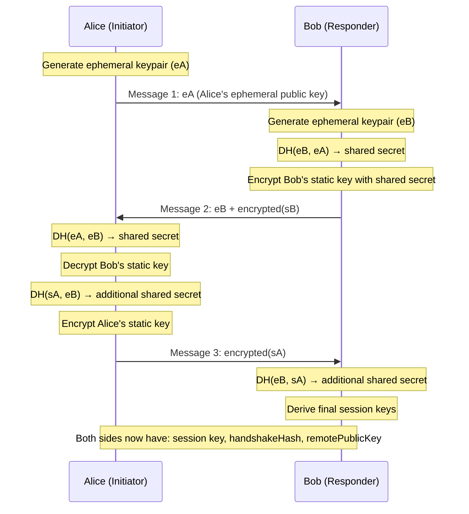
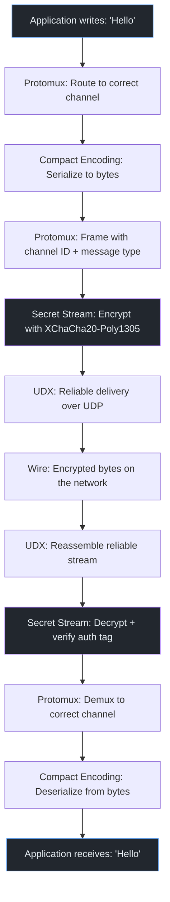

# P2P from Scratch — Part 2: Encrypted Pipes

> "Privacy is necessary for an open society in the electronic age."
> — Eric Hughes, A Cypherpunk's Manifesto

**Excerpt:** In Part 1, we punched a hole through two NATs and established a raw UDP path between peers. But raw UDP is the network equivalent of shouting across an open field — anyone standing between you can listen, modify, or impersonate. This post shows how Hyperswarm turns that raw path into an encrypted, multiplexed communication channel — and why a single connection can carry dozens of independent protocols simultaneously.

<!-- Series Navigation -->
> **Series: P2P from Scratch — Building on the Holepunch Stack**
> [Part 1: The Internet is Hostile](part-1-nat-holepunching.md) | **Part 2: Encrypted Pipes (You are here)** | [Part 3: Append-Only Truth](part-3-hypercore-merkle.md) | [Part 4: From Logs to Databases](part-4-hyperbee-hyperdrive.md) | [Part 5: Finding Peers](part-5-dht-discovery.md) | [Part 6: Many Writers, One Truth](part-6-autobase-consensus.md) | [Part 7: Trust No One](part-7-security-trust.md) | [Part 8: Building for Humans](part-8-ux-production.md)

---

## Quick Recap

In <a href="part-1-nat-holepunching.md">Part 1</a>, we punched through NATs using a DHT-coordinated timing dance and established a raw UDP path between two peers. The hole is open — but the pipe is unprotected.

---

## The Problem: An Open Pipe Is a Dangerous Pipe

At the end of Part 1, Alice and Bob had a working UDP path. Packets flow in both directions. The NAT doors are open.

But here's the thing about UDP: it's just raw bytes on a wire. There's no encryption, no authentication, and no ordering guarantee. Three problems follow immediately.

**Anyone on the network path can read the data.** Your ISP, the coffee shop Wi-Fi operator, any router between you and your peer — they can all see every byte. For a file-sharing app, that means someone can read your files. For a chat app, your messages.

**Anyone can modify the data in transit.** A malicious router could rewrite the contents of your packets before forwarding them. You'd receive corrupted data and have no way to detect the tampering.

**Anyone can impersonate your peer.** Without authentication, you have no way to verify that the packets you're receiving actually come from the person you intended to talk to. A third party could intercept the connection and pretend to be Bob.

This is the classic <a href="https://en.wikipedia.org/wiki/Man-in-the-middle_attack" target="_blank">man-in-the-middle</a> problem. And solving it in peer-to-peer is harder than in client-server, because there's no certificate authority, no TLS handshake backed by a central trust hierarchy, and no domain name to verify.

> **Key Insight:** In client-server HTTPS, trust flows from certificate authorities: your browser trusts DigiCert, DigiCert vouches for `example.com`, so you trust the connection. In P2P, there's no certificate authority. Trust must be bootstrapped from the keypairs themselves — you trust a connection because you already know the peer's public key, not because a third party vouched for them.

---

## Secret Stream: From Raw Bytes to Encrypted Channel

<a href="https://github.com/holepunchto/hyperswarm-secret-stream" target="_blank">Secret Stream</a> is the component that transforms a raw Duplex stream (like our holepunched UDP path) into an encrypted, authenticated channel. It uses two cryptographic layers:

1. **Noise XX handshake** — for mutual authentication and session key derivation
2. **libsodium's secretstream** — for ongoing AEAD encryption of all payload data

The result is a standard Node.js Duplex stream that happens to encrypt everything transparently. Application code writes plaintext; the wire carries ciphertext.

### The Noise Protocol Framework

The <a href="https://noiseprotocol.org/noise.html" target="_blank">Noise Protocol Framework</a> isn't a single protocol — it's a framework for building authenticated key-agreement protocols. You compose a Noise protocol by choosing:

- A **handshake pattern** — which messages carry which keys
- A **DH function** — how keys are exchanged (scalar multiplication on Ed25519 points in Hyperswarm, via <a href="https://github.com/holepunchto/noise-curve-ed" target="_blank">noise-curve-ed</a>)
- A **cipher** — for encrypting handshake payloads (ChaCha20-Poly1305)
- A **hash function** — for key derivation (BLAKE2b)

Hyperswarm uses the **XX** pattern. The letters describe what each side does: X means "transmit static key." Since both sides do X, both sides share their long-term public key during the handshake.

> **Terminology:** A **handshake pattern** in Noise defines the sequence of messages and which cryptographic keys are exchanged at each step. The letters encode the behavior: N = no static key for that party (anonymous), K = static key Known in advance, X = static key Transmitted. XX means both sides transmit their static key — mutual authentication with no prior knowledge required.

### Why XX? (And Not IK or NK)

The choice of handshake pattern has real consequences:

| Pattern | What It Means | Requires Prior Knowledge? | Used When |
|---|---|---|---|
| **NK** | Initiator has no static key (anonymous) | Responder's key must be known in advance | Connecting to a known server |
| **IK** | Initiator's static key sent Immediately | Responder's key must be known in advance | Both keys known beforehand |
| **XX** | Both sides Transmit static key | No prior knowledge needed | General-purpose peer discovery |

In a DHT-based peer discovery system, Alice often doesn't know Bob's public key in advance — she discovered him via a topic announcement. And Bob doesn't know Alice's key either. The XX pattern handles this gracefully: both peers learn each other's identity *during* the handshake.

The tradeoff is that XX requires three messages (one more message than IK), but for Hyperswarm's use case — where peers are strangers meeting via a DHT — this is the right choice.

---

## The Three-Message Dance

The Noise XX handshake has three messages. Each message mixes ephemeral and static keys to progressively build a shared secret.

> **Terminology:** In Noise, an **ephemeral key** is a fresh keypair generated for this specific handshake. It provides forward secrecy — even if someone later steals your static key, they can't decrypt past sessions. A **static key** is your long-term Ed25519 identity key. Hyperswarm uses <a href="https://github.com/holepunchto/noise-curve-ed" target="_blank">noise-curve-ed</a>, which performs Diffie-Hellman directly on Ed25519 points (`crypto_scalarmult_ed25519_noclamp`) — no conversion to Curve25519 needed.

Here's what flows over the wire:


*Figure 1: The Noise XX three-message handshake. Ephemeral keys go first; static keys are encrypted.*

Let's unpack each step:

**Message 1 — Alice introduces herself (ephemerally).** Alice generates a fresh ephemeral keypair and sends the public half. This is unencrypted — an eavesdropper can see it. But that's fine: ephemeral keys are disposable and reveal nothing about Alice's identity.

**Message 2 — Bob responds with his identity.** Bob generates his own ephemeral keypair, performs a Diffie-Hellman with Alice's ephemeral key to derive a shared secret, and uses that secret to *encrypt* his static public key. An eavesdropper sees Bob's ephemeral key (plaintext) and a blob of ciphertext. They can't decrypt it without performing the DH themselves.

**Message 3 — Alice reveals her identity.** Alice decrypts Bob's static key, performs additional DH operations mixing static and ephemeral keys, and sends her own static public key — encrypted. After this message, both sides have performed all the DH operations needed to derive the final session keys.

> **Key Insight:** The ephemeral keys serve two purposes. First, they provide **forward secrecy** for all post-handshake traffic — if an attacker records the handshake and later compromises a static key, they still can't derive the session keys because the ephemeral keys are gone. Second, they protect **identity hiding** — static keys are encrypted, so a passive eavesdropper can't determine who is talking to whom (though the responder's identity can be probed by an active attacker who initiates a fake handshake — the initiator has stronger identity protection).

### What Comes Out of the Handshake

After the three messages, both peers have:

- A **session key** — derived from the combined DH operations, used for all subsequent encryption
- The **handshakeHash** — a cryptographic binding of the entire handshake transcript, useful for channel binding
- The **remotePublicKey** — the peer's verified Ed25519 public key

The `handshakeHash` is particularly important. It cryptographically binds everything that happened during the handshake — which keys were exchanged, in what order, with what randomness. If a man-in-the-middle had tampered with any message, the hashes wouldn't match and the handshake would fail.

> **Gotcha:** Noise XX provides *authentication* — you know you're talking to the same keypair throughout the session. But authentication is not trust. You don't know *who* owns that keypair unless you've verified it out-of-band (pinned it, received it through an invitation flow, etc.). A stranger's keypair is authenticated but untrusted.

---

## Post-Handshake: The Encrypted Stream

Once the handshake completes, Secret Stream switches to <a href="https://doc.libsodium.org/secret-key_cryptography/secretstream" target="_blank">libsodium's secretstream</a> for all subsequent data. This uses **XChaCha20-Poly1305** — an AEAD cipher that provides both encryption (confidentiality) and authentication (tamper detection) for every chunk of data.

> **Terminology:** **AEAD** (Authenticated Encryption with Associated Data) means each encrypted message includes a cryptographic tag that proves the data hasn't been modified. If even a single bit changes in transit, the authentication tag verification fails and the recipient knows the data was tampered with.

Why XChaCha20-Poly1305 and not AES-GCM?

| Property | XChaCha20-Poly1305 | AES-GCM |
|---|---|---|
| Nonce size | 24 bytes (safe to generate randomly) | 12 bytes (nonce reuse = catastrophic for both; 24 bytes makes random collision negligible) |
| Hardware dependency | No special instructions needed | Needs AES-NI or ARM Crypto Extensions for full speed |
| Nonce management | Automatic (libsodium secretstream handles it) | Manual (application must track nonces) |
| Implementation safety | ARX operations are naturally constant-time | Cache-timing risks in table-based software implementations |

The 24-byte nonce is the key advantage. With a 12-byte nonce (AES-GCM), you risk catastrophic failure if two messages accidentally use the same nonce. With 24 bytes, the nonce space is large enough that random collision is negligible. In practice, libsodium's secretstream doesn't randomly generate a fresh nonce per message — it uses deterministic nonce evolution with an internal counter and automatic rekeying. The application never touches nonce management.

The result: application code just reads and writes from a standard Node.js Duplex stream. The encryption is invisible.

```js title="secret-stream-example.js"
const SecretStream = require('@hyperswarm/secret-stream')

// Wrap any raw Duplex stream (e.g., the holepunched UDP path)
const encrypted = new SecretStream(isInitiator, rawStream, {
  keyPair: { publicKey, secretKey }  // Your Ed25519 identity keypair
})

// Wait for the handshake to complete
await encrypted.opened

// Now you have:
console.log(encrypted.remotePublicKey)  // Peer's verified Ed25519 key
console.log(encrypted.handshakeHash)    // Cryptographic binding of handshake

// Read and write just like any stream — encryption is transparent
encrypted.write('Hello, authenticated peer!')
encrypted.on('data', data => console.log('Received:', data.toString()))
```

> **Gotcha:** Secret Stream wraps the *entire* connection — not individual messages. You don't choose what to encrypt and what to leave plain. Everything is encrypted, always. This is by design: selective encryption is an anti-pattern that inevitably leaks metadata.

---

## Protomux: One Pipe, Many Protocols

We now have an encrypted Duplex stream. One encrypted pipe between two peers. But a real P2P application needs to do many things simultaneously over that connection:

- Replicate a Hypercore (the append-only log from Part 3)
- Sync an Autobase (the multi-writer system from Part 6)
- Send custom application messages (chat, commands, metadata)

You *could* design a single protocol that handles all of these in one stream. But that creates a monolithic protocol where changes to one concern affect everything else.

<a href="https://github.com/holepunchto/protomux" target="_blank">Protomux</a> solves this by multiplexing multiple independent protocol **channels** over the single encrypted stream. Each channel has its own message types, its own state machine, and its own lifecycle — but they all share the same underlying connection.

> **Feynman Moment:** Think of Protomux like USB. A single USB cable carries power, data, and video — but each protocol runs independently. Your mouse doesn't need to know about your monitor. Similarly, Hypercore replication doesn't need to know about your chat protocol. They share a wire but live in separate channels.

### How Channel Pairing Works

When two peers want to communicate over a protocol, they each create a channel with the same **protocol name** and **id**. Protomux matches channels across peers by this pair.

```js title="protomux-channels.js"
const Protomux = require('protomux')

// Create a muxer over the encrypted stream
const mux = Protomux.from(encryptedStream)

// Open a channel for "my-chat-protocol"
const channel = mux.createChannel({
  protocol: 'my-chat-protocol',
  id: Buffer.from('room-42'),    // Optional: distinguishes instances
  handshake: chatHandshakeCodec, // Optional: codec for opening handshake

  onopen (handshakeData) {
    console.log('Channel opened! Peer sent:', handshakeData)
  },
  onclose () {
    console.log('Channel closed by peer')
  }
})

// Define message types on the channel
const textMessage = channel.addMessage({
  encoding: c.string,          // compact-encoding codec
  onmessage (msg) {
    console.log('Chat message:', msg)
  }
})

// Open the channel (triggers pairing with the remote side)
channel.open(myHandshakePayload)

// Send a message
textMessage.send('Hello from the other side')
```

The pairing is **symmetric**: both sides must create a channel with the same protocol name and id. If Alice creates `{ protocol: 'chat', id: roomId }` and Bob creates the same, Protomux pairs them. If only one side creates the channel, it stays open but idle until the other side matches.

### The Three Lifecycles

Every Protomux channel has three phases:

1. **Opening** — The channel sends a handshake message to the remote peer. If both sides have opened, the `onopen` handler fires with the remote's handshake data. This is where you exchange initial state (capabilities, versions, discovery keys).

2. **Messages** — While open, either side can send messages. Each message type is registered with `channel.addMessage()` and has its own encoding and handler. Messages within a channel are delivered in order.

3. **Closing** — Either side can close the channel. The `onclose` handler fires on the remote. Closing one channel does *not* close the underlying connection or affect other channels.

> **Key Insight:** Hyperswarm deduplicates connections — if you join multiple topics and discover the same peer through several of them, you still get a single connection. Protomux is what makes this work: each topic or Hypercore gets its own channel on the shared connection. Without multiplexing, connection deduplication would be impossible.

### How Hypercore Uses Protomux

When you replicate a Hypercore, the replication protocol opens a Protomux channel with:

- **Protocol name:** `'hypercore/alpha'`
- **Channel id:** The Hypercore's **discoveryKey** (a keyed BLAKE2b-256 hash: `BLAKE2b-256(key=publicKey, data="hypercore")` — not the public key itself, which would leak what data you're interested in)

The Hypercore replication protocol currently defines 10 message types on this channel:

| Message | Direction | Purpose |
|---|---|---|
| `sync` | Both | Announce local length and fork ID |
| `request` | Either | Ask for a specific block |
| `cancel` | Either | Cancel a pending block request |
| `data` | Either | Respond with block + Merkle proof |
| `noData` | Either | Indicate requested data is unavailable |
| `want` | Either | Express interest in a block range |
| `unwant` | Either | Cancel interest in a range |
| `bitfield` | Either | Full bitfield of available blocks |
| `range` | Either | Download a contiguous range |
| `extension` | Either | Custom extension messages |

When Alice replicates three different Hypercores with Bob, three Protomux channels open — one per discoveryKey — all sharing the same encrypted connection. Each channel independently tracks which blocks Alice has, which Bob has, and what needs to be exchanged.

---

## Cork and Uncork: Batching for Performance

When an application sends many small messages in quick succession — say, responding to multiple block requests during replication — each `send()` call would normally trigger a separate write to the underlying stream. That means separate encryption operations, separate system calls, and separate network packets.

Protomux (and individual channels) support **corking**: a pattern that buffers messages and flushes them as a single batch.

```js title="corking-example.js"
// Without corking: 100 separate writes
for (const block of blocks) {
  dataMessage.send(block)  // Each send = separate packet
}

// With corking: 1 batched write
mux.cork()
for (const block of blocks) {
  dataMessage.send(block)  // Buffered, not sent yet
}
mux.uncork()  // All 100 messages flushed as one batch
```

> **Gotcha:** Corking is about performance, not correctness. Messages are still delivered in order whether you cork or not. But for high-throughput scenarios like replicating a large Hypercore, the difference between 1,000 individual writes and 10 batched writes is significant. Hypercore replication uses corking internally.

---

## Compact Encoding: The Wire Format

Every message on a Protomux channel needs to be serialized to bytes for transmission and deserialized on the other end. Hyperswarm uses <a href="https://github.com/holepunchto/compact-encoding" target="_blank">Compact Encoding</a> — a binary serialization library that's both space-efficient and fast.

The pattern is always three steps:

```js title="compact-encoding-example.js"
const c = require('compact-encoding')

// Define a message schema
const myMessage = {
  preencode (state, msg) {
    c.uint.preencode(state, msg.type)      // 1. Measure: how many bytes?
    c.string.preencode(state, msg.payload)
  },
  encode (state, msg) {
    c.uint.encode(state, msg.type)          // 2. Write: serialize into buffer
    c.string.encode(state, msg.payload)
  },
  decode (state) {
    return {                                // 3. Read: deserialize from buffer
      type: c.uint.decode(state),
      payload: c.string.decode(state)
    }
  }
}
```

**Preencode** calculates the exact byte length needed. **Encode** writes the data into a pre-allocated buffer. **Decode** reads it back.

Why not just use JSON? Two reasons:

| Property | Compact Encoding | JSON |
|---|---|---|
| Overhead | Minimal (varint lengths, raw bytes) | High (key names repeated, quotes, escaping) |
| Speed | Faster decode (binary, no parsing) | Slower parse (string processing) |
| Types | Native buffers, uints, fixed arrays | Everything is a string |
| Consistency | Matches the rest of the Holepunch stack | Foreign to the protocol layer |

For a wire protocol that might exchange thousands of messages per second during replication, this matters.

---

## The Full Stack: From UDP to Application

Let's trace a single message through the entire transport stack to see how the pieces fit together:


*Figure 2: A message travels down the stack on one side and back up on the other. Encryption happens once at the stream level — individual channels don't re-encrypt.*

Notice that encryption happens at the Secret Stream level — *below* the multiplexing. This means:

- All channels share the same encryption session (one handshake, not one per channel)
- A new Protomux channel doesn't require a new Noise handshake
- Channel identities and protocol names are hidden from eavesdroppers (though traffic analysis — packet sizes, timing patterns — can still leak side-channel metadata)

> **Feynman Moment:** Why encrypt below the multiplexer, not above it? If you encrypted each channel separately, an eavesdropper could observe the number of channels, the timing of messages per channel, and the size distribution of each protocol's traffic. By encrypting the entire multiplexed stream, all of this metadata is hidden. The eavesdropper sees one opaque stream of bytes.

---

## The Tradeoffs

| What You Gain | What You Pay |
|---|---|
| Forward secrecy via ephemeral keys | 1 extra message vs. IK pattern |
| Identity hiding (static keys encrypted) | Cannot authenticate before the handshake completes |
| Mutual authentication without certificate authority | Must distribute public keys out-of-band for trust |
| Multiplexed protocols over single connection | Channel pairing complexity |
| AEAD encryption on every byte | Modest CPU overhead for encryption |
| Corked batch writes | Must remember to cork/uncork in hot paths |

The overhead is real but modest. The Noise handshake adds three messages to connection setup (typically < 100ms combined). The XChaCha20-Poly1305 encryption runs at several GB/s on modern hardware. For a P2P application, the NAT traversal from Part 1 dominates the latency budget — the encryption is effectively free by comparison.

---

## In Practice: Building a Multiplexed Chat

Here's a minimal example that combines everything — Secret Stream for encryption, Protomux for multiplexing, and Compact Encoding for wire serialization:

```js title="multiplexed-chat.js"
const Hyperswarm = require('hyperswarm')
const Protomux = require('protomux')
const c = require('compact-encoding')
const crypto = require('hypercore-crypto')

const swarm = new Hyperswarm()
// Hash the room name to get a 32-byte topic for discovery
const topic = crypto.discoveryKey(Buffer.alloc(32).fill('heartit-chat-room'))

swarm.on('connection', (encryptedStream, info) => {
  // encryptedStream is already a Secret Stream (Hyperswarm wraps it)
  const mux = Protomux.from(encryptedStream)

  // Create a chat channel
  const channel = mux.createChannel({
    protocol: 'heartit-chat',
    id: Buffer.from('general'),
    onopen () { console.log('Chat channel opened with', info.publicKey.toString('hex').slice(0, 8)) },
    onclose () { console.log('Chat channel closed') }
  })

  // Define a text message type
  const chatMsg = channel.addMessage({
    encoding: c.string,
    onmessage (text) {
      console.log(`[${info.publicKey.toString('hex').slice(0, 8)}] ${text}`)
    }
  })

  channel.open()

  // Read from stdin and send
  process.stdin.on('data', data => {
    chatMsg.send(data.toString().trim())
  })
})

// Join the topic as both server and client
const discovery = swarm.join(topic, { server: true, client: true })
await discovery.flushed()
console.log('Waiting for peers...')
```

This is ~30 lines of code for an encrypted, authenticated, peer-to-peer chat over a multiplexed connection with NAT traversal. No server, no certificate authority, no monthly bill.

---

## Key Takeaways

- **Secret Stream wraps any Duplex stream in Noise XX + XChaCha20-Poly1305 encryption.** Three handshake messages establish mutual authentication and session keys. After that, libsodium's secretstream encrypts every byte with AEAD.

- **Noise XX is the right pattern for peer discovery.** Neither side needs to know the other's public key in advance. Both static keys are transmitted during the handshake, encrypted under ephemeral keys for identity hiding.

- **Forward secrecy means compromised keys don't expose past sessions.** Ephemeral keypairs are generated per handshake and discarded afterward. Recording traffic today is useless if keys leak tomorrow.

- **Protomux multiplexes independent protocols over a single encrypted connection.** Channels pair by protocol name + id. Each channel has its own message types, lifecycle, and state. Hypercore replication uses `hypercore/alpha` channels keyed by discoveryKey.

- **Encrypt below the multiplexer, not above it.** This hides the number of active channels, per-channel message timing, and protocol-specific traffic patterns from eavesdroppers.

- **Cork your writes in hot paths.** Batching messages with `mux.cork()` / `mux.uncork()` reduces system calls and encryption operations for high-throughput scenarios.

---

## What's Next

We have an encrypted pipe that can carry multiple protocols. Now we need something worth transmitting.

In <a href="part-3-hypercore-merkle.md">Part 3</a>, we'll build an append-only log — Hypercore — that uses a flat in-order Merkle tree to make every byte cryptographically verifiable. We'll see how a peer can download a single block out of millions and prove it hasn't been tampered with, using only a handful of hashes and one Ed25519 signature. This is the data structure that everything else in the Holepunch stack is built on.

---

## References & Further Reading

1. <a href="https://github.com/holepunchto/hyperswarm-secret-stream" target="_blank">holepunchto/hyperswarm-secret-stream — Noise XX + libsodium transport encryption</a>
2. <a href="https://github.com/holepunchto/protomux" target="_blank">holepunchto/protomux — Protocol multiplexing over encrypted streams</a>
3. <a href="https://github.com/holepunchto/compact-encoding" target="_blank">holepunchto/compact-encoding — Binary wire serialization</a>
4. <a href="https://noiseprotocol.org/noise.html" target="_blank">Noise Protocol Framework — Specification</a>
5. <a href="https://doc.libsodium.org/secret-key_cryptography/secretstream" target="_blank">libsodium secretstream — XChaCha20-Poly1305 AEAD streaming</a>
6. <a href="https://github.com/holepunchto/noise-curve-ed" target="_blank">holepunchto/noise-curve-ed — Ed25519 Diffie-Hellman (direct, without Curve25519 conversion)</a>
7. <a href="https://github.com/holepunchto/hypercore" target="_blank">holepunchto/hypercore — Append-only log (uses Protomux for replication)</a>
8. <a href="https://en.wikipedia.org/wiki/Man-in-the-middle_attack" target="_blank">Wikipedia — Man-in-the-middle attack</a>
9. <a href="https://en.wikipedia.org/wiki/Authenticated_encryption" target="_blank">Wikipedia — Authenticated Encryption</a>

---

> **Series: P2P from Scratch — Building on the Holepunch Stack**
> [Part 1: The Internet is Hostile](part-1-nat-holepunching.md) | **Part 2: Encrypted Pipes (You are here)** | [Part 3: Append-Only Truth](part-3-hypercore-merkle.md) | [Part 4: From Logs to Databases](part-4-hyperbee-hyperdrive.md) | [Part 5: Finding Peers](part-5-dht-discovery.md) | [Part 6: Many Writers, One Truth](part-6-autobase-consensus.md) | [Part 7: Trust No One](part-7-security-trust.md) | [Part 8: Building for Humans](part-8-ux-production.md)
