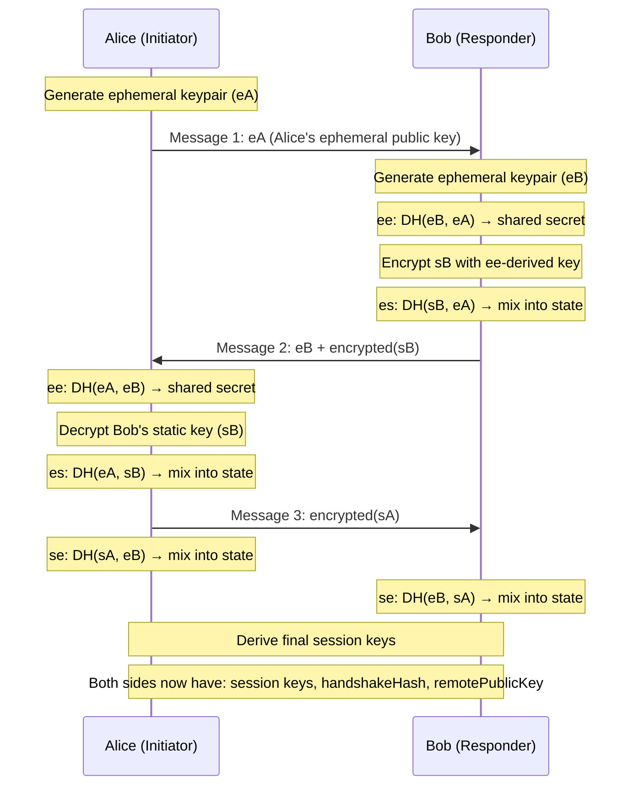
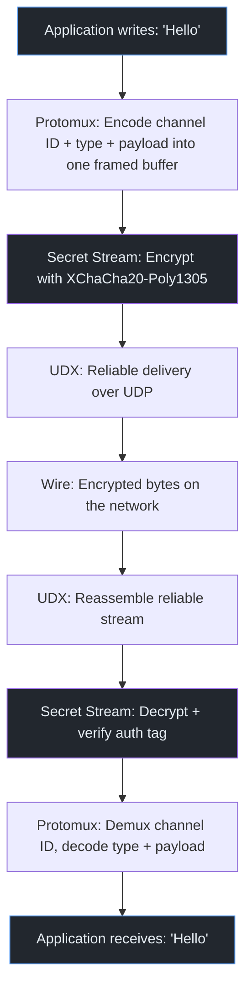

# P2P from Scratch — Part 2: P2P Encryption with the Noise Protocol

> "Privacy is necessary for an open society in the electronic age."
> — Eric Hughes, A Cypherpunk's Manifesto

**Excerpt:** In Part 1, we punched a hole through two NATs and established a raw UDP path between peers. But raw UDP is the network equivalent of shouting across an open field — anyone standing between you can listen, modify, or impersonate. This post shows how Hyperswarm turns that raw path into an encrypted, multiplexed communication channel — and why a single connection can carry dozens of independent protocols simultaneously.
<!-- meta-description: How Hyperswarm uses the Noise protocol, Secret Stream, and Protomux to build encrypted multiplexed P2P channels. With code examples. -->
<!-- meta-labs: p2p-channels -->

<!-- Series Navigation -->
> **Series: P2P from Scratch — Building on the Holepunch Stack**
> [Part 1: NAT Hole Punching Explained](part-1-nat-holepunching.md) | **Part 2: P2P Encryption with the Noise Protocol (You are here)** | [Part 3: Merkle Trees and Append-Only Logs](part-3-hypercore-merkle.md) | [Part 4: Building P2P Databases with Hyperbee and Hyperdrive](part-4-hyperbee-hyperdrive.md) | [Part 5: Peer Discovery with Kademlia DHT](part-5-dht-discovery.md) | [Part 6: Multi-Writer Consensus with Autobase](part-6-autobase-consensus.md) | [Part 7: P2P Security — Threats, Defenses, and Trust](part-7-security-trust.md) | [Part 8: Offline-First UX for P2P Applications](part-8-ux-production.md)

---

> **Verified against:** secret-stream 6.9.1 · noise-handshake 4.2.0 · sodium-native 5.1.0 · protomux 3.11.0 · compact-encoding 3.3.2 · hyperdht 6.33.2 — checked 2026-09-03. Every constant, default and byte count in this post is asserted in [`verify/`](https://github.com/heart-IT/p2p-from-scratch-labs/tree/main/verify), which installs whatever Holepunch publishes today and fails if the stack has moved.

## Quick Recap

In <a href="part-1-nat-holepunching.md">Part 1</a>, we punched through NATs using a DHT-coordinated timing dance and established a raw UDP path between two peers. The hole is open — but the pipe is raw. UDP gives us no reliability, no encryption, no authentication. This post shows how three layers — <a href="https://github.com/holepunchto/libudx" target="_blank">libudx</a>, <a href="https://github.com/holepunchto/hyperswarm-secret-stream" target="_blank">Secret Stream</a>, and <a href="https://github.com/holepunchto/protomux" target="_blank">Protomux</a> — turn that raw path into something usable.

---

## The Problem with Raw UDP

At the end of Part 1, Alice and Bob had a working UDP path. Packets flow in both directions. The NAT doors are open. But that open path is far from usable.

Here's the thing about UDP: it's just raw bytes on a wire. No reliability, no encryption, no authentication. Two categories of problems follow immediately.

**The pipe is unreliable.** UDP datagrams can arrive out of order, arrive twice, or never arrive at all. There's no delivery guarantee, no sequencing, no congestion control. You can't build a meaningful protocol on a transport that silently drops your data.

**The pipe is unprotected.** Anyone on the network path can read, modify, or impersonate the data:

- **Anyone can read it.** Your ISP, the coffee shop Wi-Fi operator, any router between you and your peer — they can all see every byte. For a file-sharing app, that means someone can read your files. For a chat app, your messages.
- **Anyone can modify it.** A malicious router could rewrite the contents of your packets before forwarding them. You'd receive corrupted data and have no way to detect the tampering.
- **Anyone can impersonate your peer.** Without authentication, you have no way to verify that the packets you're receiving actually come from the person you intended to talk to. A third party could intercept the connection and pretend to be Bob.

This is the classic <a href="https://en.wikipedia.org/wiki/Man-in-the-middle_attack" target="_blank">man-in-the-middle</a> problem. And solving it in peer-to-peer is harder than in client-server, because there's no certificate authority, no TLS handshake backed by a central trust hierarchy, and no domain name to verify.

> **Key Insight:** In client-server HTTPS, trust flows from certificate authorities: your browser trusts DigiCert, DigiCert vouches for `example.com`, so you trust the connection. In P2P, there's no certificate authority. Trust must be bootstrapped from the keypairs themselves — you trust a connection because you already know the peer's public key, not because a third party vouched for them.

---

## libudx: Making UDP Reliable

Before we can encrypt anything, we need to solve the reliability problem from above. The obvious question: why not just use TCP? Because TCP holepunching is unreliable — it requires simultaneous SYN packets and many NATs don't handle it correctly. UDP holepunching works, so Holepunch holepunches with UDP and then builds reliability on top.

That's what <a href="https://github.com/holepunchto/libudx" target="_blank">libudx</a> does. It's a C library that turns raw UDP into a reliable, ordered byte stream — doing the same job as TCP, but over the holepunched UDP path. Its JavaScript binding, <a href="https://github.com/holepunchto/udx-native" target="_blank">udx-native</a>, wraps the C transport and exposes it as a Duplex stream (via <a href="https://github.com/mafintosh/streamx" target="_blank">streamx</a>). Together they handle:

- **Retransmission** — detects lost packets and resends them
- **Ordering** — reassembles packets that arrive out of sequence
- **Congestion control** — uses <a href="https://en.wikipedia.org/wiki/TCP_BBR" target="_blank">BBR</a> (Bottleneck Bandwidth and Round-trip propagation time) to avoid flooding the network path
- **Flow control** — prevents overwhelming a slower receiver

The result is a TCP-like reliable, ordered, bidirectional Duplex stream — but established over UDP via the holepunched path from Part 1. This is the stream that Secret Stream then wraps with encryption.

> **Key Insight:** The transport stack has a clean separation of concerns. libudx solves *reliability* (getting bytes from A to B, in order, without loss). Secret Stream solves *security* (ensuring nobody else can read or tamper with those bytes). Protomux solves *multiplexing* (running many protocols over one connection). Each layer does one job.

---

## Secret Stream: From Reliable Bytes to Encrypted Channel

<a href="https://github.com/holepunchto/hyperswarm-secret-stream" target="_blank">Secret Stream</a> is the component that transforms a reliable Duplex stream (the libudx stream from above) into an encrypted, authenticated channel. It uses two cryptographic layers:

1. **Noise handshake** — for mutual authentication and deriving session keys. Used standalone, Secret Stream runs the **XX** pattern by default (configurable via `pattern`); a Hyperswarm connection arrives with an **IK** handshake already completed over the DHT — more on that below
2. **libsodium's secretstream** — for ongoing AEAD encryption of all payload data

The result is a Duplex stream (<a href="https://github.com/mafintosh/streamx" target="_blank">streamx</a>, not Node.js core streams) that happens to encrypt everything transparently. Application code writes plaintext; the wire carries ciphertext.

### The Noise Protocol Framework

The <a href="https://noiseprotocol.org/noise.html" target="_blank">Noise Protocol Framework</a> isn't a single protocol — it's a framework for building authenticated key-agreement protocols. You compose a Noise protocol by choosing:

- A **handshake pattern** — which messages carry which keys
- A **DH function** — how keys are exchanged (scalar multiplication on Ed25519 points in Hyperswarm, via <a href="https://github.com/holepunchto/noise-curve-ed" target="_blank">noise-curve-ed</a>)
- A **cipher** — for encrypting handshake payloads (ChaChaPoly — the IETF variant of ChaCha20-Poly1305)
- A **hash function** — for key derivation (BLAKE2b)

Secret Stream's default is the **XX** pattern. The letters describe what each side does: X means "transmit static key." Since both sides do X, both sides share their long-term public key during the handshake. Hyperswarm itself runs **IK** — the Initiator already Knows the responder's key — for a reason the next section makes clear.

> **Terminology:** A **handshake pattern** in Noise defines the sequence of messages and which cryptographic keys are exchanged at each step. The letters encode the behavior: N = no static key for that party (anonymous), K = static key Known in advance, I = static key sent Immediately (reduced identity hiding), X = static key Transmitted. XX means both sides transmit their static key — mutual authentication with no prior knowledge required.

### Which Pattern? It Depends on Who Already Knows Whom

The choice of handshake pattern has real consequences:

| Pattern | What It Means | Requires Prior Knowledge? | Used When |
|---|---|---|---|
| **NK** | Initiator has no static key (anonymous) | Responder's key must be known in advance | Connecting to a known server |
| **IK** | Initiator's static key sent Immediately | Responder's key must be known in advance | Connecting to a known peer while revealing own identity upfront |
| **XX** | Both sides Transmit static key | No prior knowledge needed | General-purpose peer discovery |

In Hyperswarm's DHT-based discovery, the topic announcement Alice looks up *is* Bob's public key plus his relay addresses — by the time she calls `dht.connect(publicKey)` she knows exactly whom she's dialing. Bob, though, doesn't know Alice's key. That asymmetry is the IK pattern exactly: the initiator sends her static key Immediately, encrypted to the responder's Known key, and the handshake finishes in two messages. XX is what you reach for when *neither* side knows the other — which is why it's Secret Stream's standalone default.

The tradeoff is that XX requires three messages (one more message than IK) but hides both identities with forward secrecy, while IK saves a message by leaning on the responder's key being public already — at the cost that a later leak of the responder's static key exposes which initiators talked to it. Hyperswarm takes IK's deal because the DHT has already published the responder's key. The three-message XX walkthrough below is still the clearest way to see how the DH steps compose; IK arrives at the same session keys in two messages, but with a different token list — `e, es, s, ss` then `e, ee, se` — which adds a static-static DH that XX has no need for.

---

## The Three-Message Dance: Noise XX Handshake

<!-- vg:noise/xx-handshake -->

The Noise XX handshake has three messages. The messages progressively mix ephemeral and static keys to build a shared secret.

> **Terminology:** In Noise, an **ephemeral key** is a fresh keypair generated for this specific handshake. It provides forward secrecy — even if someone later steals your static key, they can't decrypt past sessions. A **static key** is your long-term Ed25519 identity key. Hyperswarm uses <a href="https://github.com/holepunchto/noise-curve-ed" target="_blank">noise-curve-ed</a>, which performs Diffie-Hellman directly on Ed25519 points using Ed25519 scalar multiplication (`crypto_scalarmult_ed25519_noclamp`) — which avoids the usual conversion to Curve25519 — the Noise spec itself names only the 25519 and 448 DH functions (§12), so this is a Holepunch-side choice.

Here's what flows over the wire:


```mermaid
sequenceDiagram
    participant A as Alice (Initiator)
    participant B as Bob (Responder)

    Note over A: Generate ephemeral keypair (eA)

    A->>B: Message 1: eA (Alice's ephemeral public key)
    Note over B: Generate ephemeral keypair (eB)
    Note over B: ee: DH(eB, eA) → shared secret
    Note over B: Encrypt sB with ee-derived key
    Note over B: es: DH(sB, eA) → mix into state

    B->>A: Message 2: eB + encrypted(sB)
    Note over A: ee: DH(eA, eB) → shared secret
    Note over A: Decrypt Bob's static key (sB)
    Note over A: es: DH(eA, sB) → mix into state

    A->>B: Message 3: encrypted(sA)
    Note over A: se: DH(sA, eB) → mix into state
    Note over B: se: DH(eB, sA) → mix into state
    Note over A,B: Derive final session keys

    Note over A,B: Both sides now have: session keys, handshakeHash, remotePublicKey
```
*Figure 1: The Noise XX three-message handshake (`-> e, <- e ee s es, -> s se`). Ephemeral keys go first; static keys are encrypted. Each DH result is mixed into the symmetric state progressively.*

Let's unpack each step:

**Message 1 — Alice introduces herself (ephemerally).** Alice generates a fresh ephemeral keypair and sends the public half. This is unencrypted — an eavesdropper can see it. But that's fine: ephemeral keys are disposable and reveal nothing about Alice's identity.

**Message 2 — Bob responds with his identity.** Bob generates his own ephemeral keypair and both sides compute `ee = DH(eB, eA)` — the first shared secret. Bob uses the ee-derived key to *encrypt* his static public key and sends it. Then both sides compute `es = DH(sB, eA)` (Bob's static with Alice's ephemeral), mixing the result into the evolving symmetric state. An eavesdropper sees Bob's ephemeral key (plaintext) and a blob of ciphertext. They can't decrypt it because they lack the ephemeral private keys needed for the DH.

**Message 3 — Alice reveals her identity.** Alice encrypts her own static public key (using the state derived from `ee` and `es`) and sends it. Then both sides compute `se = DH(sA, eB)` (Alice's static with Bob's ephemeral). After this message, the symmetric state incorporates all three DH results (`ee`, `es`, `se`), and both sides derive the final session keys.

> **Key Insight:** The ephemeral keys serve two purposes. First, they provide **forward secrecy** for all post-handshake traffic — if an attacker records the handshake and later compromises a static key, they still can't derive the session keys because the ephemeral keys are gone. Second, they protect **identity hiding** — static keys are encrypted, so a passive eavesdropper can't determine who is talking to whom (though the responder's identity can be probed by an active attacker who initiates a fake handshake — the initiator has stronger identity protection).

### What Comes Out of the Handshake

After the three messages, both peers have:

- A **pair of session keys** — one for each direction, derived from the combined DH operations, used for all subsequent encryption
- The **handshakeHash** — a cryptographic binding of the entire handshake transcript, useful for channel binding
- The **remotePublicKey** — the peer's verified Ed25519 public key

The `handshakeHash` is particularly important. It cryptographically binds the handshake transcript — the public keys exchanged and the ciphertexts produced at each step. It's useful for **channel binding**: proving to an external system that both sides completed the same handshake (e.g., by signing it as a post-handshake authentication step). Note that in XX a man-in-the-middle doesn't cause the handshake to fail — the attacker runs two separate valid handshakes, one with each peer. What defeats MITM is that each peer sees the attacker's `remotePublicKey` instead of the intended peer's key. In Hyperswarm's IK handshake the initiator gets this check for free — the key from the DHT record is mixed into the handshake, so an impostor posing as Bob can't complete it — but Bob still only learns *a* key. The application must verify that `remotePublicKey` belongs to the intended peer — via pinning, invitation flows, or out-of-band exchange.

> **Gotcha:** Noise XX provides *authentication* — you know you're talking to the same keypair throughout the session. But authentication is not trust. You don't know *who* owns that keypair unless you've verified it out-of-band (pinned it, received it through an invitation flow, etc.). A stranger's keypair is authenticated but untrusted.

---

## Post-Handshake: The Encrypted Stream

Once the handshake completes, Secret Stream switches to <a href="https://doc.libsodium.org/secret-key_cryptography/secretstream" target="_blank">libsodium's secretstream</a> for all subsequent data. This uses **XChaCha20-Poly1305** — an AEAD cipher that provides both encryption (confidentiality) and authentication (tamper detection) for every chunk of data.

> **Terminology:** **AEAD** (Authenticated Encryption with Associated Data) means each encrypted message includes a cryptographic tag that proves the data hasn't been modified. If even a single bit changes in transit, the authentication tag verification fails and the recipient knows the data was tampered with.

Why XChaCha20-Poly1305 and not AES-GCM?

| Property | XChaCha20-Poly1305 | AES-GCM |
|---|---|---|
| Nonce size | 24 bytes (random collision negligible) | 12 bytes (nonce reuse is catastrophic; random collision risk is real) |
| Hardware dependency | No special instructions needed | Needs AES-NI or ARM Crypto Extensions for full speed |
| Nonce management | Automatic (libsodium secretstream handles it) | Manual (application must track nonces) |
| Implementation safety | ARX operations are naturally constant-time | Cache-timing risks in table-based software implementations |

The 24-byte nonce matters when nonces are generated randomly — with 12 bytes (AES-GCM), NIST caps random-IV use at ~2^32 messages per key (per [SP 800-38D §8.3](https://csrc.nist.gov/pubs/sp/800/38/d/final)), well below the ~2^48 birthday midpoint, because any random collision is a total break, not a soft warning. And nonce *reuse* in GCM leaks the GHASH authentication key — universal forgery, not just a confidentiality lapse. With 24 bytes, random collision is negligible. In practice, libsodium's secretstream draws randomness exactly once per stream — the 24-byte header it sends when the session opens — and derives every per-message nonce from it deterministically: a 32-bit counter alongside an 8-byte value that is XORed with each frame's authentication tag, so the application never touches nonce management. This counter-based approach would also be safe with a 12-byte nonce, but the real advantage of secretstream's design is that it removes nonce management from the application entirely — no counter to track, no risk of accidental reuse.

The result: application code just reads and writes from a Duplex stream. The encryption is invisible.

```js title="secret-stream-example.js"
const SecretStream = require('@hyperswarm/secret-stream')

// Wrap any raw Duplex stream (e.g., the holepunched UDP path)
const encrypted = new SecretStream(isInitiator, rawStream, {
  keyPair: { publicKey, secretKey }  // Your Ed25519 identity keypair
})

// Wait for the handshake to complete
await encrypted.opened

// Now you have:
console.log(encrypted.remotePublicKey)  // Peer's verified Ed25519 key
console.log(encrypted.handshakeHash)    // Cryptographic binding of handshake

// Read and write just like any stream — encryption is transparent
encrypted.write('Hello, authenticated peer!')
encrypted.on('data', data => console.log('Received:', data.toString()))
```

> **Gotcha:** Secret Stream encrypts *every* chunk written to the connection — you don't choose what to encrypt and what to leave plain. Under the hood, each write produces a discrete ciphertext frame — a 3-byte little-endian length prefix, then libsodium's secretstream output: a 1-byte tag, the encrypted payload, and the 16-byte Poly1305 auth tag (20 bytes of overhead per frame — 3 for the prefix, 17 for the tag and MAC — and a hard cap of 16,777,198 plaintext bytes per write) — and secretstream chains the internal state between frames so nonces evolve deterministically. The result behaves like a single encrypted pipe, but the wire carries individually authenticated chunks — not one monolithic ciphertext blob. This is by design: leaving some frames in the clear would tell an observer which parts of the stream carry what.

---

## Protomux: One Pipe, Many Protocols

<!-- vg:protomux/protocol-channels -->

We now have an encrypted Duplex stream. One encrypted pipe between two peers. But a real P2P application needs to do many things simultaneously over that connection:

- Replicate a Hypercore (the append-only log from Part 3)
- Sync an Autobase (the multi-writer system from Part 6)
- Send custom application messages (chat, commands, metadata)

You *could* design a single protocol that handles all of these in one stream. But that creates a monolithic protocol where changes to one concern affect everything else.

<a href="https://github.com/holepunchto/protomux" target="_blank">Protomux</a> solves this by multiplexing multiple independent protocol **channels** over a single framed stream — in Hyperswarm's stack, that's the encrypted Secret Stream from above. Each channel has its own message types, its own state machine, and its own lifecycle — but they all share the same underlying connection.

> **Feynman Moment:** Think of Protomux like USB. A single USB cable carries power, data, and video — but each protocol runs independently. Your mouse doesn't need to know about your monitor. Similarly, Hypercore replication doesn't need to know about your chat protocol. They share a wire but live in separate channels.

### How Channel Pairing Works

When two peers want to communicate over a protocol, they each create a channel with the same **protocol name** and **id**. Protomux matches channels across peers by this pair.

```js title="protomux-channels.js"
const Protomux = require('protomux')
const c = require('compact-encoding')

// Create a muxer over the encrypted stream
const mux = Protomux.from(encryptedStream)

// Open a channel for "my-chat-protocol"
const channel = mux.createChannel({
  protocol: 'my-chat-protocol',
  id: Buffer.from('room-42'),    // Optional: distinguishes instances
  handshake: chatHandshakeCodec, // Optional: codec for opening handshake

  onopen (handshakeData) {
    console.log('Channel opened! Peer sent:', handshakeData)
  },
  onclose (isRemote) {
    console.log(isRemote ? 'Channel closed by peer' : 'Channel closed locally')
  }
})

// Define message types on the channel
const textMessage = channel.addMessage({
  encoding: c.string,          // compact-encoding codec
  onmessage (msg) {
    console.log('Chat message:', msg)
  }
})

// Open the channel (triggers pairing with the remote side)
channel.open(myHandshakePayload)

// Send a message
textMessage.send('Hello from the other side')
```

The pairing is **symmetric**: both sides must create a channel with the same protocol name and id. If Alice creates `{ protocol: 'chat', id: roomId }` and Bob creates the same, Protomux pairs them. If only one side opens the channel, the other side rejects it on the spot and the opener's `onclose` fires — unless that side has registered interest with `mux.pair({ protocol, id }, onpair)`, which is how Hypercore waits for replication channels it hasn't created yet.

### The Three Phases

Every Protomux channel has three phases:

1. **Opening** — The channel sends a handshake message to the remote peer. If both sides have opened, the `onopen` handler fires with the remote's handshake data. This is where you exchange initial state (capabilities, versions, discovery keys).

2. **Messages** — While open, either side can send messages. Each message type is registered with `channel.addMessage()` and has its own encoding and handler. Messages within a channel are delivered in order.

3. **Closing** — Either side can close the channel. The `onclose` handler fires on the remote. Closing one channel does *not* close the underlying connection or affect other channels.

> **Key Insight:** Hyperswarm deduplicates connections — if you join multiple topics and discover the same peer through several of them, you still get a single connection, keyed by that peer's public key. Hyperswarm opens no channels of its own; Protomux is what makes the deduplicated connection *useful*, because each protocol that wants the peer — every Hypercore's replication channel, your own app protocols — takes a channel on it instead of a socket of its own.

### How Hypercore Uses Protomux

When you replicate a Hypercore, the replication protocol opens a Protomux channel with:

- **Protocol name:** `'hypercore/alpha'`, registered with `'hypercore'` as an alias, so a peer that opens the channel under either name pairs with the same replication channel
- **Channel id:** The Hypercore's **discoveryKey** (a keyed BLAKE2b-256 hash: `BLAKE2b-256(data=ascii("hypercore"), key=core.key)` — the core key is the keyed-hash *key*, not the data being hashed. Using the core key directly would leak what data you're interested in.)

The Hypercore replication protocol currently defines 10 message types on this channel:

| Message | Direction | Purpose |
|---|---|---|
| `sync` | Both | Announce local state: `fork`, `length`, `remoteLength`, and replication flags (`canUpgrade`, `uploading`, `downloading`, `hasManifest`, `allowPush`) |
| `request` | Either | Ask for a specific block |
| `cancel` | Either | Cancel a pending block request |
| `data` | Either | Respond with block + Merkle proof |
| `noData` | Either | Indicate requested data is unavailable |
| `want` | Either | Express interest in a block range |
| `unwant` | Either | Cancel interest in a range |
| `bitfield` | Either | Bitfield segment of available blocks (from a given offset) |
| `range` | Either | Announce availability (or removal) of a contiguous block range |
| `extension` | Either | Custom extension messages |

When Alice replicates three different Hypercores with Bob, three Protomux channels open — one per discoveryKey — all sharing the same encrypted connection. Each channel independently tracks which blocks Alice has, which Bob has, and what needs to be exchanged.

---

## Cork and Uncork: Batching for Performance

When an application sends many small messages in quick succession — say, responding to multiple block requests during replication — each `send()` call would normally trigger a separate write to the underlying stream. That means separate encryption operations, separate system calls, and separate network packets.

Protomux (and individual channels) support **corking**: a pattern that buffers messages and flushes them as a single batch.

```js title="corking-example.js"
// Without corking: 100 separate writes
for (const block of blocks) {
  dataMessage.send(block)  // Each send = separate packet
}

// With corking: 1 batched write
mux.cork()
for (const block of blocks) {
  dataMessage.send(block)  // Buffered, not sent yet
}
mux.uncork()  // All 100 messages flushed as one batch
```

> **Gotcha:** Corking is about performance, not correctness. Messages are still delivered in order whether you cork or not. But for high-throughput scenarios like replicating a large Hypercore, the difference between 1,000 individual writes and 10 batched writes is significant. Hypercore replication uses corking internally.

---

## Compact Encoding: The Wire Format

Every message on a Protomux channel needs to be serialized to bytes for transmission and deserialized on the other end. Hyperswarm uses <a href="https://github.com/holepunchto/compact-encoding" target="_blank">Compact Encoding</a> — a binary serialization library that's both space-efficient and fast.

The pattern is always three steps:

```js title="compact-encoding-example.js"
const c = require('compact-encoding')

// Define a message schema
const myMessage = {
  preencode (state, msg) {
    c.uint.preencode(state, msg.type)      // 1. Measure: how many bytes?
    c.string.preencode(state, msg.payload)
  },
  encode (state, msg) {
    c.uint.encode(state, msg.type)          // 2. Write: serialize into buffer
    c.string.encode(state, msg.payload)
  },
  decode (state) {
    return {                                // 3. Read: deserialize from buffer
      type: c.uint.decode(state),
      payload: c.string.decode(state)
    }
  }
}
```

**Preencode** calculates the exact byte length needed. **Encode** writes the data into a pre-allocated buffer. **Decode** reads it back.

Why not just use JSON?

| Property | Compact Encoding | JSON |
|---|---|---|
| Overhead | Minimal (compact integer prefixes, raw bytes) | High (key names repeated, quotes, escaping) |
| Speed | Faster decode (binary, no parsing) | Slower parse (string processing) |
| Types | Native buffers, uints, fixed arrays | No native binary types |
| Consistency | Matches the rest of the Holepunch stack | Foreign to the protocol layer |

For a wire protocol that might exchange thousands of messages per second during replication, this matters.

---

## The Full Stack: From UDP to Application

Let's trace a single message through the entire transport stack to see how the pieces fit together:


```mermaid
graph TD
    A["Application writes: 'Hello'"] --> B["Protomux: Encode channel ID + type + payload into one framed buffer"]
    B --> E["Secret Stream: Encrypt with XChaCha20-Poly1305"]
    E --> F["UDX: Reliable delivery over UDP"]
    F --> G["Wire: Encrypted bytes on the network"]

    G --> H["UDX: Reassemble reliable stream"]
    H --> I["Secret Stream: Decrypt + verify auth tag"]
    I --> J["Protomux: Demux channel ID, decode type + payload"]
    J --> L["Application receives: 'Hello'"]

    style A fill:#22272e,stroke:#539bf5,color:#e6edf3
    style L fill:#22272e,stroke:#539bf5,color:#e6edf3
    style E fill:#22272e,stroke:#a371f7,color:#e6edf3
    style I fill:#22272e,stroke:#a371f7,color:#e6edf3
```
*Figure 2: A message travels down the stack on one side and back up on the other. Protomux framing and compact-encoding happen in a single pass — channel ID, message type, and serialized payload are written into one buffer. Encryption happens once at the stream level — individual channels don't re-encrypt.*

Notice that encryption happens at the Secret Stream level — *below* the multiplexing. This means:

- All channels share the same encryption session (one handshake, not one per channel)
- A new Protomux channel doesn't require a new Noise handshake
- Channel identities and protocol names are hidden from eavesdroppers (though traffic analysis — packet sizes, timing patterns — can still leak side-channel metadata)

> **Feynman Moment:** Why encrypt below the multiplexer, not above it? If you encrypted each channel separately, an eavesdropper could observe the number of channels, the timing of messages per channel, and the size distribution of each protocol's traffic. By encrypting the entire multiplexed stream, all of this metadata is hidden. The eavesdropper sees one opaque stream of bytes.

---

## The Tradeoffs

| What You Gain | What You Pay |
|---|---|
| Forward secrecy via ephemeral keys | XX costs 1 extra message vs. IK |
| Identity hiding (static keys encrypted) | Mutual authentication requires all three messages to complete |
| Mutual authentication without certificate authority | Must distribute public keys out-of-band for trust |
| Multiplexed protocols over single connection | Channel pairing complexity |
| AEAD encryption on every byte | Modest CPU overhead for encryption |
| Corked batch writes | Must remember to cork/uncork in hot paths |

The overhead is real but modest. A standalone XX handshake adds three messages (1.5 round trips) to connection setup; in Hyperswarm the two IK messages ride inside the DHT's peer-handshake request and response, so by the time the UDX stream connects the session keys already exist and encrypted frames flow immediately. The XChaCha20-Poly1305 encryption runs at hundreds of megabytes per second on a single core (measured at 0.6–0.8 GB/s on an Apple M5 through sodium-native 5.1.0 for kilobyte-and-larger writes; per-call overhead pulls it toward 0.45 GB/s once frames get down to a couple of hundred bytes) — far above what a peer's uplink delivers. For a P2P application, the NAT traversal from Part 1 dominates the latency budget — the encryption is effectively free by comparison.

---

## In Practice: Building a Multiplexed Chat

Here's a minimal example that combines everything — Secret Stream for encryption, Protomux for multiplexing, and Compact Encoding for wire serialization:

```js title="multiplexed-chat.js"
const Hyperswarm = require('hyperswarm')
const Protomux = require('protomux')
const c = require('compact-encoding')
const crypto = require('hypercore-crypto')

const swarm = new Hyperswarm()
// BLAKE2b hash the room name to get a 32-byte topic for discovery
const topic = crypto.hash(Buffer.from('heartit-chat-room'))

swarm.on('connection', (encryptedStream, info) => {
  // encryptedStream is already a Secret Stream (Hyperswarm wraps it)
  const mux = Protomux.from(encryptedStream)

  // Create a chat channel
  const channel = mux.createChannel({
    protocol: 'heartit-chat',
    id: Buffer.from('general'),
    onopen () { console.log('Chat channel opened with', info.publicKey.toString('hex').slice(0, 8)) },
    onclose () { console.log('Chat channel closed') }
  })

  // Define a text message type
  const chatMsg = channel.addMessage({
    encoding: c.string,
    onmessage (text) {
      console.log(`[${info.publicKey.toString('hex').slice(0, 8)}] ${text}`)
    }
  })

  channel.open()

  // Read from stdin and send
  process.stdin.on('data', data => {
    chatMsg.send(data.toString().trim())
  })
})

// Join the topic (defaults to server + client mode)
async function main () {
  const discovery = swarm.join(topic)
  await discovery.flushed()
  console.log('Waiting for peers...')
}

main()
```

This is ~40 lines of code for an encrypted, authenticated, peer-to-peer chat over a multiplexed connection with NAT traversal. No server, no certificate authority, no monthly bill.

---

## Key Takeaways

- **libudx turns the holepunched UDP path into a reliable, ordered stream.** It handles retransmission, sequencing, congestion control, and flow control — doing TCP's job over UDP, because TCP holepunching is unreliable.

- **Secret Stream wraps the reliable stream in a Noise handshake + XChaCha20-Poly1305 encryption.** The handshake (XX standalone, IK inside Hyperswarm) establishes mutual authentication and session keys. After that, libsodium's secretstream encrypts every byte with AEAD.

- **Pick the Noise pattern by who already knows whom.** XX when neither side knows the other's key — both static keys are transmitted, encrypted under ephemeral keys for identity hiding. IK when the initiator already holds the responder's key, which is Hyperswarm's case: the DHT record it dialed *is* that key, so the handshake finishes in two messages.

- **Forward secrecy means compromised keys don't expose past sessions.** Ephemeral keypairs are generated per handshake and discarded afterward. Recording traffic today is useless if a static key leaks tomorrow — with one caveat the Noise spec spells out for IK (§7.5): the responder only gains *strong* forward secrecy once it has received a transport message from the initiator.

- **Protomux multiplexes independent protocols over a single encrypted connection.** Channels pair by protocol name + id. Each channel has its own message types, lifecycle, and state. Hypercore replication uses `hypercore/alpha` channels keyed by discoveryKey.

- **Encrypt below the multiplexer, not above it.** This hides the number of active channels, per-channel message timing, and protocol-specific traffic patterns from eavesdroppers.

- **Cork your writes in hot paths.** Batching messages with `mux.cork()` / `mux.uncork()` reduces system calls and encryption operations for high-throughput scenarios.

---

## Frequently Asked Questions

### What is the Noise protocol?
The Noise Protocol Framework is a set of patterns for building authenticated key-agreement protocols. You compose a Noise protocol by choosing a handshake pattern, a Diffie-Hellman function, a cipher, and a hash function. Hyperswarm uses Ed25519, ChaChaPoly (the IETF variant of ChaCha20-Poly1305), and BLAKE2b — with the IK pattern for DHT-brokered connections, and XX as Secret Stream's standalone default.

### How is Noise different from TLS?
TLS relies on certificate authorities for trust — your browser trusts DigiCert, who vouches for a domain. Noise derives authentication from keypairs directly, with no certificate authority needed. You still need an out-of-band mechanism to establish *trust* in a specific keypair — but you don't need a CA to prove you're talking to its holder.

### What is forward secrecy?
Forward secrecy means that compromising a long-term key doesn't expose past sessions. Ephemeral keypairs are generated per handshake and discarded afterward, so recorded traffic from today is useless even if keys leak tomorrow.

### What is Protomux used for?
Protomux multiplexes independent protocol channels over a single encrypted connection. Each channel has its own message types, lifecycle, and state. This lets Hypercore replication, Autobase sync, and custom application protocols all share one connection without interference.

---

## What's Next

We have an encrypted pipe that can carry multiple protocols. Now we need something worth transmitting.

In <a href="part-3-hypercore-merkle.md">Part 3</a>, we'll build an append-only log — Hypercore — that uses a flat in-order Merkle tree to make every byte cryptographically verifiable. We'll see how a peer can download a single block out of millions and prove it hasn't been tampered with, using only a handful of hashes and one Ed25519 signature. This is the data structure that everything else in the Holepunch stack is built on.

[heartit_lab title="p2p-channels" cmd="npx @heart-it/p2p-channels swordfish" desc="One encrypted socket, two protocols: type into chat while pulse ticks, and watch the exact compact-encoded bytes on the wire." repo="https://github.com/heart-IT/p2p-from-scratch-labs" note="needs Node.js 18+ · same phrase in two terminals"]

---

## References & Further Reading

1. <a href="https://github.com/holepunchto/hyperswarm-secret-stream" target="_blank">holepunchto/hyperswarm-secret-stream — Noise handshake (XX standalone, IK inside Hyperswarm) + libsodium transport encryption</a>
2. <a href="https://github.com/holepunchto/protomux" target="_blank">holepunchto/protomux — Protocol multiplexing over encrypted streams</a>
3. <a href="https://github.com/holepunchto/compact-encoding" target="_blank">holepunchto/compact-encoding — Binary wire serialization</a>
4. <a href="https://noiseprotocol.org/noise.html" target="_blank">Noise Protocol Framework — Specification</a>
5. <a href="https://doc.libsodium.org/secret-key_cryptography/secretstream" target="_blank">libsodium secretstream — XChaCha20-Poly1305 AEAD streaming</a>
6. <a href="https://github.com/holepunchto/noise-curve-ed" target="_blank">holepunchto/noise-curve-ed — Ed25519 Diffie-Hellman (direct, without Curve25519 conversion)</a>
7. <a href="https://github.com/holepunchto/libudx" target="_blank">holepunchto/libudx — Reliable ordered UDP streams</a>
8. <a href="https://github.com/holepunchto/hypercore" target="_blank">holepunchto/hypercore — Append-only log (uses Protomux for replication)</a>
9. <a href="https://en.wikipedia.org/wiki/Man-in-the-middle_attack" target="_blank">Wikipedia — Man-in-the-middle attack</a>
10. <a href="https://en.wikipedia.org/wiki/Authenticated_encryption" target="_blank">Wikipedia — Authenticated Encryption</a>

---

> **Series: P2P from Scratch — Building on the Holepunch Stack**
> [Part 1: NAT Hole Punching Explained](part-1-nat-holepunching.md) | **Part 2: P2P Encryption with the Noise Protocol (You are here)** | [Part 3: Merkle Trees and Append-Only Logs](part-3-hypercore-merkle.md) | [Part 4: Building P2P Databases with Hyperbee and Hyperdrive](part-4-hyperbee-hyperdrive.md) | [Part 5: Peer Discovery with Kademlia DHT](part-5-dht-discovery.md) | [Part 6: Multi-Writer Consensus with Autobase](part-6-autobase-consensus.md) | [Part 7: P2P Security — Threats, Defenses, and Trust](part-7-security-trust.md) | [Part 8: Offline-First UX for P2P Applications](part-8-ux-production.md)
