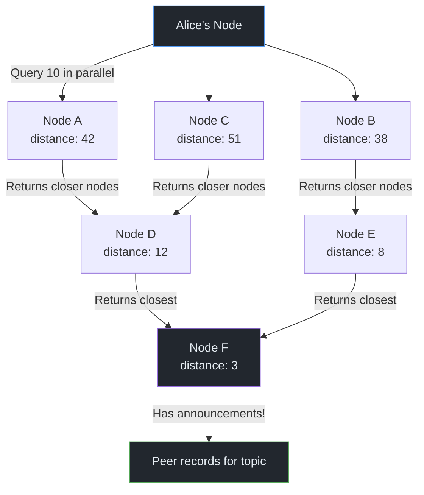
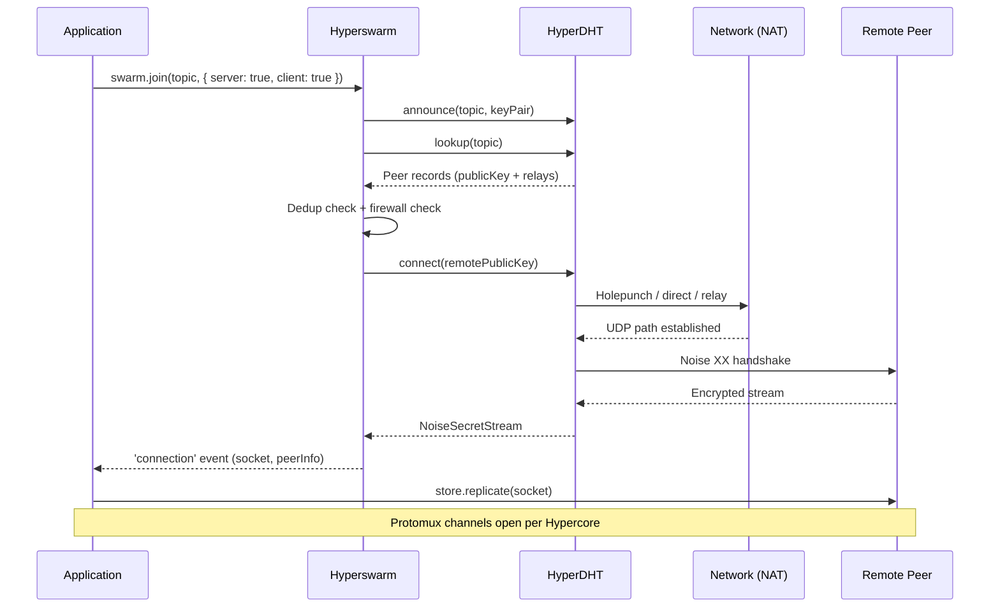

# P2P from Scratch — Part 5: Finding Peers

> "In a truly decentralized system, nobody needs to know everything — but everybody needs to know how to find someone who knows."
> — Petar Maymounkov & David Mazières, *Kademlia: A Peer-to-Peer Information System Based on the XOR Metric*

**Excerpt:** You have append-only logs, B-tree databases, encrypted pipes, and Merkle proofs. But none of it works if peers can't find each other. This post explains how HyperDHT uses a Kademlia routing table to locate peers across the Internet without a central server, how Hyperswarm manages the full lifecycle from discovery to connection, and why a single connection can serve dozens of Hypercores simultaneously.

<!-- Series Navigation -->
> **Series: P2P from Scratch — Building on the Holepunch Stack**
> [Part 1: The Internet is Hostile](part-1-nat-holepunching.md) | [Part 2: Encrypted Pipes](part-2-encrypted-pipes.md) | [Part 3: Append-Only Truth](part-3-hypercore-merkle.md) | [Part 4: From Logs to Databases](part-4-hyperbee-hyperdrive.md) | **Part 5: Finding Peers (You are here)** | [Part 6: Many Writers, One Truth](part-6-autobase-consensus.md) | [Part 7: Trust No One](part-7-security-trust.md) | [Part 8: Building for Humans](part-8-ux-production.md)

---

## Quick Recap

In Parts <a href="part-1-nat-holepunching.md">1</a>–<a href="part-2-encrypted-pipes.md">2</a>, we established encrypted connections through NATs. In Parts <a href="part-3-hypercore-merkle.md">3</a>–<a href="part-4-hyperbee-hyperdrive.md">4</a>, we built verified data structures on top: append-only logs, B-tree databases, and file systems. But none of it works if peers can't find each other.

---

## The Problem: No Server, No Directory

In the client-server world, finding a service is trivial. You type `api.example.com`, DNS resolves it to `93.184.216.34`, and you connect. The entire Internet is a giant phone book backed by a hierarchical authority.

In a peer-to-peer system, there is no phone book. Alice has a Hypercore she wants to share. Bob wants to replicate it. Neither knows the other's IP address. Neither is running a server with a domain name. Both are behind NATs (from <a href="part-1-nat-holepunching.md">Part 1</a>) and can't receive unsolicited connections.

They need a way to announce "I have this data" and discover "who else has this data" — without any single entity controlling the directory.

This is the peer discovery problem, and it's solved by a **distributed hash table** — a database spread across thousands of nodes where no single node holds the complete picture, but any node can find any record by asking the right neighbors.

---

## The Mental Model: A City Without Street Signs

Imagine a city with no street signs, no addresses, and no map. You need to find a specific house. But every resident knows their immediate neighbors, and every resident can tell you which of their neighbors lives *closest* to the area you're looking for.

You start by asking a random person. They point you to someone closer. That person points you to someone even closer. Within 5-6 hops, you're standing at the right door — even though no one in the chain knew the exact location, and no one had a complete map of the city.

This is how Kademlia works. "Closeness" isn't geographic — it's a mathematical function (XOR distance) over 256-bit identifiers. The routing is deterministic, logarithmic, and doesn't require any node to know the whole network.

> **Feynman Moment:** The analogy suggests a sequential chain of hops, but that undersells the engineering. In practice, HyperDHT queries up to 10 nodes *in parallel* from its routing table, then briefly narrows to 3 concurrent requests when chasing down closer nodes discovered from responses — giving the nearest nodes time to reply before flooding the network. Once enough responses arrive, concurrency opens back up. It's less like asking for directions one person at a time and more like shouting into a crowd, then focusing on the most promising leads. This parallelism is why lookups converge in seconds, not minutes.

---

## Kademlia: The Algorithm Behind the DHT

<a href="https://github.com/holepunchto/hyperdht" target="_blank">HyperDHT</a> implements a Kademlia-based distributed hash table, built on top of <a href="https://github.com/holepunchto/dht-rpc" target="_blank">dht-rpc</a>. Let's break down the core ideas.

### Node IDs and XOR Distance

Every node in the DHT has a 32-byte (256-bit) identifier. As we covered in <a href="part-1-nat-holepunching.md">Part 1</a>, node IDs are derived from network identity: `nodeID = BLAKE2b(publicIP + publicPort)`. You can't choose your position in the keyspace — the DHT validates your claimed ID against your observed address, preventing arbitrary keyspace placement.

> **Key distinction:** HyperDHT separates *routing identity* from *connection identity*. Routing IDs are derived from observed network addresses (for Sybil resistance and deterministic placement), while encrypted connections authenticate peers using Noise keypairs (from <a href="part-2-encrypted-pipes.md">Part 2</a>). The routing ID determines *where* you sit in the DHT; the Noise keypair determines *who* you are.

The "distance" between two IDs is their **XOR** — a bitwise operation that produces a new 256-bit value. Closer IDs share more leading bits. The distance between `1001...` and `1000...` (differing at bit 4) is smaller than between `1001...` and `1100...` (differing at bit 2).

> **Key Insight:** XOR distance is symmetric (`distance(A, B) = distance(B, A)`) and satisfies the triangle inequality. This means if A is close to B and B is close to C, then A and C aren't too far apart. This property is what makes Kademlia's routing work — each hop gets you genuinely closer to the target.

### K-Buckets: The Routing Table

Each node maintains a routing table organized into **buckets** indexed by distance. Bucket `i` holds nodes that share exactly `i` leading bits with your own ID. Since IDs are 256 bits, there are up to 256 possible buckets — though most stay empty in practice.

Each bucket holds up to **k = 20** nodes (the "k" in k-bucket). When a bucket is full and a new node wants to join, the DHT pings the oldest node — if it's still alive, the new node is discarded. This biases toward long-lived nodes, which are more likely to stay online.

```
Your node ID: 1010 0011 ...

Bucket 0: Nodes differing at bit 1 (0xxx xxxx ...) — far away, up to 20 nodes
Bucket 1: Nodes differing at bit 2 (11xx xxxx ...) — closer, up to 20 nodes
Bucket 2: Nodes differing at bit 3 (100x xxxx ...) — closer still
...
Bucket 7: Nodes differing at bit 8 (1010 0010 ...) — very close, up to 20 nodes
```

The key property: every node knows *more* about its neighborhood than about distant parts of the network. Bucket 0 covers half the keyspace but holds just 20 nodes. Bucket 7 covers 1/256th of the keyspace but also holds up to 20 nodes. This logarithmic compression is what makes Kademlia scale — a node with 20 entries per bucket can navigate a network of millions.

### How Lookups Work

When Alice wants to find peers on a topic, HyperDHT performs an **iterative lookup**:

1. Alice picks the `k = 20` closest nodes from her routing table to the topic
2. She sends parallel `FIND_NODE` requests to 10 of them simultaneously
3. Each responding node returns its own closest nodes to the topic (from its routing table)
4. Alice merges these results, discovering nodes even closer to the target
5. After initial responses arrive, concurrency drops to 3 — giving closer nodes priority
6. Repeat until no closer nodes are being discovered
7. The query converges on the 20 nodes in the entire network that are closest to the topic


*Figure 1: Iterative Kademlia lookup. Each round discovers closer nodes. Parallel queries accelerate convergence.*

Lookups scale as `O(log n)` — for a network of 10,000 nodes, the theoretical bound is about 13 sequential steps. In practice, because queries run in parallel and the routing table already contains nearby nodes, most HyperDHT lookups converge in 3–6 network round-trips.

---

## Topics: The DHT's Addressing Scheme

A **topic** is a 32-byte buffer — any 256-bit value. The DHT stores records at the 20 nodes closest to a given topic. Peers who want to find each other choose a shared topic and rendezvous there.

For Hypercore replication, the topic is the **discovery key** — a keyed BLAKE2b hash of the Hypercore's public key (from <a href="part-3-hypercore-merkle.md">Part 3</a>):

```
discoveryKey = BLAKE2b-256(key = publicKey, data = "hypercore")
```

The public key is the BLAKE2b **key** (the keyed-hash parameter), and the string `"hypercore"` is the **data** being hashed. This means only someone who already knows the public key can compute the discovery key — the hash is keyed to the identity.

This one-way derivation is critical for privacy. When you join a topic on the DHT, every routing node along the path sees the topic hash. If the topic were the raw public key, observers could learn which Hypercores you're interested in — and since the public key lets you verify the Ed25519 signatures that authenticate the Hypercore, your traffic patterns would reveal your data interests. With the discovery key, observers see only an opaque hash. You must already know the public key to compute the discovery key and find peers.

> **Key Insight:** Discovery keys separate *findability* from *access*. The DHT enables finding peers, but doesn't grant read access to the data. A node routing your lookup query learns *that* you're looking for something, but not *what* that something is. This is a meaningful privacy win over systems where the content hash is the lookup key.

### Announce and Lookup

Two operations make the DHT useful for peer discovery:

**Announce** — "I have this data, and here's how to reach me."

```js
const stream = node.announce(topic, keyPair, relayAddresses)
```

The node performs a lookup to find the 20 closest nodes to the topic, then stores a signed announcement at each of them. The announcement includes:

- The announcer's **public key** (for the Noise handshake)
- Up to **3 relay node addresses** (for holepunching coordination)
- A **cryptographic signature** proving keypair ownership (prevents impersonation)

Announcements have a two-phase structure: first find the closest nodes (with round-trip token collection), then commit the announcement with tokens proving you previously contacted each DHT node (preventing forged announcements from spoofed addresses).

**Lookup** — "Who has this data?"

```js
const stream = node.lookup(topic)
for await (const result of stream) {
  // result.peers = [{ publicKey, relayAddresses }]
}
```

The query walks the routing table toward the topic, collecting announcement records from nodes along the way. Each result yields the announcing peer's public key and relay addresses — everything needed to initiate a connection.

---

## Hyperswarm: From DHT to Connections

<a href="https://github.com/holepunchto/hyperswarm" target="_blank">Hyperswarm</a> wraps HyperDHT with connection lifecycle management. While HyperDHT handles the raw DHT operations, Hyperswarm handles the orchestration: when to search, when to connect, how to deduplicate, and when to retry.

### Joining a Topic

```js title="hyperswarm-join.js"
const Hyperswarm = require('hyperswarm')
const crypto = require('hypercore-crypto')

const swarm = new Hyperswarm()

// Derive a topic from a Hypercore's public key
const topic = crypto.discoveryKey(somePublicKey)

// Join as both server and client
const discovery = swarm.join(topic, { server: true, client: true })
await discovery.flushed() // Wait for initial announce + lookup to complete
```

The `server` and `client` flags control two independent behaviors:

| Mode | What It Does | DHT Operation | Who Connects |
|---|---|---|---|
| **Server** | Announces your keypair on the topic | `dht.announce()` | Others find and connect *to you* |
| **Client** | Searches the DHT for peers on the topic | `dht.lookup()` | You find and connect *to others* |
| **Both** (default) | Announces and searches simultaneously | Both | Bidirectional discovery |

Server mode creates a persistent presence on the DHT — periodic re-announcements (roughly every 10 minutes with jitter) keep your record fresh as DHT nodes churn. Client mode performs a one-time sweep (plus periodic refreshes) and queues discovered peers for connection.

> **Gotcha:** Server-side connections don't carry topic information. When Bob accepts an incoming connection, he doesn't know *which* topic Alice used to find him. Only client-side connections have the `peerInfo.topics` array. If your application needs to know the topic context, design the application-level handshake to exchange it (via a Protomux channel's handshake data, for example).

### Connection Deduplication

If you join 5 topics and discover the same peer on 3 of them, you don't get 3 connections. Hyperswarm enforces **single-connection-per-peer** semantics.

When a duplicate connection is detected:
1. If the existing connection has already exchanged data in both directions (`rawBytesRead > 0 && rawBytesWritten > 0`), the new connection wins — the peer must have lost the old one and is reconnecting
2. Otherwise, a deterministic tiebreaker — comparing public keys with `Buffer.compare()` — decides which side keeps the connection
3. The loser is destroyed with an `ERR_DUPLICATE` error
4. The winning connection's `peerInfo.topics` accumulates all relevant topics

This is why Protomux (from <a href="part-2-encrypted-pipes.md">Part 2</a>) is essential. One encrypted connection carries all protocol channels for all shared topics. Without multiplexing, deduplication would be impossible.

### The Connection Event

```js title="hyperswarm-connection.js"
swarm.on('connection', (socket, peerInfo) => {
  // socket: encrypted NoiseSecretStream (Duplex)
  // Already authenticated — Noise XX handshake completed

  console.log('Peer:', peerInfo.publicKey.toString('hex').slice(0, 8))
  console.log('Topics:', peerInfo.topics.length)   // Client-side only
  console.log('Client?', peerInfo.client)           // true = we initiated

  // Replicate a Corestore over this connection
  store.replicate(socket)
})
```

By the time the `connection` event fires, the full pipeline from <a href="part-1-nat-holepunching.md">Part 1</a> and <a href="part-2-encrypted-pipes.md">Part 2</a> has already executed: NAT traversal, Noise XX handshake, and session key derivation. The socket is an encrypted Duplex stream ready for application data.

---

## Persistent Peers: joinPeer

Topic-based discovery is great when you don't know who has the data. But sometimes you *do* know — you want to stay connected to a specific peer regardless of topics.

```js title="hyperswarm-joinpeer.js"
// Connect to a specific peer by their Noise public key
swarm.joinPeer(bobPublicKey)

// Stop pursuing this peer
swarm.leavePeer(bobPublicKey)
```

`joinPeer()` marks a peer as **explicit** — Hyperswarm will connect immediately and reconnect automatically if the connection drops. No topic required. This is how applications maintain stable connections to known collaborators (like co-authors in a shared document) even through network disruptions.

Explicit peers are retried with increasing backoff delays on failure, and the swarm continues attempting to connect until `leavePeer()` is called.

---

## The Full Peer Lifecycle

Here's the complete journey from "I want that data" to "I'm replicating it":


*Figure 2: The full peer lifecycle — from topic join to Hypercore replication.*

Each stage can fail independently — the DHT lookup might find no peers, holepunching might fail and fall back to relay, the firewall callback might reject the peer. Hyperswarm handles these failures with retries and fallbacks so the application only sees the final result: a working connection or a timeout.

### Configuration Knobs

```js
const swarm = new Hyperswarm({
  maxPeers: 64,         // Total connection limit (default)
  maxParallel: 3,       // Concurrent connection attempts (default)
  maxClientConnections: Infinity,
  maxServerConnections: Infinity,
  firewall (remotePublicKey, payload) {
    // Return true to reject, false to accept
    // payload contains the remote handshake data (null for client-side checks)
    return bannedKeys.has(remotePublicKey.toString('hex'))
  }
})
```

The `firewall` callback executes synchronously during connection negotiation — before resources are allocated. It receives the remote peer's Noise public key and handshake payload, letting you implement allowlists, blocklists, or any custom access control logic.

---

## How Discovery Connects to Replication

Discovery and replication are deliberately separate layers. Discovery answers "who's out there?" Replication answers "what data do we exchange?" The connection between them is the Corestore replication call:

```js title="discovery-to-replication.js"
const Corestore = require('corestore')
const Hyperswarm = require('hyperswarm')

const store = new Corestore('./my-storage')
const swarm = new Hyperswarm()

// Open a Hypercore (from Part 4's Corestore)
const core = store.get({ name: 'my-data' })
await core.ready()

// Join its discovery key as a topic
swarm.join(core.discoveryKey, { server: true, client: true })

swarm.on('connection', (socket) => {
  // Replicate ALL cores in the store over this single connection
  store.replicate(socket)
})

// Wait for the topic to be fully announced
await swarm.flush()
```

When `store.replicate(socket)` is called, Corestore wraps the encrypted socket in a Protomux instance. For each Hypercore the local store knows about, it opens a Protomux channel with protocol `hypercore/alpha` and the Hypercore's discovery key as the channel ID. The remote side's Corestore does the same. Channels pair automatically when both sides know the same Hypercore.

This is why a single connection can serve dozens of Hypercores — each gets its own Protomux channel with independent replication state, all multiplexed over the one encrypted stream from <a href="part-2-encrypted-pipes.md">Part 2</a>.

> **Feynman Moment:** There's a subtlety in how existing Hypercores propagate across connections. When Alice replicates a Corestore with Bob, and Bob starts replicating a Hypercore that Alice has in her local storage but hasn't opened yet, Bob opens a Protomux channel for it. Alice's Corestore sees the discovery key, finds the matching core in storage, loads it, and joins the channel. The replication is reactive — neither side needs to coordinate "let's sync core X now." The Protomux channel pairing handles it automatically. Note: Corestore only auto-loads cores it already knows about — it won't create a brand new core just because a peer announced an unknown discovery key. This is what makes multi-core systems like Hyperdrive (Part 4) and Autobase (Part 6) work seamlessly.

---

## Bootstrap and Network Entry

A new node joining the DHT needs at least one known address to start. HyperDHT ships with three public bootstrap nodes:

```
node1.hyperdht.org:49737
node2.hyperdht.org:49737
node3.hyperdht.org:49737
```

The bootstrap process:

1. **Connect** to bootstrap nodes and exchange routing information
2. **Discover** your own public IP and port (bootstrap nodes report how they see you)
3. **Compute** your node ID: `BLAKE2b(publicIP + publicPort)`
4. **Populate** your routing table from bootstrap responses
5. **Transition** from ephemeral to persistent mode (~20 minutes of stable uptime)

For private networks (testing, corporate deployments), you can run your own bootstrap nodes by starting a DHT node with `bootstrap: []` and pointing other nodes to it.

---

## The Tradeoffs

| What You Gain | What You Pay |
|---|---|
| Fully decentralized peer discovery — no single point of failure | DHT lookups take seconds, not milliseconds (multiple network round-trips) |
| Topic-based rendezvous without central coordination | 32-byte topic must be shared out-of-band (or derived from a known key) |
| Connection deduplication across topics | Server-side connections lack topic context |
| Automatic reconnection via `joinPeer()` | Reconnection backoff adds latency after disconnection |
| Privacy via discovery keys (observers can't infer content) | DHT routing nodes see *that* you're searching, just not *what* for |
| Single encrypted connection serves all Hypercores | Connection setup cost is amortized — but the first connection is slow |
| 20-minute ephemeral period resists Sybil attacks | New nodes can't serve DHT queries immediately |

---

## Key Takeaways

- **HyperDHT implements Kademlia with k=20 buckets, XOR distance, and iterative parallel lookups.** Queries start with 10 concurrent requests and narrow to 3 as closer nodes respond. A lookup converges in a few round-trips, even in networks of thousands of nodes.

- **Topics are 32-byte buffers — typically Hypercore discovery keys.** `announce(topic)` stores a signed record at the 20 closest nodes. `lookup(topic)` retrieves those records. The discovery key's one-way derivation hides which Hypercore you're interested in.

- **Hyperswarm wraps HyperDHT with connection lifecycle management.** `join(topic)` handles announcement, lookup, connection, deduplication, and retry. A single connection per peer serves all shared topics via Protomux channels.

- **Server mode announces; client mode searches.** Server-side connections don't carry topic information. Client-side connections include the topics array. Most applications use both modes simultaneously.

- **`joinPeer()` provides persistent, topic-independent connections.** Hyperswarm reconnects automatically with exponential backoff. Use this for known collaborators who should always be connected.

- **Discovery feeds into replication through Corestore.** `store.replicate(socket)` opens Protomux channels for every known Hypercore. New Hypercores discovered during replication are loaded and joined automatically.

---

## What's Next

We can find peers, connect securely, and replicate data. But everything so far has been **single-writer** — one keypair signs one Hypercore, and everyone else is a reader.

In <a href="part-6-autobase-consensus.md">Part 6</a>, we'll tackle the hardest problem in distributed systems: multiple writers. Autobase takes multiple independent Hypercores — each written by a different peer — and linearizes them into a single, consistent view using causal ordering and quorum consensus. This is where P2P applications go from "read-only mirrors" to "collaborative systems."

---

## References & Further Reading

1. <a href="https://github.com/holepunchto/hyperdht" target="_blank">holepunchto/hyperdht — DHT with keypair-authenticated connections and NAT traversal</a>
2. <a href="https://github.com/holepunchto/hyperswarm" target="_blank">holepunchto/hyperswarm — High-level peer discovery and connection management</a>
3. <a href="https://github.com/holepunchto/dht-rpc" target="_blank">holepunchto/dht-rpc — Low-level Kademlia DHT with Sybil-resistant node IDs</a>
4. <a href="https://pdos.csail.mit.edu/~petar/papers/maymounkov-kademlia-lncs.pdf" target="_blank">Kademlia: A Peer-to-Peer Information System Based on the XOR Metric (2002)</a>
5. <a href="https://github.com/holepunchto/hypercore-crypto" target="_blank">holepunchto/hypercore-crypto — Discovery key generation (BLAKE2b)</a>
6. <a href="https://github.com/holepunchto/corestore" target="_blank">holepunchto/corestore — Multi-Hypercore management (from Part 4)</a>
7. <a href="https://github.com/holepunchto/protomux" target="_blank">holepunchto/protomux — Protocol multiplexing (from Part 2)</a>
8. <a href="https://en.wikipedia.org/wiki/Kademlia" target="_blank">Wikipedia — Kademlia</a>
9. <a href="https://docs.pears.com/" target="_blank">Pear Runtime Documentation</a>

---

> **Series: P2P from Scratch — Building on the Holepunch Stack**
> [Part 1: The Internet is Hostile](part-1-nat-holepunching.md) | [Part 2: Encrypted Pipes](part-2-encrypted-pipes.md) | [Part 3: Append-Only Truth](part-3-hypercore-merkle.md) | [Part 4: From Logs to Databases](part-4-hyperbee-hyperdrive.md) | **Part 5: Finding Peers (You are here)** | [Part 6: Many Writers, One Truth](part-6-autobase-consensus.md) | [Part 7: Trust No One](part-7-security-trust.md) | [Part 8: Building for Humans](part-8-ux-production.md)
