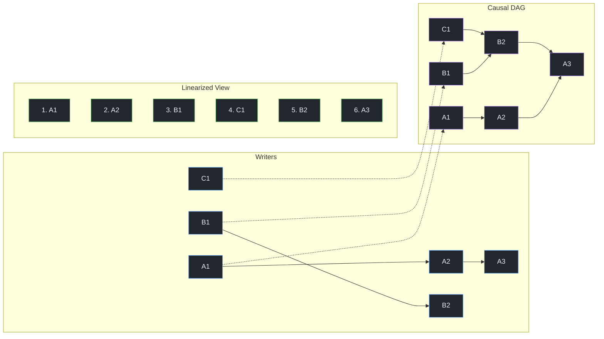

# P2P from Scratch — Part 6: Multi-Writer Consensus with Autobase

> "A distributed system is one in which the failure of a computer you didn't even know existed can render your own computer unusable."
> — Leslie Lamport

**Excerpt:** Everything in the series so far has been single-writer: one keypair signs one Hypercore, and everyone else is a reader. But real collaboration requires multiple writers — and the moment two people can write concurrently, you face the hardest problem in distributed systems: ordering. Autobase takes independent Hypercores from different writers and linearizes them into a single, deterministic view using causal DAGs and quorum consensus. This post explains how.
<!-- meta-description: How Autobase linearizes multiple Hypercore writers into one deterministic view using causal DAGs and quorum consensus. With code examples. -->
<!-- meta-labs: p2p-one-truth p2p-quorum -->

<!-- Series Navigation -->
> **Series: P2P from Scratch — Building on the Holepunch Stack**
> [Part 1: NAT Hole Punching Explained](part-1-nat-holepunching.md) | [Part 2: P2P Encryption with the Noise Protocol](part-2-encrypted-pipes.md) | [Part 3: Merkle Trees and Append-Only Logs](part-3-hypercore-merkle.md) | [Part 4: Building P2P Databases with Hyperbee and Hyperdrive](part-4-hyperbee-hyperdrive.md) | [Part 5: Peer Discovery with Kademlia DHT](part-5-dht-discovery.md) | **Part 6: Multi-Writer Consensus with Autobase (You are here)** | [Part 7: P2P Security — Threats, Defenses, and Trust](part-7-security-trust.md) | [Part 8: Offline-First UX for P2P Applications](part-8-ux-production.md)

---

> **Verified against:** autobase 7.28.1 · hypercore 11.35.2 · hyperbee 2.27.3 — checked 2026-09-03. Every constant, default and byte count in this post is asserted in [`verify/`](https://github.com/heart-IT/p2p-from-scratch-labs/tree/main/verify), which installs whatever Holepunch publishes today and fails if the stack has moved.

## Quick Recap

In Parts <a href="part-3-hypercore-merkle.md">3</a>–<a href="part-4-hyperbee-hyperdrive.md">4</a>, we built single-writer data structures: Hypercores, Hyperbee databases, and Hyperdrives. In <a href="part-5-dht-discovery.md">Part 5</a>, we connected peers via DHT discovery. But everything so far has one keypair per log — one writer, many readers.

---

## The Multi-Writer Problem: Why One Hypercore Isn't Enough

A Hypercore is powerful, but by default it has a fundamental constraint: one keypair, one writer. The owner of the Ed25519 secret key is the only person who can append blocks. Everyone else is a verifier. (A Hypercore 11 manifest can list several signers with a quorum — that is how Autobase signs its own view core — but that still produces one linear log, not concurrent independent writers.)

This works for publishing — one author, many readers. But think about a shared document, a group chat, or a collaborative database. Alice, Bob, and Carol each need to write. They're on different continents, behind different NATs, often offline. When they reconnect, their independent histories need to merge into a coherent whole.

You can't just throw three Hypercores at the problem. Each core has its own ordering, its own signature chain, its own Merkle tree. If Alice writes "set salary to 50k" and Bob writes "set salary to 60k" at the same time, which one wins? Both are cryptographically valid. Neither references the other. Without a server to timestamp them, there's no natural ordering.

This is the multi-writer problem. And the naive solutions all fail:

- **Last-write-wins** — requires synchronized clocks (which P2P doesn't have)
- **Lock-based coordination** — requires always-on connectivity (which P2P doesn't guarantee)
- **Leader election** — requires a majority to be online (which P2P apps shouldn't assume)

> **Key Insight:** The multi-writer problem isn't about resolving conflicts — it's about *ordering*. Once you have a deterministic total order over all events from all writers, conflict resolution becomes application logic. The hard part is getting every peer to agree on the same order, despite seeing events arrive in different sequences.

---

## The Mental Model: Many Streams, One River

Imagine three tributaries flowing into a single river. Each tributary carries water (events) from a different mountain (writer). Where two tributaries meet, the water merges. Downstream, a single river flows — and everyone standing at the river sees the same water in the same order.

The tributaries are independent Hypercores. The merge points are the places where one writer references another's work. The river is the linearized view — a single ordered sequence that every peer computes identically.

> **Feynman Moment:** The analogy hides the hardest part: in a real river, physics determines the merge. In a distributed system, *consensus* determines it. Two peers who have seen different subsets of the tributaries might temporarily disagree about the river's ordering. Autobase solves this with a quorum mechanism — once a majority of designated writers have acknowledged a merge point, and a majority have seen that acknowledgement, the ordering at that point becomes permanent — as long as no rival quorum is racing it. Before the quorum confirms it, the ordering is provisional and may change as new information arrives.

---

## Autobase: Architecture Overview

<a href="https://github.com/holepunchto/autobase" target="_blank">Autobase</a> is the Holepunch stack's answer to multi-writer collaboration. It takes multiple independent Hypercores — each written by a different peer — and produces a single, deterministic, linearized view.

The core components:

```
┌──────────────────────────────────────────────────────────┐
│                      Autobase                             │
│                                                           │
│  Writer Hypercores (inputs)         Linearized View       │
│  ┌──────────┐                      ┌─────────────────┐   │
│  │ Alice's   │──┐                  │ View Hypercore   │   │
│  │ core      │  │   ┌──────────┐   │ (output)         │   │
│  └──────────┘  ├──▶│ Causal   │──▶│                  │   │
│  ┌──────────┐  │   │ DAG +    │   │ Deterministic    │   │
│  │ Bob's     │──┤   │ Quorum   │   │ total ordering   │   │
│  │ core      │  │   │ Consensus│   │ of all events    │   │
│  └──────────┘  │   └──────────┘   │                  │   │
│  ┌──────────┐  │                   │ apply() builds   │   │
│  │ Carol's   │──┘                  │ state from this  │   │
│  │ core      │                     └─────────────────┘   │
│  └──────────┘                                            │
│                                                           │
│  All managed by a single Corestore                       │
└──────────────────────────────────────────────────────────┘
```

Each writer appends to their own Hypercore — they never write to anyone else's. Autobase reads all writer cores, arranges their entries into a causal DAG, linearizes the DAG into a total order, and feeds the ordered entries through a user-defined `apply` function that builds the view.

---

## The Causal DAG: Tracking What Happened Before What

<!-- vg:autobase/causal-dag-pipeline stepper -->

When Alice appends an entry to her Hypercore, she doesn't just write her data — she also records which entries from other writers she has seen. These references create a **directed acyclic graph** where edges represent the "happens-before" relationship.

### How It Works

Every entry (node) in the DAG carries:

| Field | Description |
|-------|-------------|
| **value** | The user's data (encoded via `valueEncoding`) |
| **heads** | References (`{ key, length }`) to the current DAG heads at the time of writing |
| **clock** | A vector clock Autobase derives in memory from `heads` — not stored in the block |
| **writer** | Which writer produced this node (`node.from` in `apply`) |
| **length** | Position within that writer's core, counted from 1 — the core's length after this entry |

On disk the node inside a block is just `{ heads, batch, value }` — clock, writer and length are rebuilt when the DAG is loaded. The block wrapping it also carries a version, a digest, and, for indexers, a checkpoint.

The `heads` field is the causal link. When Alice writes her third entry, she records whatever DAG heads she currently knows about — perhaps Bob's second entry and her own previous entry. This means Alice's third entry *causally depends on* (happens after) Bob's second entry.

```
Alice:   [A1] ─────────── [A2] ─────────── [A3]
                                            /
Bob:                [B1] ─── [B2] ────────┘
                             /
Carol:              [C1] ───┘
```

In this DAG, `A3` references `B2` as a head, so `A3` happens-after `B2`. And `B2` references `C1`, so `B2` happens-after `C1`. The transitive chain gives us: `C1 → B2 → A3`.

But `A2` and `B1` might not reference each other at all — they were written concurrently by peers who hadn't yet seen each other's work. These are **causally concurrent** events, and ordering them is where linearization comes in.

### Vector Clocks

Each node gets a **vector clock** — a map from *indexer* public keys to positions, built in memory by merging the clocks of all referenced heads. Non-indexing writers never appear in a clock; their entries are placed through `heads` alone. With Alice, Bob, and Carol all indexers:

```
Node A3's clock:
  Alice:  3  (A3 is Alice's 3rd entry)
  Bob:    2  (A3 has transitively seen up to Bob's 2nd entry)
  Carol:  1  (A3 has transitively seen up to Carol's 1st entry)
```

The clock answers a key question: `clock.includes(writerKey, length)` — "has this node (directly or transitively) seen the given writer's first `length` entries?" This is how Autobase determines causal ordering without synchronized timestamps.

> **Terminology:** The **happens-before** relationship (written `a → b`) means event `a` is in event `b`'s causal history. If `a → b`, then `b` has seen `a` (directly or transitively). If neither `a → b` nor `b → a`, the events are **concurrent** — they were produced independently without knowledge of each other.

---

## Linearization: From DAG to Total Order

A causal DAG gives you a *partial* order — you know that `C1` comes before `B2`, and `B2` comes before `A3`. But concurrent events like `A2` and `B1` have no causal ordering. To build a useful view (like a Hyperbee key-value store), you need a **total order** — every event has a definite position.

Autobase linearizes the DAG using two rules:

1. **Causal ordering is preserved.** If `a → b`, then `a` appears before `b` in the linearized output. This is non-negotiable — the laws of causality are respected.

2. **Concurrent events are ordered deterministically.** When two events are causally concurrent, Autobase breaks the tie with a deterministic comparison — at a minimum, `Buffer.compare(writerA.key, writerB.key)` (lexicographically smaller keys go first). The actual linearizer is more sophisticated, using batch boundaries and DAG structure in addition to key comparison, but the principle is the same: a deterministic rule that every peer applies identically.

The result is a single ordered sequence that every peer computes identically — regardless of the order in which they received the events. Two peers who have seen the same set of events will always produce the same linearization.

```
DAG:                     Linearized (key A < key B < key C):
  A1 ─── A2              1. A1  (concurrent with B1/C1, lowest key)
  B1 ─── B2              2. A2  (depends on A1; still concurrent with B1/C1, lowest key)
  C1                      3. B1  (concurrent with C1, key tiebreak)
                          4. C1
A3 ─┐ depends on         5. B2  (depends on B1, C1)
    │ B2 and A2           6. A3  (depends on A2, B2)
```

Here's how the transformation works visually — from independent writer cores through the causal DAG to a single ordered sequence:



*Figure 1: From independent writer cores (blue) through the causal DAG (purple) to the deterministic linearized view (green). Concurrent events (like A2, B1, C1) are ordered by lexicographic key comparison — here Alice's key sorts lowest, so A2 lands before B1 even though it was written later.*

Notice that the DAG preserves all causal relationships — B2 depends on C1, and A3 depends on B2. The linearization respects these dependencies. Only the ordering of *concurrent* events (those with no causal relationship) is decided by the tiebreaker.

> **Key Insight:** The tiebreaker being the public key means the ordering is deterministic and verifiable — no randomness, no timestamps, no coordination. Any peer who knows the same set of events will produce the exact same sequence. The choice of lexicographic key comparison is arbitrary but consistent, which is all that matters.

---

## The Apply Function: Building State from History

Autobase doesn't just order events — it builds a *view* from them. The view is typically a Hyperbee (from <a href="part-4-hyperbee-hyperdrive.md">Part 4</a>) that represents the current application state.

Two user-defined functions control this:

### open(store, host)

Creates the view data structure. Autobase calls it at construction — that result is `base.view` — and again, internally, whenever it rebuilds its apply state, so keep it cheap and derive everything from `store`.

```js
function open (store, host) {
  // Return a view backed by a named Hypercore
  return store.get('my-view', { valueEncoding: 'json' })
}
```

The `store` is an `AutoStore` that provides `store.get(name)` to create named Hypercores for the view. The `host` argument is a thin handle on the base — `host.key`, `host.discoveryKey`, `host.id` — not the Autobase instance itself; its writer-management calls only work inside `apply`. The returned object becomes `base.view`.

### apply(nodes, view, host)

Processes linearized events and updates the view. Called repeatedly as new events are linearized.

```js
async function apply (nodes, view, host) {
  for (const node of nodes) {
    if (node.value === null) continue  // acks never reach apply; guard only against your own null payloads

    const { value } = node

    // Handle writer management
    if (value.addWriter) {
      await host.addWriter(Buffer.from(value.addWriter, 'hex'), { indexer: true })
      continue
    }

    // Handle application data
    await view.append(value)
  }
}
```

The `host` argument provides side-effect methods:
- `host.addWriter(key, { indexer })` — add a new writer
- `host.removeWriter(key)` — remove a writer

> **Gotcha:** The `apply` function must be **pure and deterministic**. It must only modify the `view` argument — no external state, no network calls, no `Date.now()`, no `Math.random()`. Why? Because Autobase may *undo and replay* the apply function during reordering. If apply wrote to an external database, the undo wouldn't roll back that write. If apply used `Date.now()`, two replays would produce different results. Purity is a design contract, not runtime-enforced — Autobase won't throw if you break it, but your application state will silently diverge between peers.

> **Note:** When you genuinely need a timestamp inside `apply`, derive it from the view rather than a wall clock — `view.length` at the moment you append, or a counter you keep in the view. Nodes carry no view-position field — `node.length` is the position in the *writer's* core, not the view — and a node's position isn't fixed until the indexers confirm it: a concurrent write can arrive later and sort earlier, in which case Autobase truncates the view and calls `apply` again for the same node at its new position. Because the view is rewound with the reordering, a value like `view.length * 1000 + slotOffset` is a monotonic, replica-skew-free clock that every peer agrees on once the node is confirmed. Reach for `Date.now()` only *outside* `apply` — when projecting a confirmed view to the user.

---

## Writer Roles: Not Everyone Votes

<!-- vg:autobase/writer-management -->

Autobase defines three roles for writers, each with different consensus participation:

### Indexing Writers (Indexers)

Their references count toward quorum. Only indexers can advance the consensus frontier. When an indexer appends a node that references other nodes, that reference is a **vote** — it signals "I have seen these events."

Indexers are the consensus participants. A quorum is a strict majority — `floor(n/2) + 1` — so ties can't happen, but still use odd numbers (3, 5, 7): a fourth indexer raises the quorum to 3 without letting you lose any more nodes than 3 indexers already do.

### Non-Indexing Writers

Submit entries that are included in the DAG and the linearized view, but don't count toward quorum. Their references don't advance consensus.

Use this for client-server patterns: servers are indexers (they determine ordering), clients are non-indexing writers (they submit data but don't vote). This keeps the quorum small and fast while allowing many contributors.

### Relayed Writers

Entries appear only when referenced by a confirmed node from another writer. Relayed writers can never be the "head" of the DAG — their entries are only visible after an indexer or non-indexer includes them. (This role is defined in the <a href="https://github.com/holepunchto/autobase/blob/main/DESIGN.md" target="_blank">Autobase DESIGN.md</a> but is not yet a distinct API option — the current `addWriter` API only distinguishes indexing vs. non-indexing writers.)

Use this for untrusted submitters: their data enters the system only if a trusted writer vouches for it.

```js title="writer-roles.js"
async function apply (nodes, view, host) {
  for (const { value } of nodes) {
    if (value.type === 'add-indexer') {
      // Full consensus participant
      await host.addWriter(Buffer.from(value.key, 'hex'), { indexer: true })
    }
    if (value.type === 'add-contributor') {
      // Writes data but doesn't vote
      await host.addWriter(Buffer.from(value.key, 'hex'), { indexer: false })
    }
    // ... handle application data ...
  }
}
```

> **Gotcha:** When a *new* peer joins a running system, don't make them an indexer — and note that `host.addWriter(key)` does exactly that by default. Pass `{ indexer: false }`: the peer can append freely, and their blocks sit in the DAG as pending until an existing indexer's next node references them — any normal append does, and so does the `null` ack Autobase writes on its `ackInterval` timer (10 s by default) or when you call `base.ack()`. Promoting an unknown peer straight to indexer inflates the quorum (a majority of the indexer set) and risks stalls if they go offline before contributing acks. Reserve `indexer: true` for the operator-managed core set. (`host.ackWriter(key)` is a different tool: it accepts an *optimistic* block from a peer who isn't a writer at all.)

> **Key Insight:** Writer roles separate *write access* from *consensus participation*. A chat app might have hundreds of users (non-indexing writers) but only 3-5 server nodes as indexers. The ordering converges quickly because the quorum is small, while all users can still contribute messages.

---

## Quorum Consensus: When Does Ordering Become Permanent?

This is the hardest part of Autobase — and the part that makes it fundamentally different from simpler multi-writer systems like CRDTs. Note that Autobase does not run a traditional leader-based consensus algorithm like Raft or Paxos. The ordering itself is deterministic — consensus determines *when* that ordering becomes permanently confirmed.

### The Problem

The linearized order of concurrent events depends on which events you've seen. If Alice has seen events `{A1, B1}` and Bob has seen events `{A1, B1, C1}`, they might compute different orderings for the concurrent events. As more information arrives, the ordering can change — events that were in position 3 might shift to position 5.

This is fine for unconfirmed data. But at some point, the ordering needs to become permanent — otherwise applications can never safely act on it.

### Votes and Quorum

A **vote** is a reference from an indexer to a node. When indexer Alice appends an entry that references Bob's entry, Alice has voted for Bob's entry — she's saying "I've seen this."

**Single quorum:** A node achieves single quorum when a majority of indexers have (directly or transitively) referenced it. With 3 indexers, that's 2 out of 3.

**Double quorum:** A node achieves double quorum when a majority of indexers are aware of the single quorum — meaning a majority have seen that a majority has voted.

**Why double?** A single quorum isn't enough. Consider 3 indexers: Alice, Bob, Carol. Alice and Bob might form a quorum around one ordering, while Bob and Carol form a quorum around a different ordering. Bob is in both quorums — a single quorum doesn't guarantee consistency.

Double quorum solves this: if a majority know that a majority has voted, then any future majority must include someone who knows about the earlier quorum. This creates a chain of awareness that forces convergence.

> **Feynman Moment:** Think of it like a jury. Single quorum is "7 out of 12 jurors agree." But what if there was a communication breakdown and two groups of 7 formed with only 2 overlapping members? Double quorum is "7 jurors agree, and 7 jurors know that 7 jurors agree." Now any future group of 7 must include someone who knows the earlier verdict. The information can't be lost.

### The Confirmation Rule

As described in the <a href="https://github.com/holepunchto/autobase/blob/main/DESIGN.md" target="_blank">Autobase DESIGN.md</a>, a node's ordering becomes immutable once it achieves a quorum degree **2 higher** than any competing quorum. In the common case with no competing quorums, this means double quorum is sufficient. But if two concurrent branches both achieve single quorum independently, each needs to reach triple quorum (degree 3) to resolve the race. These rules may evolve as Autobase matures.

In practice, with 3 indexers actively acknowledging each other, confirmation happens within a few round-trips after all indexers have seen the events.

### ack() — The Consensus Engine

If indexers only write when they have application data, consensus stalls — there's no mechanism for indexers to signal "I've seen your work." The `ack()` method solves this by appending a null entry that carries only causal references:

```js
const base = new Autobase(store, bootstrap, {
  open,
  apply,
  ackInterval: 1000  // Auto-ack every 1 second
})
```

When an ack is written:
1. A `null` value is appended to the local writer's core
2. The null node records the current DAG heads as dependencies
3. This reference serves as a vote, advancing the quorum

`ack()` is not unconditional: it appends when the linearizer decides a fresh reference would help — another writer's head that your last node hasn't seen, or a node one vote short of quorum — or when this indexer still owes a checkpoint signature, and returns without writing otherwise. Non-indexers never write acks. The `ackInterval` option (default: 10 seconds) runs that same check on a timer. Acks aren't the only votes, either: every ordinary append by an indexer carries heads too, so a base whose indexers write data steadily confirms without them. Acks are what keeps the quorum moving when indexers have nothing else to say.

> **Gotcha:** Ack nodes never reach your `apply` function — Autobase drops `null`-valued nodes before building the batch, so `apply` only ever sees real application data. Their causal references still do their job; the linearizer reads them from the DAG, not from `apply`. If you ever see `null` in `apply`, it's your own payload, not an ack.

---

## Reordering: The Price of Decentralization

<!-- vg:autobase/view-rebuild -->

Here's the uncomfortable truth about multi-writer P2P: ordering can change. Before quorum confirmation, the linearized order of events is provisional. When new causal information arrives — a previously unseen writer's entries, or a new reference chain — Autobase may need to reorder events.

### What Happens During a Reorder

1. New events arrive (via replication) that reveal a previously unknown causal dependency
2. Autobase computes the new correct linearization
3. Events that were already applied may need to move to different positions
4. Autobase **truncates** the view back to the divergence point
5. Autobase **re-applies** events in the new correct order through the `apply` function

This is why `apply` must be pure and deterministic — it might be called multiple times with different orderings of the same events. And this is why `open` must return a view derived solely from its `store` argument — the view must be reconstructable from the apply history alone.

### signedLength vs. length

A Hypercore view exposes two length markers:

| Property | Meaning |
|----------|---------|
| `base.view.length` | Total view entries including the unconfirmed tip |
| `base.view.signedLength` | View entries signed by an indexer quorum (will never reorder) |

Everything between `view.signedLength` and `view.length` is provisional — it represents the best current guess at the ordering, but it may change. Everything before `view.signedLength` is permanent. (`base.length` and `base.signedLength` exist too, but they measure Autobase's internal *system* core, not your view — never mix them with `base.view.length`.) One more trap: those two markers belong to the Hypercore `open` returns. If `open` wraps it — a Hyperbee, as in the example below — `base.view.length` and `base.view.signedLength` are `undefined` and `base.view.get(0)` is a key lookup, not an index lookup; read `base.view.core.length` and `base.view.core.signedLength` instead. The same goes for `view.length` inside `apply`.

```js title="ordering-awareness.js"
await base.update()

const confirmed = base.view.signedLength
const total = base.view.length
const provisional = total - confirmed

console.log(`${confirmed} confirmed, ${provisional} provisional entries`)

// Safe to act on confirmed data
for (let i = 0; i < confirmed; i++) {
  const entry = await base.view.get(i)
  // This entry's position will never change
}

// Provisional data may reorder
for (let i = confirmed; i < total; i++) {
  const entry = await base.view.get(i)
  // This entry's position is tentative
}
```

### UX Implications

Reordering is invisible at the data layer — Autobase handles it automatically. But the *application* must be reordering-aware:

- **Don't show sequence numbers to users.** Position 42 today might be position 44 tomorrow. Use content-derived identifiers instead.
- **Show provisional data differently.** Entries before `signedLength` are settled. Entries after are tentative. A subtle visual indicator (like a "pending" badge) prevents user confusion when entries shuffle.
- **Never send external side effects from provisional data.** Don't send emails, trigger webhooks, or update external systems based on unconfirmed ordering. Wait for `signedLength` to advance.

---

## In Practice: Building a Multi-Writer App

Here's a complete example of a collaborative key-value store using Autobase with Hyperbee:

```js title="multi-writer-kv.js"
const Corestore = require('corestore')
const Autobase = require('autobase')
const Hyperbee = require('hyperbee')
const Hyperswarm = require('hyperswarm')

// --- Handlers ---

function open (store, host) {
  // The view is a Hyperbee for sorted key-value access
  return new Hyperbee(store.get('view'), {
    keyEncoding: 'utf-8',
    valueEncoding: 'json'
  })
}

async function apply (nodes, view, host) {
  // Process linearized nodes in order
  const batch = view.batch()

  for (const node of nodes) {
    if (node.value === null) continue  // acks never reach apply; guard only against your own null payloads

    const { type, key, value } = node.value

    if (type === 'add-writer') {
      await host.addWriter(Buffer.from(key, 'hex'), { indexer: value.indexer })
      continue
    }

    if (type === 'put') await batch.put(key, value)
    if (type === 'del') await batch.del(key)
  }

  await batch.flush()
}

// --- Setup ---

const store = new Corestore('./my-storage')
const base = new Autobase(store, null, {
  open,
  apply,
  valueEncoding: 'json',
  ackInterval: 1000
})
await base.ready()

// Join the network
const swarm = new Hyperswarm()
swarm.on('connection', (socket) => base.replicate(socket))
swarm.join(base.discoveryKey, { server: true, client: true })
await swarm.flush()

// --- Write data ---

await base.append({ type: 'put', key: 'alice', value: { role: 'admin' } })
await base.append({ type: 'put', key: 'bob', value: { role: 'editor' } })

// --- Read from the linearized view ---

await base.update()
const entry = await base.view.get('alice')
console.log(entry.value)  // { role: 'admin' }
```

A second peer joins by passing the first peer's key as the bootstrap:

```js title="multi-writer-peer-b.js"
const base = new Autobase(store, peerAKey, {
  open,
  apply,
  valueEncoding: 'json',
  ackInterval: 1000
})
await base.ready()

// Peer A must add Peer B as a writer (via apply)
// Peer A appends: { type: 'add-writer', key: base.local.key.toString('hex'), value: { indexer: true } }
```

Writer addition happens *through* the `apply` function — the first writer appends a message that the `apply` handler interprets as an `addWriter` call. This makes writer management itself part of the causal history, which means it's ordered and consistent with everything else.

---

## Fast-Forward: Catching Up Efficiently

When a peer has been offline for a long time, replaying the entire DAG history through `apply` would be expensive. Autobase supports **fast-forward**: if the confirmed checkpoint has advanced significantly, a behind peer can jump directly to the checkpoint state without replaying intermediate history.

This works because confirmed data (before `signedLength`) is immutable — the view at that point has been signed by a quorum of indexers. A behind peer can verify the checkpoint cryptographically (Hypercore's Merkle proofs validate every block retrieved) and start processing only from the checkpoint forward.

Fast-forward is enabled by default (`fastForward: true` in the constructor). It triggers automatically when a peer's signed checkpoint is at least 16 system-core blocks ahead of your local copy; a failed attempt is retried after five minutes.

---

## The Tradeoffs

| What You Gain | What You Pay |
|---|---|
| Multiple independent writers — no single bottleneck | Ordering is provisional until quorum confirms it |
| Deterministic linearization — every peer computes the same order | Concurrent events are ordered by key comparison (arbitrary but consistent) |
| Causal ordering preserved — events never precede their dependencies | Every entry stores its head references and a digest alongside the payload; only an indexer adds a checkpoint, and only from its second block on — the first has nothing to point at yet |
| Quorum-confirmed checkpoints — ordering becomes permanent | Requires a majority of indexers to be active for progress |
| Apply function builds rich views (Hyperbee, custom stores) | Apply must be pure — no side effects, no non-determinism |
| Fast-forward for catching up after long offline periods | Behind peers must verify the quorum-signed checkpoint |
| Writer roles separate contributions from consensus | More indexers = more reliable consensus but slower confirmation |

---

## Key Takeaways

- **Autobase linearizes multiple independent Hypercores into a single deterministic view.** Each writer appends to their own core. Autobase arranges all entries into a causal DAG, respects happens-before relationships, and breaks ties between concurrent events using lexicographic key comparison.

- **The causal DAG tracks "happens-before" via head references.** Every entry records the current DAG heads at the time of writing. Vector clocks computed from these references tell you exactly what each entry has seen.

- **Quorum consensus makes ordering permanent.** A vote = an indexer referencing a node. Single quorum = a majority have voted. Double quorum = a majority know about the single quorum. With no rival quorum in play, that locks the ordering at that point for good.

- **Three writer roles: indexer, non-indexer, relayed.** Indexers vote and advance consensus. Non-indexers contribute data without voting. Relayed writers' entries only appear if referenced by a confirmed writer. Use odd numbers of indexers (3, 5, 7) — an even count widens the quorum without adding fault tolerance.

- **The apply function must be pure and deterministic.** It may be called multiple times during reordering. Only modify the view argument. No external state, no `Date.now()`, no network calls. This is a design contract, not runtime-enforced.

- **Design for reordering.** Everything before `signedLength` is confirmed and permanent. Everything after is provisional. Don't trigger external side effects from provisional data. Show tentative entries differently in the UI.

---

## Frequently Asked Questions

### How does Autobase handle multiple writers?
Each writer appends to their own Hypercore. Autobase arranges all entries into a causal DAG using head references, then linearizes them into a deterministic total order. Causal relationships are always preserved, and concurrent events are ordered by lexicographic key comparison so every peer computes the same sequence.

### What is the difference between Autobase and CRDTs?
CRDTs merge state automatically without coordination by designing data types whose concurrent operations commute. Autobase linearizes events into a single ordered sequence using quorum consensus, then replays them through a user-defined apply function. CRDTs are conflict-free by design; Autobase provides a deterministic ordering that applications can use to resolve conflicts however they choose.

### What is signedLength?
`base.view.signedLength` — or `base.view.core.signedLength` when `open` wraps the core in a Hyperbee — marks the boundary between confirmed (quorum-locked) entries and provisional entries whose ordering might still change. Everything before it has been signed by a quorum of indexers and will never reorder. Everything after is the best current guess and may shift as new causal information arrives.

---

## What's Next

We've built the full collaboration stack: encrypted connections, verified data, peer discovery, and multi-writer consensus. But we've been trusting the *people* at each end. What if a peer is malicious? What if they flood the DHT with fake nodes? What if they try to impersonate someone else?

In <a href="part-7-security-trust.md">Part 7</a>, we'll examine the security model of the entire Holepunch stack — from Sybil resistance in the DHT, to Eclipse attack prevention, to the complete Merkle verification chain that makes data poisoning detectable. We'll also look at how identity works without a central authority, including blind pairing for safe peer introduction.

[heartit_lab title="p2p-one-truth" cmd="npx @heart-it/p2p-one-truth new" desc="Two writers, no server: type in both terminals and watch the same numbered view converge on each side." repo="https://github.com/heart-IT/p2p-from-scratch-labs" note="needs Node.js 18+ · two terminals — the first prints the join command"]

[heartit_lab title="p2p-quorum" cmd="npx @heart-it/p2p-quorum new" desc="Three indexers, visible quorum: kill one terminal and the majority keeps the checkpoint advancing; rejoin and watch it converge." repo="https://github.com/heart-IT/p2p-from-scratch-labs" note="needs Node.js 18+ · three terminals — the first prints the join command"]

---

## References & Further Reading

1. <a href="https://github.com/holepunchto/autobase" target="_blank">holepunchto/autobase — Multi-writer DAG linearization with quorum consensus</a>
2. <a href="https://github.com/holepunchto/autobase/blob/main/DESIGN.md" target="_blank">Autobase DESIGN.md — Authoritative design rationale for the quorum mechanism</a>
3. <a href="https://github.com/holepunchto/hypercore" target="_blank">holepunchto/hypercore — Append-only log (from Part 3)</a>
4. <a href="https://github.com/holepunchto/hyperbee" target="_blank">holepunchto/hyperbee — Sorted key-value store (from Part 4)</a>
5. <a href="https://github.com/holepunchto/corestore" target="_blank">holepunchto/corestore — Multi-Hypercore management (from Part 4)</a>
6. <a href="https://en.wikipedia.org/wiki/Vector_clock" target="_blank">Wikipedia — Vector clock</a>
7. <a href="https://en.wikipedia.org/wiki/Happened-before" target="_blank">Wikipedia — Happened-before relation</a>
8. <a href="https://en.wikipedia.org/wiki/Directed_acyclic_graph" target="_blank">Wikipedia — Directed acyclic graph</a>
9. <a href="https://docs.pears.com/" target="_blank">Pear Runtime Documentation</a>

---

> **Series: P2P from Scratch — Building on the Holepunch Stack**
> [Part 1: NAT Hole Punching Explained](part-1-nat-holepunching.md) | [Part 2: P2P Encryption with the Noise Protocol](part-2-encrypted-pipes.md) | [Part 3: Merkle Trees and Append-Only Logs](part-3-hypercore-merkle.md) | [Part 4: Building P2P Databases with Hyperbee and Hyperdrive](part-4-hyperbee-hyperdrive.md) | [Part 5: Peer Discovery with Kademlia DHT](part-5-dht-discovery.md) | **Part 6: Multi-Writer Consensus with Autobase (You are here)** | [Part 7: P2P Security — Threats, Defenses, and Trust](part-7-security-trust.md) | [Part 8: Offline-First UX for P2P Applications](part-8-ux-production.md)
