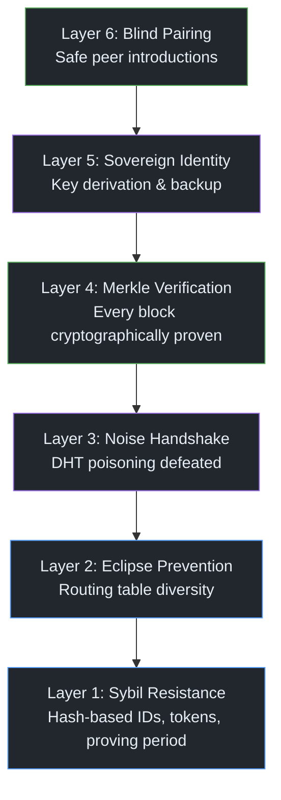

# P2P from Scratch — Part 7: P2P Security — Threats, Defenses, and Trust

> "Cryptography is typically bypassed, not penetrated."
> — Adi Shamir

**Excerpt:** The Holepunch stack is built on strong cryptography — Ed25519 signatures, BLAKE2b hashes, Noise handshakes. But cryptography alone doesn't make a system secure. Attackers don't break your ciphers — they poison your DHT, surround your node, or steal your keys. This post maps the full security model of the Holepunch stack: what's enforced in code, what's assumed by convention, and where the real attack surface lies.
<!-- meta-description: The complete P2P security model: Sybil resistance, Eclipse prevention, Merkle verification, sovereign identity, and blind pairing explained. -->
<!-- meta-labs: p2p-identity p2p-invite -->

<!-- Series Navigation -->
> **Series: P2P from Scratch — Building on the Holepunch Stack**
> [Part 1: NAT Hole Punching Explained](part-1-nat-holepunching.md) | [Part 2: P2P Encryption with the Noise Protocol](part-2-encrypted-pipes.md) | [Part 3: Merkle Trees and Append-Only Logs](part-3-hypercore-merkle.md) | [Part 4: Building P2P Databases with Hyperbee and Hyperdrive](part-4-hyperbee-hyperdrive.md) | [Part 5: Peer Discovery with Kademlia DHT](part-5-dht-discovery.md) | [Part 6: Multi-Writer Consensus with Autobase](part-6-autobase-consensus.md) | **Part 7: P2P Security — Threats, Defenses, and Trust (You are here)** | [Part 8: Offline-First UX for P2P Applications](part-8-ux-production.md)

---

> **Verified against:** hyperdht 6.33.2 · dht-rpc 6.27.0 · hypercore 11.35.2 · hypercore-crypto 3.7.0 · corestore 7.12.2 · blind-pairing-core 2.10.1 · secret-stream 6.9.1 — checked 2026-09-03. Every constant, default and byte count in this post is asserted in [`verify/`](https://github.com/heart-IT/p2p-from-scratch-labs/tree/main/verify), which installs whatever Holepunch publishes today and fails if the stack has moved.

## Quick Recap

Over Parts <a href="part-1-nat-holepunching.md">1</a>–<a href="part-6-autobase-consensus.md">6</a>, we built the full collaboration stack: NAT traversal, encrypted transport, verified data structures, peer discovery, and multi-writer consensus. Now we need to examine what happens when a peer is malicious.

---

## P2P Threat Landscape: No Gatekeeper, No Safety Net

P2P security requires a fundamentally different approach than centralized systems. In a client-server world, security has a natural chokepoint. The server validates inputs, authenticates users, and controls access. If someone misbehaves, the server revokes their account. Problem solved.

P2P has no server. No bouncer at the door. Every peer is simultaneously a client and a server — and any of them might be malicious. An attacker doesn't need to find a vulnerability in your code. They just need to join the network and start lying.

The attack surface for a P2P system is fundamentally different from a centralized one:

- **DHT Sybil attacks** — flood the routing table with fake nodes to control discovery
- **Eclipse attacks** — surround a target node so every peer it talks to is attacker-controlled
- **DHT poisoning** — announce fake records for a topic so lookups return attacker-controlled addresses
- **Data poisoning** — serve corrupted blocks to peers requesting Hypercore data
- **Identity theft** — steal a keypair and impersonate a legitimate user
- **Key loss** — no "reset password" in P2P; lose your key, lose your identity forever

The Holepunch stack addresses each of these — some with hard cryptographic guarantees, others with probabilistic defenses, and a few with conventions that application developers must uphold themselves.

> **Key Insight:** P2P security is layered, not binary. The cryptographic layer (signatures, handshakes, Merkle proofs) provides mathematical guarantees. The network layer (Sybil resistance, peer diversity) provides probabilistic protection. The application layer (key backup, access control) provides operational safety. A secure P2P application needs all three.

The full security model has six layers, each addressing a different attack vector:



*Figure 1: The six security layers of the Holepunch stack. Lower layers (blue) provide network-level probabilistic defense. Middle layers (purple) provide cryptographic authentication. Upper layers (green) provide application-level identity and access control.*

Each layer assumes the one below it is functioning. Merkle verification (Layer 4) doesn't help if an Eclipse attack (Layer 2) prevents you from reaching any honest peer. Blind Pairing (Layer 6) doesn't help if the master key (Layer 5) is compromised. The stack is only as strong as its weakest layer for any given attack.

---

## The Mental Model: A City of Strangers

Imagine a city with no police, no ID cards, and no central records office. Anyone can walk in, claim any name, and start talking to residents. How do you build trust?

You don't trust identities — you trust *cryptographic proof*. Instead of asking "who are you?" you ask "prove you know this secret." Instead of checking a database, you verify a mathematical relationship. And instead of trusting one gatekeeper, you insist on hearing from multiple independent sources before believing anything.

> **Feynman Moment:** The analogy suggests that individual interactions are untrustworthy — but that's not quite right. Each *individual* cryptographic verification is absolute. The Ed25519 signature either matches or it doesn't. The Merkle proof either checks out or it doesn't. What's probabilistic is the *network-level* protection: no single mechanism prevents a well-resourced attacker from controlling your view of the network. The defense is redundancy, diversity, and layering — making the cost of attack prohibitively high rather than mathematically impossible.

---

## Layer 1: Sybil Resistance in the DHT

A **Sybil attack** is when an adversary creates many fake identities to gain disproportionate influence. In a DHT, this means generating thousands of nodes to dominate the routing table — so that when a victim looks up any topic, the query routes through attacker-controlled nodes.

HyperDHT defends against Sybil attacks with three interlocking mechanisms.

### Mechanism 1: Node IDs Are Tied to Network Address

As we covered in <a href="part-5-dht-discovery.md">Part 5</a>, every DHT node's ID is derived from its observed IP and port:

```js title="dht-rpc/lib/peer.js"
function id (host, port, out = b4a.allocUnsafeSlow(32)) {
  const addr = out.subarray(0, 6)
  ipv4.encode({ start: 0, end: 6, buffer: addr }, { host, port })
  sodium.crypto_generichash(out, addr)  // BLAKE2b
  return out
}
```

You can't choose your position in the keyspace. To place a node near a specific target key, you'd need to find an IP:port combination whose BLAKE2b hash is close to that key — essentially brute-forcing a hash function. And the ID is derived from the *observed* address (what the network sees), not what the node claims, so NAT doesn't help the attacker.

### Mechanism 2: Round-Trip Tokens Prove Address Ownership

Before a node can write to the DHT (announce a topic, store a record), it must present a **token** received from the target node in a previous request. The token is a keyed BLAKE2b hash of the requester's IP address:

```js title="dht-rpc/lib/io.js"
token (addr, i) {
  const token = b4a.allocUnsafe(32)
  sodium.crypto_generichash(token, b4a.from(addr.host), this._secrets[i])
  return token
}
```

Two secrets are maintained, rotating periodically. Tokens are checked against both the current and previous secret, giving them an effective lifetime of between 7.5 and 15 seconds. This prevents IP spoofing — an attacker can't write to the DHT from a forged address because they'd never receive the token.

### Mechanism 3: The 20-Minute Proving Period

New nodes start in **ephemeral** mode — they can query the DHT, but they advertise no node ID, so nobody adds them to a routing table and they refuse to store announces. After roughly 20 minutes of stable uptime (240 ticks × 5 seconds), the node undergoes a reachability test: it asks 5 peers to ping its server socket back, and needs at least 3 pongs that actually arrive there, from the same public IP its client socket sees, on the port it bound locally. Only then does it transition to **persistent** mode.

This 20-minute cold start is a courtesy the default client extends to the network, not a rule the network enforces: nobody can check another node's uptime, and a node constructed with `ephemeral: false` skips the wait entirely. What it does is keep flaky nodes out of everyone's routing tables. The cost a Sybil attacker actually pays is Mechanisms 1 and 2 — every node needs its own reachable public IP:port, because every node it talks to recomputes its ID from the address it sees. After a sleep/wake cycle, the node resets to ephemeral and must re-prove stability (taking roughly 60 minutes in that case).

> **Key Insight:** None of these mechanisms makes Sybil attacks impossible — a well-funded attacker with thousands of distinct IP addresses and patience could still position nodes near a target. The defense is *economic*: it makes the attack expensive enough that the vast majority of adversaries can't afford it. This is the fundamental security model of open DHTs.

---

## Layer 2: Eclipse Prevention

An **Eclipse attack** is more targeted than a Sybil attack. Instead of dominating the whole DHT, the attacker surrounds a specific victim — controlling every peer the victim communicates with. If successful, the attacker controls the victim's entire view of the network.

HyperDHT's routing table design provides structural resistance:

- **K-bucket eviction favors incumbents.** When a bucket is full and a new node appears, the DHT picks the incumbent it has heard from least recently. If that node is a 30-minute veteran that answered within the last minute, the newcomer is simply dropped; otherwise it is pinged, and only if it fails to answer does the new node take its slot. Long-running honest nodes are hard to displace.
- **Down hints never evict directly.** A hint that a node is down only makes the recipient ping it — the node is dropped only if that ping fails, with at most 10 such checks in flight — and each node sends at most 50 hints per 5-second tick.
- **Multiple independent lookup paths.** A Kademlia lookup queries up to 10 nodes in parallel from different parts of the routing table. An attacker would need to control nodes across multiple buckets to intercept all paths.

But the most important Eclipse defense is **peer diversity at the application level**. If your application relies on a single DHT path for critical data, one compromised route can blind you. Maintaining connections to peers discovered through different topics, at different times, from different network paths makes Eclipse attacks exponentially harder.

> **Gotcha:** Eclipse resistance is a shared responsibility. The DHT provides structural resistance, but the application must maintain peer diversity. If your application connects to only 2-3 peers for important data, you're vulnerable regardless of the DHT's defenses.

---

## Layer 3: DHT Poisoning and the Noise Handshake

**DHT poisoning** is when an attacker announces fake records on a topic — so that when you look up "who has this data?", the DHT returns attacker-controlled addresses instead of real peers.

The defense is elegant: **the DHT provides candidates, not trusted peers.** Every connection goes through a Noise handshake (the framework from <a href="part-2-encrypted-pipes.md">Part 2</a>; HyperDHT uses the two-message IK pattern, because the lookup already told you the peer's public key) that cryptographically proves the remote peer holds the private key matching the announced public key.

```
Lookup result:  { publicKey: 0xABCD..., relayAddresses: [...] }
                          ↓
               HyperDHT connect(publicKey)
                          ↓
               Noise IK handshake (2 messages)
                          ↓
     Handshake proves:  remote holds private key for 0xABCD...
                          ↓
               Connection established — or rejected
```

The handshake is non-negotiable. If the remote party can't prove key ownership, the connection fails. Announces are signed, so nobody can publish a record under a key they don't hold; a malicious DHT node can still hand you a legitimate key attached to attacker-controlled addresses, and that connection dies at the Noise handshake because the attacker doesn't hold the private key. What the handshake cannot stop is an attacker announcing *their own* key on the topic — anyone may — so a connection to them succeeds. That is where Layer 4 takes over: without the core key they can't even open replication, and without the signing key they can't forge a block.

The HyperDHT server firewall adds another layer. It runs *after* the remote identity is cryptographically verified but *before* the connection is fully established:

```js title="hyperdht-firewall.js"
const server = dht.createServer({
  async firewall (remotePublicKey, remotePayload, clientAddress) {
    // remotePublicKey is already verified by Noise handshake
    // Return true to reject, false to accept
    return !allowedKeys.has(remotePublicKey.toString('hex'))
  }
})
```

The firewall receives three arguments: the verified public key, handshake payload data, and the client's network address. Because it runs post-authentication, you can implement access control based on cryptographic identity — not just IP addresses.

> **Terminology:** The HyperDHT server firewall (`async firewall(remotePublicKey, remotePayload, clientAddress)` — 3 args, can be async) is distinct from the Hyperswarm firewall (`firewall(remotePublicKey, payload)` — 2 args, synchronous). Hyperswarm installs its firewall as the HyperDHT server firewall for inbound connections and also consults it before each outbound dial — one hook, both directions.

---

## Layer 4: The Merkle Verification Chain

<!-- vg:replication/delta-sync -->

Even after you've connected to a legitimate peer, you don't trust their data. Every block received from a remote Hypercore is verified through a **complete cryptographic chain** before your application sees it.

Here's the full chain, from raw bytes to trusted data:

```
┌─────────────────────────────────────────────────────────────┐
│                 The Verification Chain                        │
│                                                              │
│  1. Raw block data arrives from peer                        │
│     ↓                                                        │
│  2. BLAKE2b(0x00 ‖ uint64(data.length) ‖ data) → leaf hash │
│     ↓                                                        │
│  3. Merkle uncle path: leaf + siblings → root peaks          │
│     ↓                                                        │
│  4. BLAKE2b(0x02 ‖ for each root: hash ‖ index ‖ size)     │
│     → bagged tree hash                                       │
│     ↓                                                        │
│  5. 112-byte signable:                                       │
│     [TREE namespace (32)] [manifest hash (32)]               │
│     [tree hash (32)] [length (8)] [fork (8)]                 │
│     ↓                                                        │
│  6. Ed25519 signature verification against core's public key │
│     ↓                                                        │
│  7. Data is trusted ✓                                        │
└─────────────────────────────────────────────────────────────┘
```

Steps 5 and 6 run when the tree grows. `MerkleTree.verify()` checks the Ed25519 signature only if the incoming proof carries an `upgrade`; a block that falls inside a length you have already verified stops at step 3, checked against root hashes an earlier signature already covered. So the signature is verified once per length advance, and every block still has to hash its way into a signed root.

Each step has a specific security property:

| Step | What It Prevents |
|------|------------------|
| Leaf hash with `0x00` type prefix | Second-preimage attacks (leaf hashes can't collide with parent hashes) |
| Parent hash with `0x01` type prefix | Domain separation between tree levels |
| Root bagging with `0x02` type prefix | Prevents root hash collisions across different tree structures |
| Manifest hash in signable | Prevents cross-core signature reuse (each core has a unique manifest) |
| Length in signable | Prevents truncation attacks (signature commits to exact tree size) |
| Fork counter in signable | Detects unauthorized tree rewrites (fork increments on truncate) |
| Ed25519 signature | Proves the core owner authorized this exact tree state |

Hypercore performs this verification automatically on every block received during replication. You can't skip it, bypass it, or weaken it through configuration. It's not a "security option" — it's the data layer itself.

> **Feynman Moment:** The three type prefixes (0x00 for leaves, 0x01 for parents, 0x02 for roots) seem like a minor detail, but they solve a subtle attack called a **second-preimage attack**. Without domain separation, an attacker could craft data whose leaf hash happens to equal a valid parent hash — potentially making a corrupted tree look valid. The type prefix makes this impossible: no matter what data you feed in, a leaf hash always starts with a different internal state than a parent hash. It's one byte that closes an entire class of attacks.

---

## Layer 5: Sovereign Identity and Key Management

In a centralized system, your identity lives on a server. Lose your password? Reset it via email. Account compromised? The admin revokes it. P2P has no admin. Your identity *is* your keypair, and the rules are simple and unforgiving:

- **Lose your private key → lose your identity forever.** No recovery, no appeal, no reset.
- **Compromise your primary key → compromise every named core.** Every Hypercore you open with `get({ name })` derives its keypair deterministically from the Corestore primary key (as we covered in <a href="part-4-hyperbee-hyperdrive.md">Part 4</a>). One key rules them all.

The derivation chain from <a href="part-4-hyperbee-hyperdrive.md">Part 4</a>:

```
Primary Key (32 bytes — the root of trust)
    ↓ keyed BLAKE2b with namespace + name
Deterministic Seed (32 bytes)
    ↓ crypto_sign_seed_keypair
Ed25519 Keypair (for a specific Hypercore)
```

The primary key is the BLAKE2b key parameter in `crypto_generichash_batch` — it's a proper keyed hash, not a simple concatenation. Same primary key plus same namespace plus same name always produces the same Hypercore keypair.

This determinism is both a strength and a vulnerability. It means you can regenerate all your cores from a single backup of the primary key. But it also means a single compromise exposes every core in the store.

### Key Backup Strategies

Since there's no "forgot password" flow, applications *must* provide key backup:

| Strategy | How It Works | Tradeoff |
|----------|-------------|----------|
| **Mnemonic seed** | Encode the 32-byte primary key as 24 words (BIP39-style) | Simple but requires secure physical storage |
| **Social recovery** | Split the key into N shares, require M to reconstruct (Shamir's Secret Sharing) | Resilient to individual loss, but requires trusted social graph |
| **Multi-device sync** | Replicate the primary key across user's devices | Convenient, but each device is an attack surface |
| **Hardware key** | Store the primary key in a hardware security module | Strongest protection, but adds cost and complexity |

> **Gotcha:** Corestore does not encrypt the primary key at rest. It's stored as raw bytes in the store's RocksDB database on disk. Protection depends entirely on the OS-level file permissions and disk encryption. If your application handles sensitive data, encrypting the primary key before storage is your responsibility, not Corestore's.
>
> Two further hygiene rules apply once the key is in process memory:
>
> - **Don't keep your own copy.** Corestore holds the exact buffer you pass and re-derives every named core's key pair from it on each `get({ name })`, so you can't `sodium_memzero` it while the store is open — you'd silently derive wrong keys (and, before `ready()`, persist a zeroed seed). Hand Corestore its own copy (`b4a.from(primaryKey)`), scrub *yours*, and let the copy live only as long as the store does.
> - **Never log it.** A single `console.log`, error message, or stack-trace template that interpolates the primary key — even once, even in development — is a total compromise. Treat it like a TLS private key, not like a config value.

---

## Layer 6: Blind Pairing — Safe Introductions

How do you invite someone to a private group without a central server? You can't just share a Hypercore key on a public channel — anyone who intercepts it gets access. You need a protocol that lets two strangers establish a trusted connection through an out-of-band invitation.

<a href="https://github.com/holepunchto/blind-pairing-core" target="_blank">blind-pairing-core</a> implements a 5-step cryptographic handshake:

**Step 1 — Create the invite.** The member generates a random 32-byte seed, derives an Ed25519 keypair from it, and packages the seed with a discovery key into an invite token. This token is shared out-of-band (QR code, secure message, in person).

**Step 2 — Candidate requests access.** The candidate decodes the invite, re-derives the same keypair from the seed, and encrypts a request using XChaCha20-Poly1305 under a key derived from the invitation's public key, signing it with the invitation's secret key — so only someone holding the seed can produce a request the member will accept.

**Step 3 — Member validates.** The member decrypts the candidate's request using the same derived key and verifies the cryptographic receipt signature.

**Step 4 — Member responds.** If accepted, the member encrypts a response containing the group's core key (and its encryption key, when the group has one) under a session-derived key, and sends it back.

**Step 5 — Candidate verifies and joins.** The candidate decrypts the response, verifies that the discovery key matches the original invite, and joins the group.

```
Member                              Candidate
  │                                      │
  │──── Invite (seed + discoveryKey) ───▶│  (out-of-band)
  │                                      │
  │◀─── Encrypted request ──────────────│  (via DHT)
  │     (XChaCha20-Poly1305)            │
  │                                      │
  │──── Encrypted response ─────────────▶│  (via DHT)
  │     (key + encryptionKey)            │
  │                                      │
  │         ✓ Paired                     │
```

The security of the scheme rests on the **confidentiality of the invite**. The 32-byte seed is essentially a bearer credential — anyone who possesses it can impersonate a legitimate candidate. This is why the invite must be shared through a trusted channel.

> **Key Insight:** Blind pairing separates *discovery* from *authorization*. The DHT is used for rendezvous (finding each other), but the invite seed provides the cryptographic basis for trust. An attacker who monitors the DHT sees encrypted blobs at ephemeral keypair locations — without the invite seed, they can't decrypt, forge, or replay anything.

---

## The Trust Boundary Map

Not all security properties are enforced the same way. Here's an honest accounting of what the Holepunch stack guarantees in code versus what it assumes by convention:

| Property | Enforced in Code | Assumed by Convention |
|----------|:---:|:---:|
| Node IDs tied to IP:port (Sybil resistance) | Yes | — |
| Round-trip tokens for DHT writes | Yes | — |
| 20-min ephemeral proving period | Default client only | Attacker-run nodes can skip it |
| Noise IK mutual authentication | Yes | — |
| Merkle proof + Ed25519 signature verification | Yes | — |
| Discovery key hides the core key | Yes | — |
| Type-prefix domain separation (0x00/0x01/0x02) | Yes | — |
| Primary key encryption at rest | — | Application must implement |
| Peer diversity for Eclipse resistance | — | Application must maintain |
| Invite confidentiality (Blind Pairing) | — | Out-of-band channel must be secure |
| Apply function purity (Autobase) | — | Developer must uphold |
| Post-handshake key ratcheting | — | Not provided (single key for connection lifetime) |

The left column is math. The right column is discipline. A secure application needs both.

> **Gotcha:** IK mixes both ephemerals (`ee`) in its second message, so the transport keys are forward secret — recorded session traffic stays unreadable even if a long-term static key leaks later. The exception is the first handshake message, whose payload is protected by `es` and `ss` alone; a leaked static key opens that one message, which in HyperDHT carries connection metadata rather than application data. There is also no post-handshake key ratcheting (unlike Signal's Double Ratchet). libsodium does rotate the key once its 32-bit frame counter wraps, but that is a nonce-exhaustion guard four billion frames away, not a ratchet — in practice a connection keeps the same symmetric keys for as long as it lives. For most P2P applications this is fine — connections are relatively short-lived and data is already authenticated by Merkle proofs. But it's worth understanding the boundary.

---

## The Tradeoffs

| What You Gain | What You Pay |
|---|---|
| No central authority to compromise | No central authority to revoke access or reset passwords |
| Cryptographic identity (unforgeable) | Key loss is permanent — no recovery without backup |
| Automatic Merkle verification on every block | Can't skip verification for performance — it's always on |
| Sybil resistance via hash-based node IDs | Determined attacker with many IPs can still position nodes |
| Noise IK proves identity before connection | 2-message handshake adds a round trip to every connection |
| Impersonation defeated by handshake verification | Attackers can still announce themselves on a topic — wasted connections, filtered by Layer 4 |
| Blind pairing enables serverless invitations | Invite security depends on out-of-band channel |
| Deterministic key derivation from one master key | Single point of failure — master key compromise exposes all cores |

---

## Key Takeaways

- **The Holepunch stack has six security layers: Sybil resistance, Eclipse prevention, DHT poisoning defense, Merkle verification, sovereign identity, and Blind Pairing.** Each addresses a different attack vector. No single layer is sufficient alone.

- **Sybil resistance is economic, not absolute.** Hash-based node IDs and round-trip tokens make Sybil attacks expensive but not impossible; the 20-minute proving period protects routing-table quality, not you from an attacker. The defense works because the cost exceeds the reward for most adversaries.

- **DHT lookups return candidates, not trusted peers.** The Noise handshake is the real authentication boundary. An attacker who poisons the DHT can redirect your lookups, but can't impersonate a legitimate key without its private key — and can't serve a forged block without the signing key.

- **Every block has to hash its way into a signed tree.** Leaf hash → Merkle path → root peaks → bagged tree hash → 112-byte signable → Ed25519 signature. Hypercore checks the signature each time the tree grows, and every block after that must chain into a root that signature covered. It is enforced in code, not optional: nobody but the core's owner can get a block into your copy of their log.

- **Your master key is your entire identity.** Every named Hypercore keypair derives from the Corestore primary key. Protect it like a root CA certificate — encrypted storage, no transmission, backup strategy in place. There is no password reset in P2P.

- **Know what's enforced and what's assumed.** Cryptographic verification is mathematical. Peer diversity, key protection, and invite confidentiality are operational. Build your application assuming both layers are necessary.

---

## Frequently Asked Questions

### Is peer-to-peer networking secure?
P2P systems can be secure when properly designed. The Holepunch stack uses Ed25519 signatures, Noise-authenticated encrypted streams, and Merkle verification at every layer. The key difference from centralized systems is that security is distributed across cryptographic proofs rather than concentrated in a single server.

### What is a Sybil attack?
A Sybil attack is when an adversary creates many fake identities to gain disproportionate influence over a network. In a DHT, this means generating thousands of nodes to dominate routing tables and control peer discovery. HyperDHT defends against this with hash-derived node IDs verified against the observed address and round-trip tokens.

### How does blind pairing work?
Blind pairing lets a stranger be admitted through a shared secret without the group's key — or the invite — ever touching the DHT. A member generates a random invite seed, shares it out-of-band (QR code, secure message), and the candidate uses it to derive matching cryptographic keys. The DHT is used for rendezvous, but only holders of the invite seed can decrypt the exchange.

---

## What's Next

We've mapped every layer of the stack — from punching through NATs to securing against sophisticated attacks. The technology is sound. But technology alone doesn't make a product. Users don't care about Merkle proofs or Sybil resistance. They care about whether the app works when they're on the subway, whether their data appears instantly, and whether they can recover when things go wrong.

In <a href="part-8-ux-production.md">Part 8</a>, we'll tackle the hardest challenge of all: making P2P feel reliable to real humans. We'll cover offline-first design, optimistic UX for eventually-consistent data, availability strategies (seeded mesh, personal relay nodes, hybrid architectures), mobile deployment with suspend/resume, and the observability tools that keep a serverless system debuggable.

[heartit_lab title="p2p-identity" cmd="npx @heart-it/p2p-identity" desc="24 words become an identity; devices get attested in a signature chain a stranger can verify — and one flipped bit breaks it." repo="https://github.com/heart-IT/p2p-from-scratch-labs" note="needs Node.js 18+ · runs entirely on your machine"]

[heartit_lab title="p2p-invite" cmd="npx @heart-it/p2p-invite new" desc="An invite that admits a stranger without ever containing the key: redeem it in a second terminal and verify the key only ever crossed an encrypted channel." repo="https://github.com/heart-IT/p2p-from-scratch-labs" note="needs Node.js 18+ · two terminals — the first prints the invite"]

---

## References & Further Reading

1. <a href="https://github.com/holepunchto/dht-rpc" target="_blank">holepunchto/dht-rpc — Kademlia DHT with Sybil-resistant node IDs and round-trip tokens</a>
2. <a href="https://github.com/holepunchto/hyperdht" target="_blank">holepunchto/hyperdht — DHT with keypair-authenticated Noise IK connections</a>
3. <a href="https://github.com/holepunchto/hypercore" target="_blank">holepunchto/hypercore — Append-only log with Merkle proof verification</a>
4. <a href="https://github.com/holepunchto/hypercore-crypto" target="_blank">holepunchto/hypercore-crypto — BLAKE2b hashing, Ed25519 signatures, type-prefixed domain separation</a>
5. <a href="https://github.com/holepunchto/blind-pairing-core" target="_blank">holepunchto/blind-pairing-core — Cryptographic invitation protocol for serverless group access</a>
6. <a href="https://github.com/holepunchto/hyperswarm-secret-stream" target="_blank">holepunchto/hyperswarm-secret-stream — Noise handshake (XX standalone; IK when HyperDHT brokers the connection) + XChaCha20-Poly1305 post-handshake encryption</a>
7. <a href="https://github.com/holepunchto/corestore" target="_blank">holepunchto/corestore — Deterministic key derivation from a single primary key</a>
8. <a href="https://noiseprotocol.org/noise.html" target="_blank">Noise Protocol Framework — Specification for the IK and XX handshake patterns</a>
9. <a href="https://en.wikipedia.org/wiki/Sybil_attack" target="_blank">Wikipedia — Sybil attack</a>
10. <a href="https://docs.pears.com/" target="_blank">Pear Runtime Documentation</a>

---

> **Series: P2P from Scratch — Building on the Holepunch Stack**
> [Part 1: NAT Hole Punching Explained](part-1-nat-holepunching.md) | [Part 2: P2P Encryption with the Noise Protocol](part-2-encrypted-pipes.md) | [Part 3: Merkle Trees and Append-Only Logs](part-3-hypercore-merkle.md) | [Part 4: Building P2P Databases with Hyperbee and Hyperdrive](part-4-hyperbee-hyperdrive.md) | [Part 5: Peer Discovery with Kademlia DHT](part-5-dht-discovery.md) | [Part 6: Multi-Writer Consensus with Autobase](part-6-autobase-consensus.md) | **Part 7: P2P Security — Threats, Defenses, and Trust (You are here)** | [Part 8: Offline-First UX for P2P Applications](part-8-ux-production.md)
