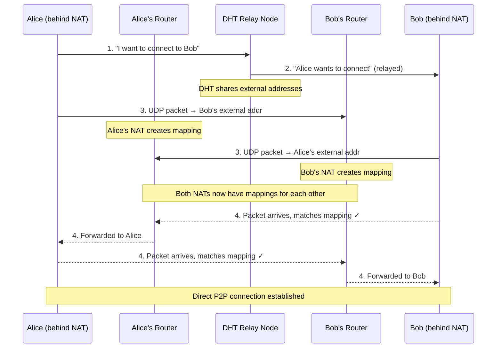

# P2P from Scratch — Part 1: The Internet is Hostile

> "The Internet was done so well that most people think of it as a natural resource like the Pacific Ocean, rather than something that was man-made. When was the last time a technology with a footprint so large was so error-free?"
> — Alan Kay

**Excerpt:** You want two computers to talk directly to each other. No server in the middle, no middleman, no monthly bill. Sounds simple — the Internet is a network, after all. But the moment you try it, you discover something uncomfortable: the Internet was never designed for this. Here's why, and how Hyperswarm punches through anyway.

<!-- Series Navigation -->
> **Series: P2P from Scratch — Building on the Holepunch Stack**
> **Part 1: The Internet is Hostile (You are here)** | [Part 2: Encrypted Pipes](part-2-encrypted-pipes.md) | [Part 3: Append-Only Truth](part-3-hypercore-merkle.md) | [Part 4: From Logs to Databases](part-4-hyperbee-hyperdrive.md) | [Part 5: Finding Peers](part-5-dht-discovery.md) | [Part 6: Many Writers, One Truth](part-6-autobase-consensus.md) | [Part 7: Trust No One](part-7-security-trust.md) | [Part 8: Building for Humans](part-8-ux-production.md)

---

## The Problem: Your Computer Doesn't Have an Address

Here's something that should bother you: your laptop is connected to the Internet right now, but nobody can reach it.

Try it. Find your IP address. It's probably something like `192.168.1.47`. Now ask a friend on a different Wi-Fi network to send a packet to `192.168.1.47`. Nothing happens. That address means nothing outside your home.

The IP address the rest of the world sees — the one your ISP gave your router — belongs to your *router*, not your laptop. And your router has no idea which of the dozens of devices behind it you're trying to reach. Worse, in many countries your ISP doesn't even give your router a real public IP. They put your router behind *their own* router, so you're behind two layers of address translation.

This is <a href="https://en.wikipedia.org/wiki/Network_address_translation" target="_blank">Network Address Translation</a> — NAT — and it's the reason peer-to-peer connectivity is hard.

> **Terminology:** **NAT** (Network Address Translation) is a technique where a router rewrites the source IP address of outbound packets and maintains a mapping table so it can route responses back to the correct internal device. It was designed to conserve IPv4 addresses, not to enable direct communication.

Every time you visit a website, your router creates a temporary mapping: "outgoing traffic from `192.168.1.47:52301` should appear as `203.0.113.5:41928` to the outside world." When the website responds to `203.0.113.5:41928`, the router checks its table, finds the mapping, and forwards the response to your laptop.

This works perfectly for client-server communication. You always initiate the connection. The server always has a fixed public address. The router's mapping table always has the right entry.

But what if there's no server? What if two laptops, both behind NATs, want to talk to each other?

Neither one has a public address. Neither router has a mapping entry for the other. Any packet sent to either router from an unknown source gets silently dropped.

This is the fundamental problem of peer-to-peer networking. It's not a software bug — it's a consequence of address translation and stateful firewalling.

---

## The Mental Model: Two People in Soundproof Rooms

Imagine two people, Alice and Bob, each in a soundproof room with a locked door. The door only opens from the inside, and only for a few seconds. Neither person can hear the other through the walls.

They want to have a conversation.

If Alice opens her door and shouts, but Bob's door is still closed — he hears nothing. If Bob opens his door a minute later and shouts, Alice's door has already closed — she hears nothing. They could each open their doors a thousand times and never connect.

But if someone *outside* both rooms — a coordinator — passes each of them a note saying "open your door in exactly 10 seconds," and they both do it at the same moment, their voices travel through both open doors and they connect.

That coordinator is the role a <a href="https://github.com/holepunchto/hyperdht" target="_blank">DHT</a> (distributed hash table) plays in peer-to-peer networking. The soundproof room is your NAT. The door opening is your router creating a mapping entry. The simultaneous timing is the critical requirement.

> **Feynman Moment:** Here's where the analogy breaks — and where the real engineering begins. In the real world, "opening the door" doesn't just mean creating a NAT mapping. Different routers create mappings with wildly different rules. Some routers assign the same external port no matter who you're talking to. Others assign a different external port for every destination. Some allow any outside address to send traffic through the mapping. Others only allow the specific address you originally contacted. These differences aren't edge cases — they're the entire battlefield.

---

## How NATs Actually Work (The Four Behavioral Classes)

Not all NATs are created equal. The way your router creates and filters its mapping table determines whether holepunching can work at all.

> **Terminology:** **NAT Mapping** is the entry your router creates in its translation table when an internal device sends a packet. It links your internal IP:port to an external IP:port and governs what traffic can flow back through.

| NAT Type | Mapping Behavior | Inbound Filtering | Holepunch Friendly? |
|---|---|---|---|
| **Full Cone** | Same external port for all destinations | Any source allowed through | Yes — easiest |
| **Restricted Cone** | Same external port for all destinations | Only IPs you've contacted | Yes — with coordination |
| **Port Restricted** | Same external port for all destinations | Only IP:port pairs you've contacted | Yes — with precise timing |
| **Symmetric** | Different external port per destination IP:port | Only the specific destination | No — port unpredictable |

> **Note on terminology:** The four names above (Full Cone, Restricted Cone, Port Restricted, Symmetric) come from <a href="https://www.rfc-editor.org/rfc/rfc3489" target="_blank">RFC 3489</a> (2003). The later <a href="https://www.rfc-editor.org/rfc/rfc4787" target="_blank">RFC 4787</a> (2007) replaces this with a two-axis model — *mapping behavior* (Endpoint-Independent / Address-Dependent / Address-and-Port-Dependent) × *filtering behavior* — which better captures real-world NATs that don't fit neatly into one of four boxes. Internally, HyperDHT uses a three-level classification — **OPEN**, **CONSISTENT** (predictable port mapping), and **RANDOM** (unpredictable) — which maps to what matters for holepunching: can you predict the port or not?

The first three types share a critical property: the external port stays the same regardless of destination. If your laptop sends a packet to server A and gets mapped to external port `41928`, it also uses port `41928` when talking to server B. This consistency is what makes holepunching possible — a coordinator can observe the port from one connection and tell a peer to aim at that same port.

Symmetric NAT breaks this entirely. Every new destination gets a fresh, unpredictable external port, and symmetric NATs typically combine this with address-and-port-dependent filtering — making both mapping and filtering unpredictable. A coordinator can observe the port your router assigned when talking to the DHT, but that port is useless for connecting to another peer — the router will assign a completely different one.

> **Key Insight:** Holepunching is fundamentally about *port prediction*. If the coordinator can predict what external port your router will use, peers can aim their packets at it. Symmetric NAT makes this prediction impossible.

---

## The Dance: How Holepunching Actually Works

Let's walk through what <a href="https://github.com/holepunchto/hyperswarm" target="_blank">Hyperswarm</a> does when two peers want to connect. This isn't abstract protocol theory — this is what happens on your network right now.

### Step 1: Both Peers Join the DHT

Both Alice and Bob connect to <a href="https://github.com/holepunchto/hyperdht" target="_blank">HyperDHT</a> — a Kademlia-based distributed hash table. This establishes their presence in the network and — critically — creates NAT mappings. The DHT nodes can now observe each peer's external IP and port.

### Step 2: Signaling via DHT Nodes

Alice wants to connect to Bob. She finds Bob's announcement in the DHT and sends a connection request. But she doesn't send it directly to Bob — she can't, because Bob's NAT would drop it. Instead, she sends it to one of Bob's designated *relay nodes* in the DHT.

This is a key design choice: Hyperswarm doesn't rely on external STUN/TURN servers like WebRTC does. Instead, the DHT nodes *themselves* perform the equivalent functions — NAT type detection (STUN's role) and connection relay when holepunching fails (TURN's role). The protocol is different, but the jobs are the same. No single company controls the infrastructure.

### Step 3: The Simultaneous Send

The relay delivers Alice's intent to Bob. Now both peers know about each other's external address (IP + port, as observed by the DHT). Both peers simultaneously send UDP packets toward each other's external address.

Here's the critical moment: when Alice sends a packet to Bob's external address, *Alice's* router creates a mapping entry that says "I'm expecting a response from Bob's IP." When Bob's packet arrives at Alice's router — from Bob's IP — the router matches it against the fresh mapping and lets it through.

The same thing happens on Bob's side. Both doors open at the same moment. The hole is punched.


*Figure 1: The holepunching dance. Both peers must send before either receives.*

> **Implementation detail:** The diagram above shows the logical flow. In practice, HyperDHT sends multiple probe rounds with retries — the first packets sent to an unopened NAT mapping are expected to be dropped. The holepunch succeeds when at least one packet from each side arrives *after* the other side's outbound packet has created the necessary mapping. This is why timing coordination matters more than single-packet delivery.

> **Note:** All of this refers to **UDP holepunching**. Hyperswarm uses UDP for the holepunch dance because UDP NAT mappings are simpler and more predictable. TCP holepunching is significantly harder — it requires simultaneous SYN packets and many NATs don't support it reliably. This is why Hyperswarm establishes the UDP path first and then upgrades it to a reliable, encrypted stream.

### Step 4: Encrypted Stream

Once the UDP path is established, Hyperswarm upgrades the connection to a reliable, encrypted stream using <a href="https://github.com/holepunchto/hyperswarm-secret-stream" target="_blank">Secret Stream</a> — a Noise XX handshake with Ed25519 keypairs, followed by libsodium's AEAD encryption for all payload data. We'll cover this in detail in <a href="part-2-encrypted-pipes.md">Part 2</a>.

> **Gotcha:** The timing requirement isn't just "roughly at the same time." NAT mappings have expiry timers. If Alice sends her packet but Bob's router takes too long to relay the signal, Alice's mapping may expire before Bob's packet arrives. Connection failures that look like "peer unreachable" are often timing desynchronization in disguise.

---

## When the Dance Fails: Symmetric NAT and Relay Fallback

Holepunching works when at least one side has a predictable port mapping. If Alice is behind a symmetric NAT but Bob is behind a cone or restricted NAT, Bob's external port is still predictable — so the holepunch can target it. Alice's side creates a fresh mapping for the outbound packet to Bob, and Bob's response arrives at that mapping. One predictable side is enough.

Relay is only needed when **both** peers are behind randomized (symmetric) NATs. Neither side can predict the other's port, so there's no target to aim at. No amount of timing coordination can overcome both ports being unpredictable.

Hyperswarm handles this with **relay fallback**: the connection routes through a DHT node that both peers can reach. Each peer can specify up to 3 relay nodes. The data still flows — just through an intermediary.

| Scenario | NAT A | NAT B | Method | Result |
|---|---|---|---|---|
| Best case | Full Cone | Full Cone | Direct holepunch | Low latency, direct path |
| Common case | Restricted | Port Restricted | Coordinated holepunch | Slightly higher latency |
| One-sided | Symmetric | Restricted | Direct holepunch | Works — B's port is predictable |
| Worst case | Symmetric | Symmetric | Full relay | Both ports unpredictable, must relay |

On typical consumer networks, Holepunch achieves roughly 95% direct connections and only ~5% relayed. The ~5% happens specifically when both peers are on randomized NATs — since it requires both sides to be unpredictable simultaneously, the probability is low. But it's not uniformly distributed: environments where symmetric NATs are common (like corporate networks) see a higher local relay rate when peers within those environments connect to each other. The application should handle both paths transparently.

> **Key Insight:** The fallback isn't a failure — it's a design requirement. Any P2P system that doesn't account for symmetric NAT will silently fail for a significant fraction of users. Hyperswarm makes the fallback automatic so applications don't need to handle it manually.

---

## Beyond NAT: What Makes Hyperswarm's DHT Different

The DHT isn't just a signaling helper — it's the peer discovery layer, and it has its own engineering challenges.

### Sybil Resistance via Node ID Derivation

In a standard Kademlia DHT, nodes choose their own IDs. An attacker could generate thousands of IDs strategically positioned near a target, surrounding it with malicious nodes. This is a <a href="https://en.wikipedia.org/wiki/Sybil_attack" target="_blank">Sybil attack</a>.

<a href="https://github.com/holepunchto/dht-rpc" target="_blank">dht-rpc</a> prevents this by *deriving* node IDs from the node's network identity: `nodeID = hash(publicIP + publicPort)`. You can't choose your ID — the network determines it from your address. An attacker would need control of specific IP addresses to position themselves near a target in the keyspace.

This is one defense layer. Round-trip tokens prove IP ownership (preventing spoofing), and the ephemeral-to-persistent transition (described below) prevents rapid routing table pollution.

### The Ephemeral-to-Persistent Transition

New nodes don't immediately become permanent members of the DHT's routing tables. They start in **ephemeral mode** — participating in queries but not stored in other nodes' routing tables.

After approximately 20–30 minutes of stable uptime (the base threshold is 240 ticks × 5 seconds, but NAT assessment and network conditions add overhead), the node transitions to **persistent mode** and takes a permanent position in the routing table. After a sleep/wake cycle, this timer resets to ~60 minutes.

This protects the DHT from short-lived nodes churning the routing tables and from attackers spinning up thousands of nodes to flood the network. If you're running a server on an open NAT, you can bypass this with `ephemeral: false`, but for consumer devices behind NATs, the transition period is a feature, not a limitation.

---

## The Tradeoffs: Nothing Is Free

Holepunching and DHT-based discovery solve the fundamental connectivity problem, but they come with costs.

| What You Gain | What You Pay |
|---|---|
| No central server dependency | Connection setup is slower (DHT lookup + holepunch negotiation) |
| No monthly infrastructure bill | ~5% of connections relay through intermediaries (only when both sides are on randomized NATs) |
| Resistant to single-point-of-failure | First connection takes seconds, not milliseconds |
| Works across ISPs and countries | Both-sides-symmetric connections get relay latency |
| DHT nodes are the infrastructure | ~20–30 minute warmup for new DHT nodes (~60 min after wake) |

The connection setup cost is a one-time tax. Once the hole is punched, the direct UDP path is as fast as any other Internet connection. But that initial negotiation — DHT lookup, signaling, simultaneous send, handshake — takes real time. Your UX needs to account for this (we'll cover P2P UX design in <a href="part-8-ux-production.md">Part 8</a>).

---

## In Practice: Watching It Happen

You can observe Hyperswarm's holepunching in action with a minimal script. Install the module and create two peers that discover each other via a shared topic:

```js title="holepunch-demo.js"
const Hyperswarm = require('hyperswarm')

// Both peers must join the same topic — a 32-byte buffer.
// Use a fixed value so both machines connect to the same swarm.
const topic = Buffer.from(
  'a1b2c3d4e5f6a7b8c9d0e1f2a3b4c5d6a7b8c9d0e1f2a3b4c5d6a7b8c9d0e1f2',
  'hex'
)

const swarm = new Hyperswarm()
swarm.on('connection', (conn, info) => {
  console.log('Connected to peer!', info.publicKey.toString('hex').slice(0, 8))
  conn.on('data', data => console.log('Received:', data.toString()))
  conn.write('Hello from ' + (process.argv[2] || 'anonymous'))
})
const discovery = swarm.join(topic, { server: true, client: true })
await discovery.flushed()
console.log('Announced on topic, waiting for peers...')
```

> **Note:** Code examples in this series use `require()` with top-level `await` for clarity. To run them, either wrap the body in `(async () => { ... })()` or save with an `.mjs` extension and use `import` instead of `require`. The <a href="https://docs.pears.com/" target="_blank">Pear Runtime</a> supports this syntax natively.

Run this same script on two different machines (or two different networks) — e.g., `node holepunch-demo.js Alice` on one and `node holepunch-demo.js Bob` on the other. Because the topic is hardcoded, both peers discover each other automatically. You'll see the connection event and the data exchange. If both peers are behind randomized (symmetric) NATs, Hyperswarm silently falls back to relay — the `connection` event fires either way. If only one side is symmetric, holepunching still works directly.

> **Gotcha:** If you run both peers on the same machine or the same LAN, you're not testing holepunching at all — you're testing local discovery. Real holepunching only happens across NAT boundaries. To test properly, use two different networks or a cloud VM as the second peer.

---

## Key Takeaways

- **NAT is the fundamental obstacle to P2P connectivity.** Your device doesn't have a reachable address. Your router drops unsolicited inbound packets. This isn't a bug — it's how the Internet was designed.

- **Holepunching is a timing dance.** Both peers must create outbound NAT mappings simultaneously so that each peer's inbound packet matches the other's fresh mapping. The DHT coordinates this timing.

- **Both-sides-symmetric is the only case that requires relay.** If only one peer is behind a symmetric NAT, holepunching still works — the other side's port is predictable. Relay is only needed when both peers have randomized port mappings, making prediction impossible on both ends.

- **Hyperswarm's DHT is more than a phone book.** Node IDs derived from `hash(IP + port)` resist Sybil attacks. Ephemeral-to-persistent transitions resist routing table pollution. DHT nodes double as relay infrastructure.

- **Budget for ~5% relayed connections.** On consumer networks, Holepunch achieves ~95% direct connectivity. The ~5% relay fraction occurs specifically when both peers are on randomized NATs — since it requires both sides to be unpredictable, the probability is low. But it's not uniformly distributed: environments where symmetric NATs are common (corporate networks) see higher local relay rates. Your architecture and UX must handle relayed connections as a first-class path, not an error state.

---

## What's Next

We've established that two peers can find each other and create a connection path — even through hostile network conditions. But that path is just raw UDP packets. Anyone between the two peers can read them, modify them, or inject fake ones.

In <a href="part-2-encrypted-pipes.md">Part 2</a>, we'll look at how Hyperswarm turns that raw UDP path into an encrypted, multiplexed communication channel using the Noise protocol, Secret Stream, and Protomux. We'll see how a single encrypted connection carries multiple independent protocol channels — and why that matters when you start replicating data structures in Part 3.

---

## References & Further Reading

1. <a href="https://github.com/holepunchto/hyperswarm" target="_blank">holepunchto/hyperswarm — High-level peer discovery and connection management</a>
2. <a href="https://github.com/holepunchto/hyperdht" target="_blank">holepunchto/hyperdht — DHT layer with keypair connections and NAT traversal</a>
3. <a href="https://github.com/holepunchto/dht-rpc" target="_blank">holepunchto/dht-rpc — Low-level Kademlia DHT with Sybil-resistant node IDs</a>
4. <a href="https://github.com/holepunchto/hyperswarm-secret-stream" target="_blank">holepunchto/hyperswarm-secret-stream — Noise XX + libsodium transport encryption</a>
5. <a href="https://en.wikipedia.org/wiki/Network_address_translation" target="_blank">Wikipedia — Network Address Translation</a>
6. <a href="https://www.rfc-editor.org/rfc/rfc4787" target="_blank">RFC 4787 — NAT Behavioral Requirements for Unicast UDP</a>
7. <a href="https://en.wikipedia.org/wiki/Hole_punching_(networking)" target="_blank">Wikipedia — Hole Punching (Networking)</a>
8. <a href="https://en.wikipedia.org/wiki/Sybil_attack" target="_blank">Wikipedia — Sybil Attack</a>
9. <a href="https://docs.pears.com/" target="_blank">Pear Runtime Documentation</a>

---

> **Series: P2P from Scratch — Building on the Holepunch Stack**
> **Part 1: The Internet is Hostile (You are here)** | [Part 2: Encrypted Pipes](part-2-encrypted-pipes.md) | [Part 3: Append-Only Truth](part-3-hypercore-merkle.md) | [Part 4: From Logs to Databases](part-4-hyperbee-hyperdrive.md) | [Part 5: Finding Peers](part-5-dht-discovery.md) | [Part 6: Many Writers, One Truth](part-6-autobase-consensus.md) | [Part 7: Trust No One](part-7-security-trust.md) | [Part 8: Building for Humans](part-8-ux-production.md)
