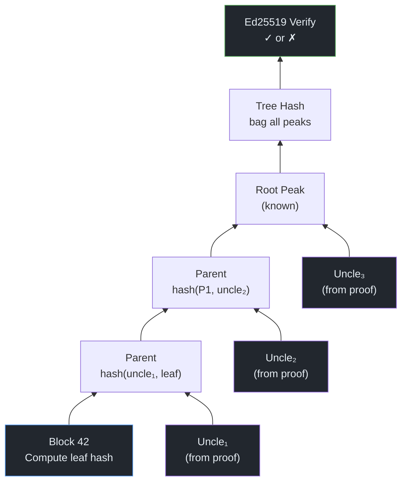

# P2P from Scratch — Part 3: Append-Only Truth

> "The first principle is that you must not fool yourself — and you are the easiest person to fool."
> — Richard Feynman, *Cargo Cult Science*, 1974

**Excerpt:** You have an encrypted pipe between two peers. Now you need something worth sending through it. Hypercore is an append-only log where every byte is cryptographically verifiable — a peer can download a single block out of millions and prove it hasn't been tampered with, using only a handful of hashes and one signature. This post explains the data structure that everything else in the Holepunch stack is built on.

<!-- Series Navigation -->
> **Series: P2P from Scratch — Building on the Holepunch Stack**
> [Part 1: The Internet is Hostile](part-1-nat-holepunching.md) | [Part 2: Encrypted Pipes](part-2-encrypted-pipes.md) | **Part 3: Append-Only Truth (You are here)** | [Part 4: From Logs to Databases](part-4-hyperbee-hyperdrive.md) | [Part 5: Finding Peers](part-5-dht-discovery.md) | [Part 6: Many Writers, One Truth](part-6-autobase-consensus.md) | [Part 7: Trust No One](part-7-security-trust.md) | [Part 8: Building for Humans](part-8-ux-production.md)

---

## Quick Recap

In <a href="part-1-nat-holepunching.md">Part 1</a>, we punched through NATs to establish a UDP path. In <a href="part-2-encrypted-pipes.md">Part 2</a>, we wrapped that path in Noise XX encryption and multiplexed independent protocols over it with Protomux. Now we need data worth sending through the pipe.

---

## The Problem: Trust Without a Server

In a client-server world, you trust data because you trust the server. You ask a database for row 42, and you believe the response because the server is yours (or belongs to a company you trust). The connection is encrypted with TLS, the server has a certificate, and that's the end of the story.

In peer-to-peer, there's no server. A stranger on the Internet sends you a chunk of data and claims it's block 42 of some log. Why should you believe them?

You can't trust the peer — they might be compromised, malicious, or simply buggy. You can't trust the network — someone might have tampered with the data in transit. You need a way to verify the data *itself*, independent of who sent it to you.

This is what <a href="https://github.com/holepunchto/hypercore" target="_blank">Hypercore</a> provides: an append-only log where every block is bound to a cryptographic proof chain that terminates in a single Ed25519 signature. If the proof checks out, the data is authentic — regardless of which peer delivered it.

> **Key Insight:** The trust model is inverted compared to client-server. In HTTPS, you trust the *channel* (TLS certificate) and therefore trust the data. In Hypercore, you trust the *data* (Merkle proof + signature) regardless of the channel. A block verified by its proof is equally trustworthy whether it came from the original author, a mirror, or a stranger's cache.

---

## Append-Only: Why Immutability Matters

A Hypercore is a log. You can append new blocks to the end. You cannot modify or delete existing blocks.

This seems limiting — but it's the foundation of everything that follows. If history is immutable, then:

- **Verification is permanent.** Once you've verified block 42, it will never change. You can cache it, share it, replicate it — the proof remains valid forever.
- **Replication is simple.** Two peers compare their lengths and fork IDs. If forks match, whoever has more blocks sends the difference. There are no merge conflicts, no version vectors, no three-way diffs.
- **Auditability is free.** The full history of every change is preserved. You don't need a separate audit log — the data structure *is* the audit log.

State changes are expressed as new facts appended to the log, not as mutations of existing entries. If you want to "update" a record, you append a new block that supersedes the old one. Higher layers (like Hyperbee, which we'll cover in Part 4) project the current state from this history.

> **Terminology:** **Append-only** means new data is always added to the end. Existing entries are never modified. This is also called an *immutable log* or *event log*. It's the same idea behind database write-ahead logs, event sourcing, and blockchain ledgers — but without the blockchain.

---

## The Mental Model: Tamper-Evident Seals

Imagine you're shipping a crate of 1,000 numbered bottles across the ocean. You don't trust the ship's crew. How do you let the recipient verify that *one specific bottle* hasn't been swapped — without inspecting all 1,000?

Seal every pair of bottles together with a wax stamp. Then seal pairs of pairs. Keep going until you have one master seal at the top. Give the recipient that single master seal in advance (signed by you, sent separately). Now they can verify bottle #42 by checking only the chain of seals from that bottle up to the master seal — about 10 seals out of 1,000 bottles. If any seal is broken or wrong, someone tampered with the chain.

That's a Merkle tree. The bottles are data blocks. The wax seals are hashes. The master seal is the signed root. The signed delivery note is the Ed25519 signature.

> **Feynman Moment:** The analogy maps well, but here's where it gets more interesting. Real wax seals are symmetric — anyone can stamp one. Cryptographic hashes are one-way: you can verify a hash instantly, but you can't reverse-engineer data that produces a given hash. This asymmetry is what makes the system trustless. The recipient doesn't need to trust the crew, the ship, or the route — only the math.

---

## The Data Structure: A Flat In-Order Merkle Tree

Hypercore needs to let a peer verify any individual block without downloading the entire log. The classic solution is a Merkle tree — a binary tree of hashes where each parent is the hash of its children. To verify a leaf, you only need the hashes along the path from that leaf to the root.

But Hypercore's tree isn't a standard Merkle tree. It uses a **flat in-order tree** — a scheme from <a href="https://www.rfc-editor.org/rfc/rfc7574" target="_blank">RFC 7574</a> (the Peer-to-Peer Streaming Peer Protocol) that maps a binary tree onto a flat array using a clever indexing scheme.

### The Layout

```
Block:    0     1     2     3     4
         ───   ───   ───   ───   ───
Index:  [ 0 ] [ 2 ] [ 4 ] [ 6 ] [ 8 ]       ← Leaves (even indices)
           \  /        \  /       |
          [ 1 ]       [ 5 ]      ...          ← Depth 1 (odd)
              \       /
              [ 3 ]                           ← Depth 2
```

The rules are simple:

- **Even indices** (0, 2, 4, 6, 8, ...) are **leaf nodes** — they correspond to data blocks.
- **Odd indices** (1, 3, 5, 7, ...) are **parent nodes** — they store hashes of their children.
- **Depth** = the number of trailing 1-bits in the binary representation of the index.

That last rule is the elegant part. Let's see why:

| Index | Binary | Trailing 1-bits | Depth | Role |
|---|---|---|---|---|
| 0 | `000` | 0 | 0 | Leaf (block 0) |
| 1 | `001` | 1 | 1 | Parent of [0, 2] |
| 2 | `010` | 0 | 0 | Leaf (block 1) |
| 3 | `011` | 2 | 2 | Parent of [1, 5] |
| 4 | `100` | 0 | 0 | Leaf (block 2) |
| 5 | `101` | 1 | 1 | Parent of [4, 6] |
| 6 | `110` | 0 | 0 | Leaf (block 3) |
| 7 | `111` | 3 | 3 | Root of a full 8-leaf tree (indices 0–14) |

> **Feynman Moment:** Why use trailing 1-bits for depth? Because it makes tree navigation pure bit arithmetic. To find a node's parent: increment the depth by 1 and halve the offset. To find children: decrement the depth and double the offset. No pointers, no linked lists, no memory allocation. The entire tree structure is implicit in the indices — O(1) navigation with no storage overhead.

### Navigation via Bit Arithmetic

Every node has a `(depth, offset)` pair that uniquely identifies it. The conversion is:

```
index = (1 + 2 × offset) × 2^depth − 1
```

And from this formula, all navigation falls out:

| Operation | Formula |
|---|---|
| Parent | `(depth + 1, floor(offset / 2))` |
| Left child | `(depth − 1, offset × 2)` |
| Right child | `(depth − 1, offset × 2 + 1)` |
| Sibling | `(depth, offset ± 1)` — toggle the parity |

No recursion, no tree traversal. Just arithmetic.

---

## How Blocks Are Hashed

Hypercore uses <a href="https://doc.libsodium.org/hashing/generic_hashing" target="_blank">BLAKE2b-256</a> (via libsodium's `crypto_generichash`) for all Merkle tree hashes. Each hash includes a **type prefix** to prevent <a href="https://en.wikipedia.org/wiki/Merkle_tree#Second_preimage_attack" target="_blank">second preimage attacks</a> — you can't trick the system into confusing a leaf hash for a parent hash.

### Leaf Hash (data blocks)

```
leaf_hash = BLAKE2b-256( 0x00 || uint64_LE(data.length) || data )
```

The inputs are:
1. **`0x00`** — the leaf type prefix (one byte)
2. **The byte length** of the data, as a fixed 8-byte little-endian uint64
3. **The raw data** itself

### Parent Hash (internal nodes)

```
parent_hash = BLAKE2b-256( 0x01 || uint64_LE(left.size + right.size) || left.hash || right.hash )
```

The inputs are:
1. **`0x01`** — the parent type prefix (one byte)
2. **The combined byte size** of both subtrees, as an 8-byte LE uint64
3. **Left child's 32-byte hash** (lower index always first)
4. **Right child's 32-byte hash**

Note that `size` propagates upward: every parent carries the total byte length of all data in its subtree. A leaf's size is `data.byteLength`. A parent's size is `left.size + right.size`.

> **Terminology:** A **second preimage attack** is when an attacker creates different data that produces the same hash as legitimate data. Type prefixes prevent a specific variant: without them, an attacker could construct a fake "data block" whose raw bytes happen to match the concatenation of two child hashes, making a leaf look like a parent. The `0x00`/`0x01`/`0x02` prefixes make leaves, parents, and roots structurally distinguishable.

---

## Root Peaks and Bagging

Here's where Hypercore diverges from a textbook Merkle tree. A classic Merkle tree has exactly one root — but that's only possible when the number of leaves is a power of 2.

Hypercore is append-only. Its length changes with every append. After 5 appends, there are 5 leaves — not a power of 2. The tree can't form a single balanced root.

Instead, Hypercore decomposes the leaf count into powers of 2 and maintains a **separate root for each complete subtree**. These roots are called **peaks** (like in a Merkle Mountain Range).

For 5 leaves (binary: `101` = 4 + 1):

```
Peak 1: root of 4-leaf subtree           Peak 2: root of 1-leaf subtree
              [ 3 ]                                [ 8 ]
            /       \
         [ 1 ]     [ 5 ]
        /    \    /    \
      [0]  [2] [4]  [6]
```

The peaks are computed by `fullRoots(2 × length)` from the <a href="https://github.com/mafintosh/flat-tree" target="_blank">flat-tree</a> module — a greedy decomposition of the block count into descending powers of 2.

### Tree Hash (Bagging the Peaks)

To produce a single hash that commits to the entire log, Hypercore "bags" all the peaks into one hash:

```
tree_hash = BLAKE2b-256( 0x02 || root₀.hash || uint64_LE(root₀.index) || uint64_LE(root₀.size)
                               || root₁.hash || uint64_LE(root₁.index) || uint64_LE(root₁.size)
                               || ... )
```

This is a **single hash** over all root peaks — not a pairwise reduction. Each root contributes three fields:
1. Its **32-byte hash**
2. Its **flat-tree index** (8-byte LE uint64)
3. Its **byte size** (8-byte LE uint64)

Including the index and size makes the commitment unambiguous — you can't reinterpret the same sequence of hashes as a different tree shape.

> **Key Insight:** The `0x02` root type prefix is the third domain separator. With three prefixes — `0x00` for leaves, `0x01` for parents, `0x02` for the tree hash — no valid hash at one level can be confused with a hash at another level. This domain separation prevents structural ambiguity attacks where a leaf could be misinterpreted as a parent or vice versa, even if hash outputs happen to overlap across node types.

---

## The Signature: Binding It All Together

The tree hash commits to every block in the log. But the tree hash alone doesn't prove *who* created the log. For that, Hypercore signs the tree hash with an Ed25519 key.

The signed message is exactly **112 bytes**:

| Offset | Size | Content |
|---|---|---|
| 0 | 32 bytes | **Namespace** — a 32-byte constant specific to Hypercore signatures, derived from the protocol namespace rules |
| 32 | 32 bytes | **Manifest hash** — identifies the Hypercore's signing and encryption scheme |
| 64 | 32 bytes | **Tree hash** — the bagged root peaks from above |
| 96 | 8 bytes | **Length** — the block count as uint64 LE |
| 104 | 8 bytes | **Fork** — the fork counter as uint64 LE |

```
signature = Ed25519_sign( namespace || manifestHash || treeHash || length || fork, secretKey )
```

The **namespace** prevents cross-protocol attacks — a signature from a different protocol can't be replayed as a Hypercore signature. The **manifest hash** binds the signature to a specific Hypercore configuration. The **length** and **fork** counter tie the signature to a specific point in the log's history.

> **Gotcha:** The fork counter is critical for truncation safety. If a Hypercore owner truncates the log (removes blocks from the end), the fork counter increments monotonically. Any peer holding pre-truncation data can detect that the log was forked by comparing fork counters. Without this, an attacker could truncate a log, append different data, and re-sign — creating an alternative history that passes verification.

---

## Sparse Replication: Download Only What You Need

This is where the Merkle tree pays off. A peer doesn't need to download all million blocks to verify block 42. They need:

1. **Block 42's data** (to compute the leaf hash)
2. **The uncle hashes** — one sibling hash at each level from the leaf up to a root peak
3. **The root peaks** (if not already known)
4. **The Ed25519 signature** over the bagged root hash

The verification walks upward from the leaf:


*Figure 1: Verifying a single block. Purple nodes are the uncle hashes provided in the proof. Only a handful of hashes are needed, regardless of log size.*

### How Many Uncle Hashes?

The number of uncle hashes depends on **which root peak's subtree** contains the block — not on the total log size.

Hypercore's tree is a Merkle mountain range. The `fullRoots` decomposition splits N blocks into complete subtrees whose sizes are the powers of 2 in N's binary representation. For a block in a subtree of size S, you need `log₂(S)` uncle hashes.

For example, with 13 blocks (binary `1101` = 8 + 4 + 1):

| Block range | Subtree size | Uncle hashes needed |
|---|---|---|
| 0–7 | 8 | 3 |
| 8–11 | 4 | 2 |
| 12 | 1 | 0 (it *is* the root) |

The worst case is `floor(log₂(N))` for blocks in the largest subtree. For a log with a million blocks, that's at most 19 hashes — each 32 bytes. A few hundred bytes to verify a block of any size.

> **Key Insight:** Sparse replication is what makes Hypercore practical for large datasets. A Hyperbee key-value store (Part 4) maps a B-tree onto a Hypercore. A key lookup only downloads the B-tree path nodes — not the entire database. A file in a Hyperdrive only downloads its content blocks — not every file in the drive. The Merkle tree makes each of these partial downloads independently verifiable.

---

## Fork IDs: Handling Truncation Safely

Append-only sounds absolute, but sometimes you do need to remove blocks — garbage collection, error correction, or privacy (removing data that shouldn't have been shared). Hypercore supports this via `truncate()`, with a safety mechanism: **fork IDs**.

When a Hypercore is truncated:

1. The blocks beyond the new length are removed
2. The **fork counter increments** monotonically (0 → 1 → 2 → ...)
3. The fork counter is included in the signed message (the 8 bytes at offset 104)
4. New data can be appended after the truncation point

Any peer holding pre-truncation data can detect the fork by comparing the fork counter in the signature. If the counter doesn't match what they expect, they know the log's history was rewritten from that point forward.

```js title="fork-detection.js"
const core = store.get({ key: remoteKey })
await core.ready()

// The fork counter is available on the core
console.log(core.fork) // 0 = never truncated, 1+ = truncated

core.on('truncate', (ancestors, forkId) => {
  console.log(`Log truncated — ${ancestors} ancestors preserved (fork ${forkId})`)
  // Invalidate any cached state derived from blocks beyond the new length
})
```

> **Gotcha:** Fork detection is about *detecting* history rewriting, not preventing it. The Hypercore owner holds the Ed25519 secret key and can always truncate and re-sign. The protection is for *peers*: they can detect that the log they cached is no longer consistent with the current signed state. Applications must decide how to handle forks — ignore them, alert the user, or reject the peer.

---

## The Replication Protocol

When two peers replicate a Hypercore, they open a Protomux channel (from <a href="part-2-encrypted-pipes.md">Part 2</a>) with protocol name `hypercore/alpha` and the Hypercore's **discovery key** as the channel id.

The replication protocol has 10 message types:

| Index | Message | Purpose |
|---|---|---|
| 0 | `sync` | Announce local length and fork ID |
| 1 | `request` | Ask for a specific block (with proof) |
| 2 | `cancel` | Cancel a pending request |
| 3 | `data` | Respond with block data + Merkle proof |
| 4 | `noData` | Indicate requested data is unavailable |
| 5 | `want` | Express interest in a block range |
| 6 | `unwant` | Cancel interest in a range |
| 7 | `bitfield` | Full bitfield of locally available blocks |
| 8 | `range` | Download a contiguous range |
| 9 | `extension` | Custom application-defined messages |

A typical replication exchange:

1. Both peers send `sync` — announcing their length and fork ID
2. Peers exchange `bitfield` or `want`/`unwant` to communicate which blocks they have and need
3. One peer sends `request` for specific blocks
4. The other responds with `data` — containing the block value *and* the Merkle proof (uncle hashes)
5. The requester verifies the proof locally before accepting the block

The discovery key (a hash of the Hypercore's public key) is used for the channel id instead of the public key itself. This prevents a network observer from learning *which* Hypercore is being replicated — they see the discovery key, but can't reverse it to the public key without already knowing it.

> **Terminology:** The **discovery key** is `BLAKE2b-256(key=publicKey, data="hypercore")` — a keyed BLAKE2b hash where the Hypercore's public key is the hash key parameter (libsodium's `crypto_generichash` key argument) and the string `"hypercore"` is the data being hashed. It's a one-way derivation: knowing the discovery key doesn't reveal the public key (which allows verification and replication). Peers use the discovery key to find each other via the DHT, but only peers who already know the public key can actually verify and replicate the data. This separates *findability* from *access*.

---

## In Practice: Creating and Verifying a Hypercore

```js title="hypercore-demo.js"
const Hypercore = require('hypercore')
const Corestore = require('corestore')

const store = new Corestore('./my-storage')

// Create a new Hypercore (generates Ed25519 keypair)
const core = store.get({ name: 'my-log' })
await core.ready()

console.log('Public key:', core.key.toString('hex'))
console.log('Discovery key:', core.discoveryKey.toString('hex'))

// Append some blocks
await core.append(Buffer.from('Hello'))
await core.append(Buffer.from('World'))
await core.append(Buffer.from('!'))

console.log('Length:', core.length)        // 3
console.log('Byte length:', core.byteLength) // 11 (or use core.info() for future-proof access)
console.log('Fork:', core.fork)            // 0 (never truncated)

// Read a block — Hypercore verifies the Merkle proof automatically
const block = await core.get(1)
console.log('Block 1:', block.toString())  // "World"

// The tree has 3 leaves → peaks at indices 1 and 4
// Block 0 (index 0) and Block 1 (index 2) share parent at index 1
// Block 2 (index 4) is a lone peak
```

When you call `core.get(1)`, Hypercore:
1. Checks if block 1 is in local storage
2. If not, requests it from connected peers (with Merkle proof)
3. Verifies: leaf hash → uncle path → root peak → bagged tree hash → Ed25519 signature
4. Stores the verified block locally
5. Returns the data

The verification is automatic. Application code never touches hashes or signatures directly.

---

## The Tradeoffs

| What You Gain | What You Pay |
|---|---|
| Every block independently verifiable | Storage overhead for Merkle tree nodes (one hash per block + internal nodes) |
| Sparse replication (download only what you need) | Hypercore stores tree nodes locally to generate proofs for peers |
| Immutable history — verified once, trusted forever | Can't edit or delete without truncation + fork |
| Single-writer simplicity (one keypair = one log) | Multi-writer requires a layer on top (Autobase, Part 6) |
| Replication is just "compare lengths, send difference" | First sync includes the full Merkle proof chain, not just raw data |

The storage overhead is modest. Each node is a 32-byte hash plus an 8-byte size — 40 bytes. For a log with N blocks, the tree contains roughly 2N total nodes (N leaves + up to N−1 internal nodes). So the tree metadata roughly doubles relative to the leaf hashes, but for most applications, the data blocks themselves dominate.

---

## Key Takeaways

- **Hypercore is an append-only log with cryptographic verification.** Every block is bound to a Merkle proof chain terminating in an Ed25519 signature. Trust the math, not the messenger.

- **The flat in-order tree maps a binary tree to a flat array via bit arithmetic.** Even indices are leaves, odd indices are parents, depth equals trailing 1-bits. Navigation is O(1) with no pointers.

- **Three type prefixes prevent structural confusion.** `0x00` for leaves, `0x01` for parents, `0x02` for root bagging. Each level is cryptographically distinguishable, preventing second preimage attacks.

- **Root peaks handle non-power-of-2 lengths.** The block count is decomposed into powers of 2, each producing a separate complete subtree root. All peaks are bagged into a single tree hash via one BLAKE2b-256 call.

- **Sparse proofs are small.** Verifying one block requires at most `floor(log₂(N))` uncle hashes — a few hundred bytes regardless of log size. This is what makes partial replication practical.

- **Fork IDs protect against history rewriting.** Truncation increments a monotonic fork counter embedded in the signature. Peers can detect when a log's history has changed.

---

## What's Next

We have a verified, append-only log. But a log is just a sequence of blocks — you can append and read by index, and that's it. Most applications need richer access patterns: sorted key-value lookups, file systems, range queries.

In <a href="part-4-hyperbee-hyperdrive.md">Part 4</a>, we'll see how Hyperbee maps a B-tree onto Hypercore's sequential blocks to create a sparse-friendly sorted key-value store, and how Hyperdrive combines a Hyperbee (metadata) with Hyperblobs (content) to build a distributed file system. We'll also look at Corestore — the component that manages multiple Hypercores with deterministic key derivation from a single master seed.

---

## References & Further Reading

1. <a href="https://github.com/holepunchto/hypercore" target="_blank">holepunchto/hypercore — Append-only log with cryptographic verification</a>
2. <a href="https://github.com/holepunchto/hypercore-crypto" target="_blank">holepunchto/hypercore-crypto — BLAKE2b-256 hashing and Ed25519 signing</a>
3. <a href="https://github.com/mafintosh/flat-tree" target="_blank">mafintosh/flat-tree — Flat in-order tree index arithmetic</a>
4. <a href="https://www.rfc-editor.org/rfc/rfc7574" target="_blank">RFC 7574 — Peer-to-Peer Streaming Peer Protocol (bin number indexing)</a>
5. <a href="https://www.datprotocol.com/deps/0002-hypercore/" target="_blank">DEP-0002 — Hypercore specification (Dat Enhancement Proposal)</a>
6. <a href="https://doc.libsodium.org/hashing/generic_hashing" target="_blank">libsodium — Generic hashing (BLAKE2b)</a>
7. <a href="https://en.wikipedia.org/wiki/Merkle_tree" target="_blank">Wikipedia — Merkle tree</a>
8. <a href="https://en.wikipedia.org/wiki/Merkle_tree#Second_preimage_attack" target="_blank">Wikipedia — Second preimage attack</a>
9. <a href="https://docs.pears.com/" target="_blank">Pear Runtime Documentation</a>

---

> **Series: P2P from Scratch — Building on the Holepunch Stack**
> [Part 1: The Internet is Hostile](part-1-nat-holepunching.md) | [Part 2: Encrypted Pipes](part-2-encrypted-pipes.md) | **Part 3: Append-Only Truth (You are here)** | [Part 4: From Logs to Databases](part-4-hyperbee-hyperdrive.md) | [Part 5: Finding Peers](part-5-dht-discovery.md) | [Part 6: Many Writers, One Truth](part-6-autobase-consensus.md) | [Part 7: Trust No One](part-7-security-trust.md) | [Part 8: Building for Humans](part-8-ux-production.md)
