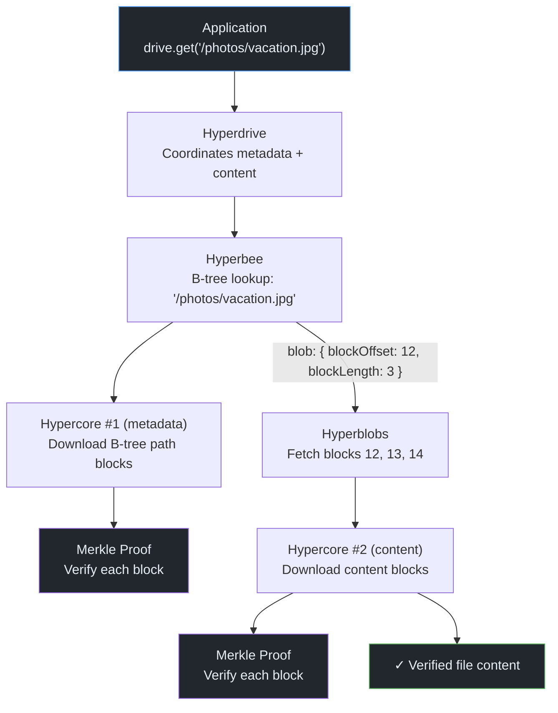

# P2P from Scratch — Part 4: From Logs to Databases

> "Simple things should be simple, complex things should be possible."
> — Alan Kay

**Excerpt:** A Hypercore is an append-only log — you can append blocks and read them by index. That's it. But most applications need sorted key-value lookups, file systems, and range queries. This post explains how Hyperbee maps a B-tree onto Hypercore's sequential blocks, how Hyperdrive combines a Hyperbee with Hyperblobs to build a distributed file system, and how Corestore manages multiple Hypercores from a single master seed.

<!-- Series Navigation -->
> **Series: P2P from Scratch — Building on the Holepunch Stack**
> [Part 1: The Internet is Hostile](part-1-nat-holepunching.md) | [Part 2: Encrypted Pipes](part-2-encrypted-pipes.md) | [Part 3: Append-Only Truth](part-3-hypercore-merkle.md) | **Part 4: From Logs to Databases (You are here)** | [Part 5: Finding Peers](part-5-dht-discovery.md) | [Part 6: Many Writers, One Truth](part-6-autobase-consensus.md) | [Part 7: Trust No One](part-7-security-trust.md) | [Part 8: Building for Humans](part-8-ux-production.md)

---

## The Problem: Access Patterns

A Hypercore gives you `append(data)` and `get(index)`. For a chat log, that's fine — messages arrive in order and you read them sequentially. But consider a contacts app: you need to look up "Alice" without scanning every block. Or a file system: you need to read `/photos/vacation.jpg` without downloading every file in the drive.

You need data structures on top of the log. The challenge is building them in a way that preserves Hypercore's two superpowers: **cryptographic verification** (every read is provably correct) and **sparse replication** (download only what you need, not the whole dataset).

---

## Hyperbee: A B-Tree on an Append-Only Log

<a href="https://github.com/holepunchto/hyperbee" target="_blank">Hyperbee</a> is a sorted key-value store built on a single Hypercore. It maps a <a href="https://en.wikipedia.org/wiki/B-tree" target="_blank">B-tree</a> onto sequential log blocks, giving you `O(log n)` lookups, range queries, and ordered iteration — all sparse-friendly.

### Why a B-Tree?

A B-tree is a self-balancing search tree where each node can hold multiple keys and has multiple children. Compared to a binary search tree, a B-tree is *wider* and *shorter* — fewer levels means fewer blocks to download for a lookup.

Hyperbee uses a B-tree (not a B+ tree — values are stored at every level, not just the leaves). The tree parameters are:

- **Maximum children per node:** 9
- **Maximum keys per node:** 8
- **Minimum keys per non-root node:** 4

When a node exceeds 8 keys, it splits. When it drops below 4, it rebalances.

> **Feynman Moment:** Why does wider-and-shorter matter for P2P? Because every level in the tree is a potential network round-trip. In a binary tree with a million entries, a lookup traverses ~20 levels. In Hyperbee's B-tree with max 9 children, the same million entries fit in ~7 levels. Fewer levels = fewer blocks to download = faster sparse queries over the network.

### How It Maps to Hypercore

Here's the key insight: Hypercore is append-only, so you can't update a tree node in place. Instead, every mutation (put or delete) **appends a new block** to the Hypercore containing:

1. **The key** being inserted or deleted
2. **The value** (or null for deletions)
3. **A tree index** — a snapshot of the modified path from root to the affected leaf

The tree index (called a `YoloIndex` internally) encodes multiple levels, where each level contains:
- **Key pointers**: Hypercore sequence numbers referencing blocks that hold other keys
- **Child pointers**: `(seq, offset)` pairs pointing to child tree nodes in other blocks

Unchanged subtrees are referenced by their existing Hypercore sequence numbers. This means each block contains a complete root-to-leaf snapshot of just the modified path — everything else is referenced by pointer.

```
Hypercore blocks:
┌─────────┐ ┌─────────┐ ┌─────────┐ ┌─────────┐ ┌─────────┐
│ Block 0  │ │ Block 1  │ │ Block 2  │ │ Block 3  │ │ Block 4  │
│ (header) │ │ key: "a" │ │ key: "c" │ │ key: "b" │ │ key: "d" │
│          │ │ val: ... │ │ val: ... │ │ val: ... │ │ val: ... │
│          │ │ index:   │ │ index:   │ │ index:   │ │ index:   │
│          │ │  [root]  │ │ [root→…]│ │ [root→…]│ │ [root→…]│
└─────────┘ └─────────┘ └─────────┘ └─────────┘ └─────────┘
```

Block 0 is always the header (protocol: `"hyperbee"`). Each subsequent block carries the inserted key-value pair plus the tree index snapshot. The *latest* block's tree index always points to the current root — reading the tree starts from the end of the log.

> **Key Insight:** This append-only B-tree has an unusual property: every past state of the tree is still accessible. Block 3's index represents the tree as it was after 3 insertions. This gives you free versioning — `db.checkout(version)` returns a read-only snapshot at any historical state, with zero extra storage cost.

### Sparse Lookups

When a remote peer queries `db.get("alice")`, Hyperbee only downloads the blocks along the B-tree path from the current root to the leaf containing "alice". For a database with a million entries, that's roughly 7 blocks — not a million.

Each downloaded block is a Hypercore block, which means it comes with a Merkle proof (from <a href="part-3-hypercore-merkle.md">Part 3</a>). The lookup is not only sparse but **cryptographically verified** — you know each block is authentic without trusting the peer who sent it.

---

## Hyperbee API: What You Can Do

```js title="hyperbee-basics.js"
const Hyperbee = require('hyperbee')
const Hypercore = require('hypercore')
const Corestore = require('corestore')

const store = new Corestore('./my-storage')
const core = store.get({ name: 'my-db' })
const db = new Hyperbee(core, {
  keyEncoding: 'utf-8',
  valueEncoding: 'json'
})
await db.ready()

// Basic CRUD
await db.put('alice', { age: 30, city: 'Berlin' })
await db.put('bob', { age: 25, city: 'Tokyo' })
await db.put('carol', { age: 35, city: 'Berlin' })

const entry = await db.get('alice')
// { seq: 1, key: 'alice', value: { age: 30, city: 'Berlin' } }

await db.del('bob')
```

### Range Queries

```js title="hyperbee-ranges.js"
// All entries from 'a' to 'c' (inclusive start, exclusive end)
for await (const entry of db.createReadStream({ gte: 'a', lt: 'd' })) {
  console.log(entry.key, entry.value)
}

// First entry in a range (without streaming all of them)
const first = await db.peek({ gte: 'a' })
```

### Atomic Batches

Multiple operations can be committed atomically — either all succeed or none do.

```js title="hyperbee-batch.js"
const batch = db.batch()

await batch.put('alice', { age: 31, city: 'Berlin' })
await batch.put('dave', { age: 28, city: 'London' })
await batch.del('carol')

// All three operations are appended to the Hypercore in a single atomic call
await batch.flush()

// Or abort without writing anything:
// await batch.close()
```

Under the hood, `batch.flush()` serializes all pending changes into an array of blocks and calls `core.append(blocks)` once — a single Hypercore append of multiple blocks, which is atomic.

### Compare-and-Swap

For optimistic concurrency control, both `put` and `del` accept a `cas` function:

```js title="hyperbee-cas.js"
// Only update if the previous value matches a condition
await db.put('alice', { age: 31, city: 'Berlin' }, {
  cas (prev, next) {
    // prev is the current entry (or null if key doesn't exist)
    // Return true to proceed with the write
    return prev !== null && prev.value.age < next.value.age
  }
})
```

### Snapshots and Versioning

```js title="hyperbee-versions.js"
// Snapshot at the current version (read-only)
const snapshot = db.snapshot()

// Snapshot at a specific version
const v2 = db.checkout(2)
const oldEntry = await v2.get('alice') // State as of version 2

// Diff between versions
for await (const diff of db.createDiffStream(2)) {
  // diff.left = entry in current version (or null)
  // diff.right = entry in version 2 (or null)
  console.log(diff)
}
```

### Sub-Databases

Hyperbee supports logical namespaces within a single Hypercore:

```js title="hyperbee-subs.js"
const users = db.sub('users')
const settings = db.sub('settings')

await users.put('alice', { role: 'admin' })
await settings.put('theme', 'dark')

// Each sub has its own keyspace — no collisions
const user = await users.get('alice')       // Found
const nope = await settings.get('alice')    // null
```

Sub-databases work via **key prefixing** — `users.put('alice', ...)` actually stores the key as `users\x00alice` in the underlying B-tree, where `\x00` is the separator byte. Range queries on a sub are automatically scoped to its prefix. Subs can be nested: `db.sub('a').sub('b')` produces prefix `a\x00b\x00`.

> **Gotcha:** Subs are not separate Hypercores. They share the same B-tree, the same Hypercore, and the same replication stream. They're a logical namespace, not a physical boundary.

### Watching for Changes

```js title="hyperbee-watch.js"
// Watch a range for changes
const watcher = db.watch({ gte: 'a', lt: 'z' })

for await (const [current, previous] of watcher) {
  // current and previous are Hyperbee snapshots
  // Diff them to find what changed
  for await (const diff of current.createDiffStream(previous)) {
    console.log('Changed:', diff.left?.key || diff.right?.key)
  }
}

// Or watch a single key
const entry = await db.getAndWatch('alice')
console.log(entry.node) // Current value

entry.on('update', () => {
  console.log('Alice changed:', entry.node)
})
```

---

## Hyperdrive: A Distributed File System

<a href="https://github.com/holepunchto/hyperdrive" target="_blank">Hyperdrive</a> is a POSIX-like file system built on top of Hyperbee and a companion module called <a href="https://github.com/holepunchto/hyperblobs" target="_blank">Hyperblobs</a>. It uses a **two-core architecture**:

```
┌──────────────────────────────────────────────────────┐
│                    Hyperdrive                         │
│                                                       │
│  ┌─────────────────────┐   ┌──────────────────────┐  │
│  │   Hyperbee (db)     │   │  Hyperblobs (blobs)  │  │
│  │   ═══════════       │   │  ════════════════     │  │
│  │   File metadata:    │   │  Raw file content:   │  │
│  │   path → {          │   │  64 KB chunks        │  │
│  │     executable,     │   │  appended to a       │  │
│  │     linkname,       │   │  separate Hypercore   │  │
│  │     blob: {         │   │                       │  │
│  │       blockOffset,  │──▶│  [chunk][chunk][...]  │  │
│  │       blockLength,  │   │                       │  │
│  │       byteOffset,   │   │                       │  │
│  │       byteLength    │   │                       │  │
│  │     },              │   │                       │  │
│  │     metadata        │   │                       │  │
│  │   }                 │   │                       │  │
│  │                     │   │                       │  │
│  │  (Hypercore #1)     │   │  (Hypercore #2)       │  │
│  └─────────────────────┘   └──────────────────────┘  │
│                                                       │
│  Both cores managed by a single Corestore             │
└──────────────────────────────────────────────────────┘
```

### Why Two Cores?

Separating metadata from content has a practical payoff:

1. **Listing is cheap.** A `readdir()` or `list()` only touches the Hyperbee — no file content is downloaded. You can browse a drive with millions of files and only download the B-tree path nodes.

2. **Selective download.** You can download a single file's content without downloading every other file. The Hyperbee entry tells you exactly which blocks in the Hyperblobs core to fetch (`blockOffset` and `blockLength`).

3. **Independent replication.** Both cores have independent discovery keys and can be replicated at different rates. A peer might replicate all metadata eagerly (for fast directory listings) but fetch content lazily (only when a file is actually opened).

### How Hyperblobs Works

<a href="https://github.com/holepunchto/hyperblobs" target="_blank">Hyperblobs</a> is a thin wrapper around a Hypercore that handles binary large objects. When you write a file:

1. The file content is split into **64 KB chunks** (the default block size)
2. Each chunk is appended to the Hyperblobs' Hypercore
3. Hyperblobs returns a **blob ID**: `{ blockOffset, blockLength, byteOffset, byteLength }`
4. This blob ID is stored in the Hyperbee entry alongside the file metadata

When you read a file, the blob ID tells Hyperblobs exactly which Hypercore blocks to fetch and concatenate.

### The File Entry Format

When you call `drive.entry(path)`, the returned object looks like:

```js
{
  seq: 5,                    // Hyperbee sequence number
  key: '/photos/vacation.jpg',
  value: {
    executable: false,       // Is the file executable?
    linkname: null,          // Symlink target (or null)
    blob: {                  // Pointer into the Hyperblobs core
      blockOffset: 12,       // Starting block index
      blockLength: 3,        // Number of 64KB blocks
      byteOffset: 786432,   // Starting byte offset
      byteLength: 195841    // Total file size in bytes
    },
    metadata: null           // Arbitrary application-defined metadata
  }
}
```

For symlinks, `blob` is null and `linkname` contains the target path. File size is derived from `blob.byteLength` — there's no separate size field.

### Hyperdrive API

```js title="hyperdrive-basics.js"
const Hyperdrive = require('hyperdrive')
const Corestore = require('corestore')

const store = new Corestore('./my-storage')
const drive = new Hyperdrive(store)
await drive.ready()

// Write a file
await drive.put('/hello.txt', Buffer.from('Hello, World!'))

// Read a file
const content = await drive.get('/hello.txt')  // Buffer

// Check existence
const exists = await drive.exists('/hello.txt')  // true

// File metadata (without reading content)
const entry = await drive.entry('/hello.txt')

// Delete
await drive.del('/hello.txt')

// Symlinks
await drive.symlink('/link.txt', '/hello.txt')

// Streaming read/write
const rs = drive.createReadStream('/large-file.bin')
const ws = drive.createWriteStream('/output.bin')
rs.pipe(ws)
```

### Directory Operations

```js title="hyperdrive-dirs.js"
await drive.put('/docs/readme.md', Buffer.from('# Hello'))
await drive.put('/docs/guide.md', Buffer.from('# Guide'))
await drive.put('/docs/api/ref.md', Buffer.from('# API'))

// List entry names (shallow, one level)
for await (const name of drive.readdir('/docs')) {
  console.log(name)  // 'readme.md', 'guide.md', 'api'
}

// List full entries (recursive by default)
for await (const entry of drive.list('/docs')) {
  console.log(entry.key, entry.value.blob?.byteLength)
}
```

### Versioning and Diffing

```js title="hyperdrive-versions.js"
// Snapshot at a specific version
const old = drive.checkout(5)
const content = await old.get('/config.json')

// Diff against a previous version
for await (const diff of drive.diff(5, '/docs')) {
  console.log(diff)
  // { left: currentEntry, right: oldEntry }  — left is current, right is old
}

// Watch for changes in a folder
const watcher = drive.watch('/docs')
```

### Mirroring

Hyperdrive can mirror to or from any drive-compatible target — another Hyperdrive, a local directory (via <a href="https://github.com/holepunchto/localdrive" target="_blank">Localdrive</a>), or anything implementing the same interface:

```js title="hyperdrive-mirror.js"
const Localdrive = require('localdrive')
const local = new Localdrive('./my-folder')

// Mirror a remote Hyperdrive to a local folder
const mirror = drive.mirror(local)
await mirror.done()

console.log(mirror.count)
// { files: 12, add: 10, remove: 0, change: 2 }
```

### Accessing Internal Cores

You can access both underlying cores directly when needed:

```js title="hyperdrive-internals.js"
drive.db           // The Hyperbee instance (metadata)
drive.core         // The Hypercore backing the Hyperbee
drive.blobs        // The Hyperblobs instance (may be null until loaded)
await drive.getBlobs()  // Ensures blobs core is loaded, returns the Hyperblobs instance
drive.contentKey   // Public key of the blobs core
```

> **Gotcha:** `drive.blobs` can be `null` initially — the blobs core is loaded lazily. For writable drives it's available after `ready()`, but for read-only drives you may need `await drive.getBlobs()` to force loading.

---

## Corestore: Managing Multiple Hypercores

A Hyperdrive needs two Hypercores. An Autobase application (Part 6) might need dozens — one per writer. Managing all those keypairs manually would be a nightmare.

<a href="https://github.com/holepunchto/corestore" target="_blank">Corestore</a> solves this with **deterministic key derivation** from a single master seed. You create Hypercores by name, and Corestore derives the keypair automatically.

### The Derivation Chain

```
primaryKey (32-byte master seed)
     │
     ▼
 BLAKE2b keyed hash ──── inputs: NS + namespace + name
     │                           │         │         │
     │                    ┌──────┘    ┌────┘    ┌───┘
     │                    │           │         │
     │              "corestore"    32 bytes   UTF-8
     │              namespace      (default:  encoded
     │              constant       all zeros) string
     │
     ▼
  32-byte seed
     │
     ▼
  Ed25519 keypair (crypto_sign_seed_keypair)
     │
     ├── publicKey (32 bytes) ── identifies the Hypercore
     └── secretKey (64 bytes) ── signs new appends
```

The derivation uses `crypto_generichash_batch` (BLAKE2b keyed hashing) with the `primaryKey` as the hash key, and three data inputs concatenated in order:

1. **NS** — a constant derived from `crypto.namespace('corestore', 1)` (a two-step BLAKE2b derivation: hash `"corestore"`, append a counter byte, hash again)
2. **namespace** — a 32-byte namespace (defaults to all zeros for the root store)
3. **name** — the UTF-8 encoded name string you passed to `store.get()`

The resulting 32-byte seed is fed into `crypto_sign_seed_keypair` to produce a deterministic Ed25519 keypair.

> **Key Insight:** The same `primaryKey` + `namespace` + `name` always produces the same keypair. This means a user can reconstruct every Hypercore they've ever created from their master seed alone — no need to store individual keypairs. It's the same principle as hierarchical deterministic wallets in cryptocurrency, applied to P2P data structures.

### Using Corestore

```js title="corestore-basics.js"
const Corestore = require('corestore')

const store = new Corestore('./my-storage')

// Create or open a Hypercore by name
const core1 = store.get({ name: 'chat-log' })
const core2 = store.get({ name: 'profile' })
await core1.ready()
await core2.ready()

// Deterministic: same name always produces the same keypair
const again = store.get({ name: 'chat-log' })
await again.ready()
console.log(again.key.equals(core1.key))  // true

// Open a remote core by public key (read-only, no keypair derived)
const remote = store.get({ key: somePublicKey })
```

### Namespaces

Namespaces create isolated derivation paths. Two modules using the same name in different namespaces get different Hypercores:

```js title="corestore-namespaces.js"
const chatStore = store.namespace('chat')
const docsStore = store.namespace('docs')

const chatLog = chatStore.get({ name: 'messages' })
const docsLog = docsStore.get({ name: 'messages' })

await chatLog.ready()
await docsLog.ready()

// Different keys — the namespace changes the derivation
console.log(chatLog.key.equals(docsLog.key))  // false
```

Namespaces are computed as `BLAKE2b(parentNamespace, name)` — they can be nested (`store.namespace('a').namespace('b')`) and each level produces a completely different derivation path.

### The Primary Key

The `primaryKey` is the root of the entire key hierarchy. Whoever holds it can derive every Hypercore keypair in the store.

```js title="corestore-primary-key.js"
// First run: Corestore generates and persists a random primaryKey
const store1 = new Corestore('./my-storage')
await store1.ready()

// The primaryKey is stored in the storage backend
// On subsequent runs, it's loaded automatically

// You CAN provide your own primaryKey (requires unsafe: true)
const store2 = new Corestore('./other-storage', {
  primaryKey: myMasterSeed,
  unsafe: true
})
```

> **Gotcha:** The `primaryKey` is the root of trust for a user's entire identity. Compromising it compromises every Hypercore in the store. It should never be logged, transmitted, or stored in plaintext outside the Corestore's own encrypted storage.

### Sessions and Resource Management

Corestore uses a garbage collection model for Hypercores. When a core becomes idle (no active sessions referencing it), it enters a GC cycle. A core must survive 3 GC cycles (~6 seconds of idle time) before being closed:

```js title="corestore-sessions.js"
// Sessions share the same underlying storage and cores
const session = store.session()

const core = session.get({ name: 'temp' })
// ... use core ...

// Closing the session releases its references
// If no other sessions reference the core, it enters GC
await session.close()

// For mobile/embedded: suspend and resume storage
await store.suspend()
// ... app backgrounded ...
store.resume()
```

### Replication

Corestore handles replication for all its Hypercores through a single protocol stream:

```js title="corestore-replication.js"
const stream = store.replicate(isInitiator)

// All active Hypercores are automatically attached to the stream
// When either side discovers a new Hypercore during replication
// (via discovery key exchange), Corestore loads it automatically
```

When a remote peer opens a Protomux channel for a discovery key that the local store knows about, Corestore automatically loads the corresponding Hypercore and joins the replication. This is what makes Hyperdrive's two-core replication seamless — you replicate the Corestore, and both the Hyperbee and Hyperblobs cores are handled automatically.

---

## How It All Fits Together

Here's how the layers compose for a typical file operation — reading `/photos/vacation.jpg` from a remote Hyperdrive:


*Figure 1: Reading a file from a remote Hyperdrive. The B-tree lookup in Hyperbee requires only path nodes (sparse). The blob fetch in Hyperblobs downloads only the file's content blocks. Every block is Merkle-verified.*

The total data downloaded:
- **~7 Hyperbee blocks** (B-tree path for a million-file drive)
- **3 Hyperblobs blocks** (the actual file content — 3 x 64 KB)
- **Merkle proofs** for each block (a handful of 32-byte hashes)

Everything else in the drive stays undownloaded. And every byte is cryptographically verified.

---

## The Tradeoffs

| What You Gain | What You Pay |
|---|---|
| Sorted key-value lookups with `O(log n)` sparse access | Append-only B-tree duplicates path nodes on every mutation — storage grows faster than a mutable B-tree |
| Free versioning — every past state is accessible via `checkout()` | Old versions accumulate unless explicitly garbage-collected |
| Two-core architecture separates metadata from content | Two discovery keys to manage, blobs core loaded lazily |
| Deterministic key derivation from a single seed | The `primaryKey` is a single point of compromise — losing it means losing every keypair |
| Automatic GC for idle Hypercores | ~6-second idle threshold may cause unnecessary re-opens in bursty access patterns |
| Atomic batches via `batch.flush()` | Batch serialization happens in memory before the single append |

---

## Key Takeaways

- **Hyperbee maps a B-tree onto Hypercore's sequential blocks.** Each mutation appends a new block with the key, value, and a snapshot of the modified path. With max 9 children per node, a million-entry database requires ~7 levels — 7 blocks to download for any lookup.

- **Hyperdrive separates metadata from content.** A Hyperbee stores file entries (path, executable flag, blob pointer, metadata). A Hyperblobs core stores raw content in 64 KB chunks. Both are independent Hypercores managed by a single Corestore.

- **Corestore derives all keypairs from a single master seed.** The derivation chain is `primaryKey` → BLAKE2b keyed hash (with namespace and name) → Ed25519 keypair. Namespaces isolate derivation paths for different modules. The primaryKey is the root of trust.

- **Everything remains sparse and verified.** A Hyperbee lookup downloads only the B-tree path. A Hyperdrive file read downloads only the file's content blocks. Every downloaded block carries a Merkle proof from the underlying Hypercore.

- **Append-only means free versioning.** `db.checkout(version)` and `drive.checkout(version)` give you read-only snapshots at any historical state. `createDiffStream` computes the delta between two versions.

---

## What's Next

We have data structures: key-value stores, file systems, deterministic key management. But we're still missing a fundamental piece — how do peers *find each other*?

In <a href="part-5-dht-discovery.md">Part 5</a>, we'll explore Hyperswarm's DHT-based discovery: how peers announce themselves on topics, how the Kademlia DHT routes queries without a central server, and how `joinPeer()` maintains persistent connections through the chaos of peer churn.

---

## References & Further Reading

1. <a href="https://github.com/holepunchto/hyperbee" target="_blank">holepunchto/hyperbee — Sorted key-value store built on Hypercore</a>
2. <a href="https://github.com/holepunchto/hyperdrive" target="_blank">holepunchto/hyperdrive — P2P file system with POSIX-like API</a>
3. <a href="https://github.com/holepunchto/hyperblobs" target="_blank">holepunchto/hyperblobs — Binary large object storage on Hypercore</a>
4. <a href="https://github.com/holepunchto/corestore" target="_blank">holepunchto/corestore — Multi-Hypercore management with deterministic key derivation</a>
5. <a href="https://github.com/holepunchto/hypercore" target="_blank">holepunchto/hypercore — Append-only log (from Part 3)</a>
6. <a href="https://github.com/holepunchto/localdrive" target="_blank">holepunchto/localdrive — Local file system with drive-compatible API</a>
7. <a href="https://github.com/holepunchto/mirror-drive" target="_blank">holepunchto/mirror-drive — Mirror between any two drives</a>
8. <a href="https://en.wikipedia.org/wiki/B-tree" target="_blank">Wikipedia — B-tree</a>
9. <a href="https://docs.pears.com/" target="_blank">Pear Runtime Documentation</a>

---

> **Series: P2P from Scratch — Building on the Holepunch Stack**
> [Part 1: The Internet is Hostile](part-1-nat-holepunching.md) | [Part 2: Encrypted Pipes](part-2-encrypted-pipes.md) | [Part 3: Append-Only Truth](part-3-hypercore-merkle.md) | **Part 4: From Logs to Databases (You are here)** | [Part 5: Finding Peers](part-5-dht-discovery.md) | [Part 6: Many Writers, One Truth](part-6-autobase-consensus.md) | [Part 7: Trust No One](part-7-security-trust.md) | [Part 8: Building for Humans](part-8-ux-production.md)
